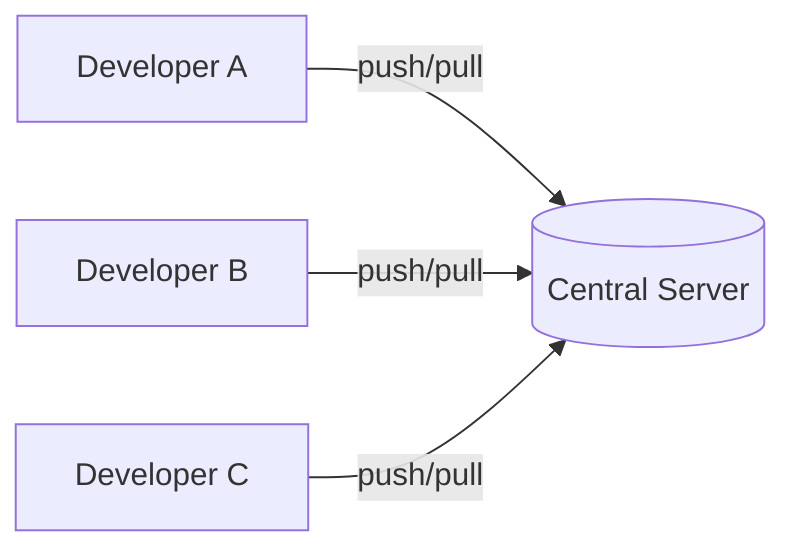
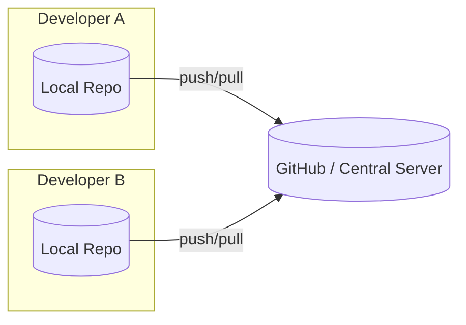
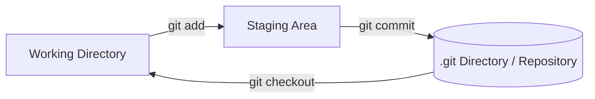

# Fundamentals

---

## What is Version Control?

Imagine you are working on a project folder on your laptop:

```
project/
 ├── index.html
 ├── style.css
 └── data.csv
```

You make some changes. Without any tool, the "safe" way to avoid losing work is to **copy the whole folder** before making changes:

```
project.zip          (2 GB, original)
 → project_final.zip      (2 GB, copy)
    → project_final2.zip  (2 GB, another copy)
```

Every time you make a change, you duplicate the entire project — and each copy eats the same amount of disk space. That's wasteful and doesn't scale.

**Version Control** is the solution.

> Version control (also called source control) is **the process of tracking and managing changes to files over time.**

With version control you can:
- See **who** changed what and **when**
- Go back to any earlier version of a file
- Work in a team without overwriting each other's work

---

## Why Git?

Git is a **Version Control System (VCS)**. It was created by Linus Torvalds in 2005 to manage the Linux kernel source code.

Git lets you:
- Recover old versions of any file easily
- Find out **who** introduced a bug and **when**
- Roll back to a previous working state
- Work offline — almost every operation is local

**Git's key strengths:**
- **Snapshots, not diffs** — Git captures a full snapshot of your project at each commit (not just what changed). This makes switching between versions very fast.
- **Everything is local** — you don't need internet for most operations.
- **Integrity** — Git uses a checksum (SHA-1 hash) for everything. If a file is secretly changed, Git will know.
- **Mostly adds data** — it's very hard to truly lose work in Git.

---

## Git vs GitHub

People often confuse Git and GitHub. They are **different things**.

| Git                                              | GitHub                                             |
| ------------------------------------------------ | -------------------------------------------------- |
| A software tool (VCS) that runs on your computer | A **website** that hosts Git repositories online   |
| Tracks the history of your code                  | Lets you share and collaborate on code with others |
| Maintained by Linus Torvalds                     | Maintained by Microsoft                            |
| Works from the command line                      | Has a nice web interface (GUI)                     |

**Simple analogy:**
- Git = your local photo album tool (organizes and saves your photos)
- GitHub = Google Photos (hosts your albums online so others can see them)

> **Alternatives to Git:** Apache Subversion (SVN), Mercurial
> **Alternatives to GitHub:** Bitbucket, GitLab, Azure DevOps Server
> **GUI clients for Git (not alternatives):** SourceTree, GitHub Desktop, GitKraken

---

## Centralized vs Distributed VCS

### Centralized VCS (e.g., SVN)

Everyone connects to **one central server**. If the server goes down, nobody can work.



**Problem:** If the server crashes, you lose everything. You also can't work offline.

---

### Distributed VCS (e.g., Git) ✅

Every developer has their **own full copy** of the entire repository. They work locally and then push/pull from a central server (like GitHub).



**Advantages:**
- Work fully offline
- Much faster (no network needed for most operations)
- If the server crashes, every developer still has a full copy

---

## Git Architecture

Git has **three main areas** where your files can live:



| Area                     | What it is                                                           |
| ------------------------ | -------------------------------------------------------------------- |
| **Working Directory**    | The folder on your computer where you edit files                     |
| **Staging Area (Index)** | A "waiting room" — you've markfiles ed as ready for the next commit  |
| **.git Directory**       | The hidden folder where all your commit history is permanently saved |

**Commit** = taking a snapshot of the staging area and saving it permanently to the `.git` directory.

---

## Git Terminology

Here are the key words you'll see everywhere in Git:

| Term | Meaning |
|---|---|
| **Repository (Repo)** | A project folder tracked by Git. Contains all your files + the full history. |
| **Commit** | A saved snapshot of your project at a point in time |
| **Branch** | A separate line of development. Like a parallel version of your project. |
| **HEAD** | A pointer that points to the current commit/branch you're on |
| **Staging Area / Index** | The place where you prepare changes before committing |
| **Remote** | A copy of the repository stored somewhere else (e.g., on GitHub) |
| **Origin** | The conventional name for the main remote repository (usually GitHub) |
| **Clone** | Making a copy of a remote repository onto your local machine |
| **Push** | Sending your local commits to the remote repository |
| **Pull** | Downloading commits from the remote repository to your local machine |
| **Merge** | Combining two branches together |
| **Conflict** | When two branches changed the same part of a file — Git needs your help to decide which to keep |
| **SHA / Hash** | A unique fingerprint (40-character string) that Git gives to every commit |

---

## Quick Summary

```
Problem:    Copying folders manually is wasteful and unmanageable
Solution:   Version Control Systems (VCS) track changes automatically

Git:        A distributed VCS — every developer has the full history
GitHub:     A hosting service for Git repositories (not Git itself)

Centralized VCS: One server → single point of failure
Distributed VCS: Every developer has a full copy → work offline, safer

Git's 3 areas: Working Directory → Staging Area → .git Repository
```

