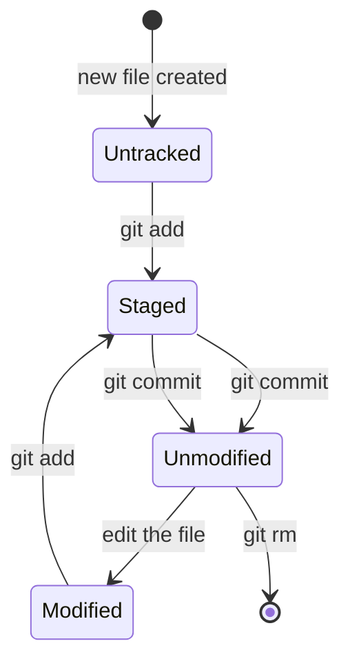

# Git Repository Fundamentals

---

## git init

`git init` turns any folder into a Git repository. It creates a hidden `.git` folder inside your project.

```bash
# Create a new folder and initialize it
mkdir my-project
cd my-project
git init
```

Or initialize an existing folder:

```bash
cd existing-folder
git init
```

**What happens after `git init`?**
- Git creates a hidden `.git` directory inside your folder
- Your folder is now a Git repository
- Git starts tracking this folder

---

## .git Directory

After `git init`, you'll see a hidden `.git` folder. This is where Git stores **everything** — all your history, all your commits, all your settings.

```
my-project/
├── .git/           ← hidden folder (the actual Git repository)
│   ├── HEAD
│   ├── config
│   ├── objects/    ← where all commits and files are stored
│   └── refs/       ← where branch pointers are stored
├── index.html
└── style.css
```

> ⚠️ **Never manually edit or delete the `.git` folder.** If you delete it, you lose all your Git history.

If you want to stop tracking a project with Git, just delete the `.git` folder:
```bash
rm -rf .git
```

---

## Working Directory

The **working directory** is simply the folder on your computer where you edit your files. It's what you see when you open the folder in your file explorer.

Files in the working directory can be in 4 states:
- **Untracked** — new files Git doesn't know about yet
- **Unmodified** — files tracked by Git that haven't changed
- **Modified** — tracked files that you've changed but haven't staged
- **Staged** — files ready to go into the next commit

---

## Staging Area

The **staging area** (also called the **index**) is like a "waiting room" or a "draft" for your next commit.

Think of it this way:
- You write code → files go into the **working directory**
- You `git add` → files move to the **staging area**
- You `git commit` → everything in the staging area gets saved as a snapshot

**Why do we need a staging area?**

Imagine you fixed 3 bugs but you want to commit them as 3 separate commits (for a clean history). The staging area lets you choose **which changes to include** in each commit.

```bash
# Stage only specific files
git add bug1.js      # only this file goes to staging
git commit -m "Fix bug 1"

git add bug2.js bug3.js
git commit -m "Fix bug 2 and 3"
```

---

## Local Repository

The **local repository** is the `.git` folder on your computer. It stores:
- All your commits (snapshots)
- All your branches
- All your history

This is your **personal copy** of the project. You can work on it entirely offline. When you're ready to share, you push to a **remote repository** (like GitHub).

---

## HEAD

**HEAD** is a special pointer in Git. It points to the **current branch** you are on (and therefore to the latest commit on that branch).

```
main ──→ commit C
          ↑
         HEAD
```

When you switch branches (`git checkout feature`), HEAD moves to point to the `feature` branch.

When you make a new commit, HEAD moves forward automatically to the new commit.

**Detached HEAD** — if you checkout a specific old commit (not a branch), HEAD points directly to that commit instead of a branch. This is called "detached HEAD" state. You can look around, but don't make permanent changes here without creating a new branch.

```bash
git checkout abc123   # HEAD is now "detached" (pointing to a commit, not a branch)
```

---

## Index

The **index** is just another name for the **staging area**. You'll often see this word in Git's error messages or documentation.

```bash
git diff --cached   # compares the index (staging area) with the last commit
```

---

## Git Object Database

Internally, Git stores everything in a simple **object database** inside the `.git/objects/` folder. Every piece of data (file content, directory structure, commits) is stored as a **Git object** with a SHA-1 hash as its name.

There are 4 types of Git objects (covered more in section 04 - Git Internals):
- **Blob** — stores file contents
- **Tree** — stores directory structure
- **Commit** — stores commit metadata + points to a tree
- **Tag** — stores tag information

---

## File Lifecycle in Git



| State | Meaning |
|---|---|
| **Untracked** | Git doesn't know about this file yet |
| **Unmodified** | File is tracked and hasn't changed since the last commit |
| **Modified** | File has been edited but not staged yet |
| **Staged** | File is in the staging area, ready for the next commit |

---

## Quick Reference

```bash
git init                  # Initialize a new Git repository
ls -la                    # See the hidden .git folder
git status                # Check the state of your working directory and staging area
```

**Remember:**
```
Working Directory  →  git add  →  Staging Area  →  git commit  →  .git (Repository)
```

