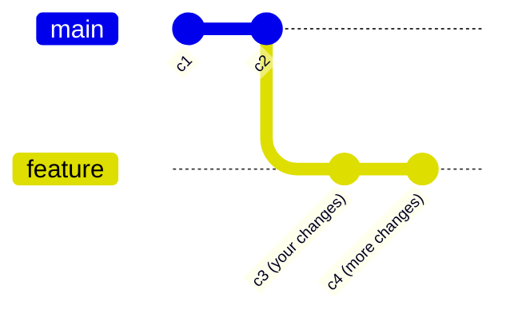
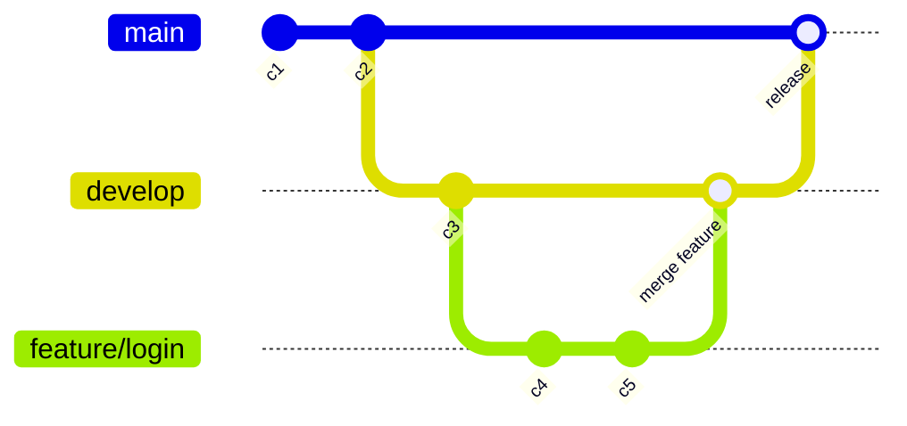

# 05 - Branching

---

## What is a Branch?

A **branch** is a separate line of development. Think of it like making a copy of your project where you can try new things — without affecting the original working version.

**Real-world analogy:**
- `main` branch = the published book
- `feature` branch = your rough draft for a new chapter

You write the draft, then when it's ready, you "merge" it into the published book.



Any changes you make on `feature` **do not affect** `main` until you merge them.

---

## Why Use Branches?

- Develop a new feature without breaking the working code
- Fix a bug safely on a separate branch
- Let multiple people work on different features at the same time
- Experiment freely — if it doesn't work, just delete the branch

---

## git branch

`git branch` is used to list, create, and delete branches.

```bash
git branch              # list all local branches
git branch -a           # list all branches (local + remote)
git branch -v           # list branches with the latest commit on each
git branch feature      # create a new branch called "feature" (doesn't switch to it)
git branch -d feature   # delete a branch (safe — only if it's merged)
git branch -D feature   # force delete (even if NOT merged — use carefully!)
git branch -m old new   # rename a branch
```

**Renaming a branch example:**
```bash
# Rename "dev" to "feature/login"
git branch -m dev feature/login
git push origin feature/login       # push the renamed branch to remote
git push origin --delete dev        # delete the old name from remote
git push --set-upstream origin feature/login  # set tracking
```

---

## git switch

`git switch` is the **modern way** to switch branches (available in Git 2.23+). It replaces the confusing overloaded `git checkout`.

```bash
git switch main                  # switch to the main branch
git switch feature               # switch to the feature branch
git switch -c new-branch         # create a new branch AND switch to it
git switch -c new-branch main    # create a branch from main and switch to it
```

---

## git checkout

`git checkout` is the **older way** to switch branches. It still works, but `git switch` is now preferred for switching branches.

```bash
git checkout main              # switch to main
git checkout feature           # switch to feature
git checkout -b develop        # create AND switch to a new branch called "develop"
git checkout -b feature main   # create "feature" branch from "main" and switch to it
```

`git checkout` can also be used to:
- Restore files (see section 10 - Undoing Changes)
- Navigate to a specific commit (detached HEAD)

---

## Creating Branches

```bash
# Method 1: Create, then switch
git branch feature
git switch feature

# Method 2: Create and switch in one command (modern)
git switch -c feature

# Method 3: Create and switch in one command (older)
git checkout -b feature

# Create a branch from a specific commit
git checkout -b hotfix abc1234
```

---

## Switching Branches

```bash
git switch main       # modern way
git checkout main     # older way
```

**What happens when you switch branches?**
- Git updates your working directory to match the state of the branch you're switching to
- HEAD moves to point to the new branch

> ⚠️ **Commit or stash your changes before switching branches!** If you have uncommitted changes, Git may warn you or refuse to switch (to prevent losing your work).

---

## Deleting Branches

```bash
git branch -d feature    # safe delete (only if branch is merged)
git branch -D feature    # force delete (even if NOT merged)
```

**Delete a remote branch:**
```bash
git push origin --delete feature    # deletes the branch on GitHub
git push -d origin feature          # same thing, shorter syntax
```

---

## Branch Naming

Good branch names are clear and descriptive. Common conventions:

| Type | Pattern | Example |
|---|---|---|
| Feature | `feature/short-description` | `feature/login-page` |
| Bug fix | `fix/short-description` | `fix/null-pointer-crash` |
| Hotfix | `hotfix/short-description` | `hotfix/payment-bug` |
| Release | `release/version` | `release/v1.2.0` |
| Chore/refactor | `chore/description` | `chore/update-dependencies` |

**Rules:**
- Use lowercase and hyphens (no spaces or underscores)
- Keep it short but meaningful
- Avoid: `my-branch`, `test`, `temp`, `branch1`

---

## Branch Tracking

A **tracking branch** is a local branch that is linked to a remote branch. When you push/pull, Git knows where to send/get the code.

```bash
# Push a new local branch and set it to track the remote
git push --set-upstream origin feature
# or shorter:
git push -u origin feature

# From then on, just:
git push    # pushes to origin/feature automatically
git pull    # pulls from origin/feature automatically
```

**Check which remote a branch is tracking:**
```bash
git branch -vv
```

**Clone and track a remote branch:**
```bash
git checkout --track origin/feature    # creates local "feature" tracking remote "origin/feature"
```

---

## Long-Running vs Topic Branches

### Long-running branches
Branches that exist for the entire life of the project:
- `main` / `master` — always has production-ready code
- `develop` — where active development happens

### Topic (Feature) branches
Short-lived branches created for a specific task, then merged and deleted:
- `feature/login-page`
- `fix/null-pointer-crash`



---

## Quick Reference

```bash
git branch                    # list local branches
git branch -a                 # list all branches (including remote)
git branch feature            # create branch (don't switch)
git switch -c feature         # create + switch (modern)
git checkout -b feature       # create + switch (older)
git switch main               # switch to main
git branch -d feature         # delete merged branch
git branch -D feature         # force delete branch
git push -u origin feature    # push + set tracking
git push --delete origin feature  # delete remote branch
git log --oneline --graph --all   # visualize branches
```

