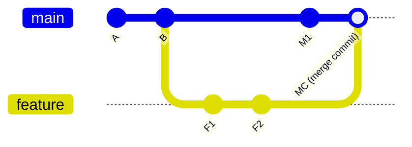

# Merging

---

## git merge

`git merge` joins two branches together. When your feature is ready, you merge it back into `main`.

**The rule:** Always switch to the **branch you want to merge INTO**, then run `git merge`.

```bash
git checkout main        # go to the branch you want to merge into
git merge feature        # bring feature's changes into main
```

Or with a message:
```bash
git merge feature -m "Merge feature/login into main"
```

**Other useful merge commands:**
```bash
git merge --no-ff feature      # always create a merge commit (even if fast-forward is possible)
git merge --squash feature     # squash all feature commits into one before merging
git merge --abort              # cancel a merge in progress (during a conflict)
git merge --continue           # continue after resolving a conflict

# Preview what will be merged (without actually merging)
git log main..feature          # commits in feature but not in main
git diff main...feature        # differences between the two
```

---

## Why Does `git merge` Exist?

When two developers work on different branches, there comes a moment when both sets of work need to live in the same codebase.

> **The core purpose:** Merge joins two branch histories by creating a single new commit that has two parents — one from each branch.

Unlike `git rebase` (which **rewrites** history), `git merge` **preserves everything exactly as it happened**. Both branches keep all their original commits. Git only adds one new commit — the **merge commit**.

---

## Fast-Forward Merge

This happens when the **receiving branch has NOT moved** since you created the feature branch. In other words, `main` is directly behind `feature`.

Git simply **moves the `main` pointer forward** to your latest commit. No new merge commit is created.

```
Before:
main:    A → B
feature: A → B → F1 → F2

After fast-forward:
main:    A → B → F1 → F2   (main pointer just moved forward)
```

This gives the cleanest, straightest history.

**Disadvantage of fast-forward:**
There is NO record that a feature branch ever existed. Someone reading the log later has no idea these commits were made on a separate branch.

---

## Three-Way Merge

This happens when **both branches have moved** since they diverged. Git cannot simply move a pointer — it must actually combine two sets of changes.

```
Before:
main:    A → B → M1 → M2
feature: A → B → F1 → F2

After merge:
main:    A → B → M1 → M2 → MC   (MC = merge commit)
                  ↗
             F1 → F2
```

Git uses **three snapshots** to figure out the combined result:

| Snapshot | What it is |
|---|---|
| Common ancestor (B) | Where both branches started from |
| Tip of `main` (M2) | What changed on main |
| Tip of `feature` (F2) | What changed on feature |

Git compares all three and creates the merge commit automatically wherever it can. Where it cannot decide (same line edited differently on both sides) it stops → this is a **conflict**.

---

## Merge Commit

A **merge commit** is a special commit that has **two parents** — one from each branch.



**Forcing a merge commit (no fast-forward):**
```bash
git merge --no-ff feature
```

This creates a merge commit even when fast-forward is possible. It records that a feature branch existed:

```
* e7f1c9a  Merge branch 'feature/login'
|\
| * f3c9a01  Add login validation
| * b2d4e8c  Create login form
|/
* 4e2a1b8  Initial setup
```

Anyone reading this log instantly knows these 3 commits are one feature that was developed separately.

---

## Merge Conflict

A conflict happens when **both branches edited the exact same line** in a file — and Git doesn't know which version to keep.

**Example scenario:**
```
Both branches changed line 1 of greeting.js:
  main:    const greeting = "Hello World";
  feature: const greeting = "Hi there!";
```

Git pauses the merge and marks the file like this:

```
<<<<<<< HEAD (main)
const greeting = "Hello World";
=======
const greeting = "Hi there!";
>>>>>>> feature
```

- Everything between `<<<<<<< HEAD` and `=======` is **your version** (main)
- Everything between `=======` and `>>>>>>>` is **their version** (feature)

---

## Conflict Resolution

**Step 1 — Open the conflicted file and edit it**

Remove the conflict markers and keep what you want:

```javascript
// You decided to keep this:
const greeting = "Hello World and Hi there!";
```

**Step 2 — Stage the resolved file**

```bash
git add greeting.js
```

**Step 3 — Complete the merge**

```bash
git merge --continue
# OR simply:
git commit
```

Git will create the merge commit with the default merge message.

**Important:** Git can usually merge **most changes automatically**. A conflict only happens for lines that **both branches changed differently**. You only need to resolve the conflicting portion.

```
File changes:
  Line 10 → changed only in main     ✅ Git handles automatically
  Line 20 → changed only in feature  ✅ Git handles automatically
  Line 30 → changed in BOTH          ❌ Conflict — you decide
  Line 40 → unchanged                ✅ Git handles automatically
```

---

## Abort Merge

If you get confused and want to cancel the merge and go back to before you ran `git merge`:

```bash
git merge --abort
```

This is safe to run at any point during a conflict. It returns your branch to exactly the state it was in before the merge started.

---

## What the Log Looks Like After a Merge

```bash
git log --oneline --graph --all
```

```
*   e7f1c9a (HEAD -> main) Merge branch 'feature/login'
|\
| * 3a2d8bc  Add login validation
| * c91f4e1  Create login form
* | b8f3a12  Update homepage banner
* | 9d4c7f0  Fix navigation bug
|/
* 4e2a1b8  Initial commit
```

The "diamond" shape shows you exactly when the branch was created and merged.

---

## When Vim Opens During a Merge

When Git needs to create a **merge commit**, it needs a commit message and opens your editor. If your editor is Vim:

```
Merge branch 'feature' into main

# Please enter a commit message...
```

Usually Git already provides a good default message. Just save and exit:
```
Esc → :wq → Enter
```

**Four possible outcomes of `git merge`:**

| Outcome                 | What happens                                                 |
| ----------------------- | ------------------------------------------------------------ |
| **Fast-forward**        | main pointer moves forward, no commit, no Vim                |
| **Merge commit needed** | Git creates a merge commit, Vim opens for the message        |
| **Merge conflict**      | Git pauses, you fix conflicts, then `git add` + `git commit` |
| **Already up to date**  | Nothing to do — the branch already has all the changes       |

---

## Merge Best Practices

✅ **Always commit your current work before merging** — keep your working directory clean

✅ **Pull the latest changes before merging** — make sure you're merging up-to-date code:
```bash
git pull origin main    # update main first
git merge feature       # then merge feature into it
```

✅ **Use `--no-ff` for features** — create merge commits to preserve branch history

✅ **Delete the branch after merging** — keep your branch list clean:
```bash
git branch -d feature
git push --delete origin feature
```

✅ **Use `git merge --abort` if confused** — it's always safe to cancel and start over

---

## Merge vs Rebase — Summary

Use `git merge` when:
- Integrating a finished feature into `main`
- Working on a shared branch that teammates have pulled
- You want the history to clearly show what happened and when

Use `git rebase` when:
- Cleaning up local commits before opening a pull request
- Bringing a feature branch up to date privately
- The commits have never been pushed or shared with anyone

> **Simple rule:** Merge is always safe. Rebase is only safe on commits that exist **only on your machine.**

---

## Quick Reference

```bash
git checkout main          # switch to the branch you're merging INTO
git merge feature          # merge feature into main
git merge --no-ff feature  # always create a merge commit
git merge --squash feature # squash all commits into one
git merge --abort          # cancel merge (during conflict)
git merge --continue       # continue after resolving conflict
git log --oneline --graph  # visualize the merge history
git branch -d feature      # delete merged branch
```

