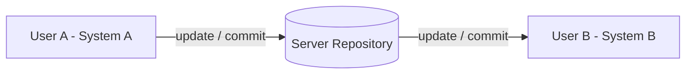
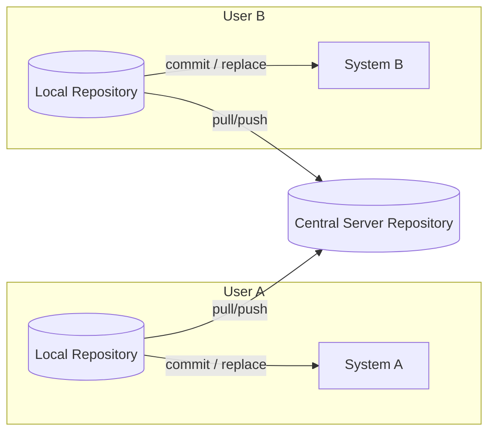
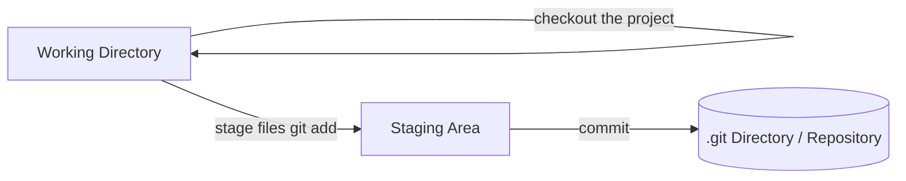
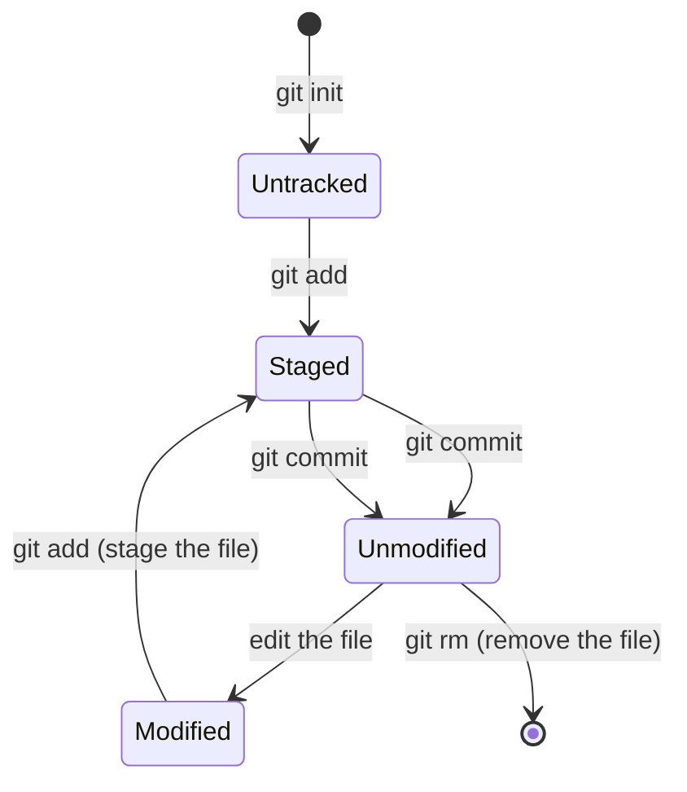
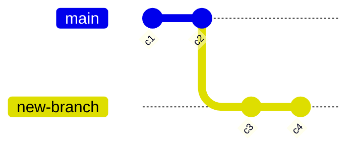
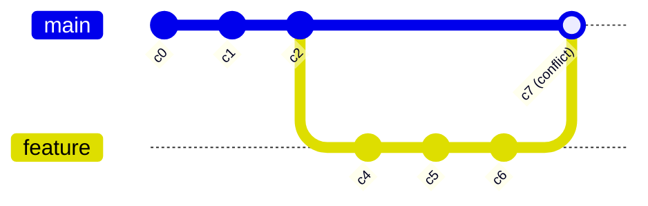
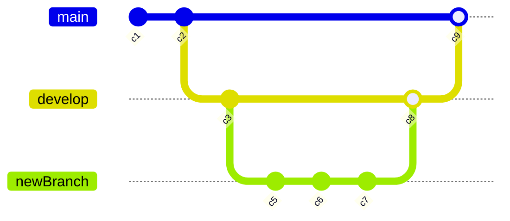

# Git & GitHub Notes (Beginner to Advanced)

> Cleaned up and reorganized from handwritten notes. A couple of small corrections/updates are called out in blockquotes like this one — GitHub's default branch name changed from `master` to `main` for new repositories (since late 2020). Your notes use `master` throughout; both work the same way, just replace `master` with whatever your default branch is called.

---

## 1. Why does Git even exist?

Imagine a project folder on your laptop:

```
project/
 ├── f1
 ├── f2
 ├── f4
 └── data.csv
```

You make some changes to it. Without any tool, the "safe" way to avoid losing work is to **copy the whole folder** before making changes:

```
project.zip (2 GB, original)
   → project_final.zip (2 GB, copy)
      → project_final2.zip (2 GB, copy)
```

Every time you make a change, you duplicate the entire project just to be safe — and each copy eats up the same amount of extra space (in this example, an extra 2 GB every time). That's wasteful and doesn't scale.

**Git was created to solve exactly this problem.**

## 2. What is Git?

Git is a **Version Control System (VCS)**. It lets you:
- Easily recover old versions of a file
- Find out **who** introduced a bug and **when**
- Roll back to a previous working state

## 3. History of Version Control Systems

Version control (also called source control) is **the process of tracking and managing changes to files over time.**

### 3.1 Local VCS
A simple database on your own machine that keeps track of file changes.

- **Pros:** You can roll back to an earlier version.
- **Cons:** If your hard disk crashes (or you lose the laptop), everything is lost.

### 3.2 Centralized VCS
Everyone connects to **one central server repository** to update and commit changes.



### 3.3 Distributed VCS
This is what Git uses. Every user has their **own full local repository**, and they push/pull changes to/from a central server. This gives you flexibility to work fully offline.



## 4. Git vs GitHub

| Git | GitHub |
|---|---|
| A VCS (software) to manage source code history | A **hosting service** for Git repositories |
| Focuses on code sharing and version control | Focuses on centralized source code hosting |
| Maintained by Linus Torvalds | Maintained by Microsoft |
| A command-line tool | A service with a GUI (website) |

> **Alternatives:**
> - Alternatives to Git (other VCS tools): Apache Subversion (SVN)
> - Alternatives to GitHub (other hosting services): Bitbucket, Azure DevOps Server
> - SourceTree is actually a **GUI client for Git** (not really a competing VCS), useful if you don't want to use the command line.

## 5. Git's Key Features

- **Tracks all history of changes** — Git captures a **snapshot** of your project at each commit, not just the difference (diff). (Internally it's smart about storage, but conceptually think "snapshot.")
- **Almost every operation is local** — no need for a network connection for most commands.
- **Integrity** — Git uses **checksums** for everything. If someone changes a file in the repository, the checksum changes too, and Git can detect it.
- Git generally only **adds data** — it's hard to make Git do something that is truly not recoverable.

## 6. Installing Git

1. Go to [git-scm.com](https://git-scm.com)
2. Download the Windows installer → choose the **Standalone Installer (64-bit Git)**
3. Install it on your computer

After installation you get:
- **Git Bash** — a terminal program (works like Linux terminal), available on Windows and Linux
- **Git command line tool** — usable directly from Windows terminal too

### First-time setup
Right-click inside a folder → **Git Bash Here**, then run:

```bash
git config --global user.name "yourname"
git config --global user.email "your.email@example.com"
```

This configures your name and email, which get attached to every commit you make.

To check your settings:
```bash
git config --list
```

## 7. Git's Three-Stage Architecture

Git has 3 main areas:



- **Working Directory** — where you actually edit, create, or delete files.
- **Staging Area** — a "waiting room" where you place files you're ready to save (commit) in the next snapshot.
- **.git Directory (Repository)** — where all committed snapshots of your project are permanently stored.

**Commit** = capturing a snapshot of your project at a specific point in time.

A staging attempt can be:
- ✅ **Successful** → ready for stage
- ❌ **Failed** → stays in working directory
- ✅ **Successful commit** → ready for stage (moves into the repository)

## 8. Tracking Your First Project

```bash
# 1. Create/open the folder where your project lives, then open Git Bash there

# 2. Initialize Git (creates the hidden .git folder)
git init

# 3. Check the state of your working directory
git status

# 4. Add files to the staging area
git add file1.txt file2.js accdb   # add specific files
git add .                          # add everything

# 5. Commit the staged snapshot with a message
git commit -m "Initial commit"
```

- `git init` — Initializes a new Git repository (creates hidden Git files).
- `git status` — Displays the state of your working directory: which files are staged, modified, or untracked.
- `git add` — Moves changes from the working directory to the staging area.
- `git commit -m "message"` — Stores the staged snapshot as a commit in the project history.

### Viewing history
```bash
git log
```
`git log` lists the staged snapshots (commits) and provides the project's commit history.

## 9. Git File Lifecycle



- **Untracked** — Git doesn't know about this file yet.
- **Unmodified** — the file is committed and unchanged since the last commit.
- **Modified** — you've edited a tracked file, but haven't staged it yet.
- **Staged** — the file is marked and ready to go into the next commit.

If you modify a file that's already committed, then run `git add`, then `git commit`, Git will use the new modified file — the old committed version won't be used for the commit anymore.

## 10. Ignoring Files with `.gitignore`

You'll often want Git to **ignore** certain files or folders — e.g. log files, temporary files, personal/config files, hidden files, etc.

Create a special file (typically named `.gitignore`) and specify which files or parts of your project Git should ignore.

**Example — ignoring all `.log` files:**
```
*.log
```

**Example — ignoring a whole folder** (`new-dir/`) but keeping other folders:
```
new-dir/
```
By default, Git ignores empty folders anyway.

**Example — ignore everything in a folder except one file:**
```
new-dir/*
!new-dir/keep.txt
```

**Example from the original notes** — different `.gitignore` files at different levels:
```
# In root .gitignore (applies to whole repo)
*.log
temp.log
stash/
temp/

# In stash/.gitignore (overrides for that subfolder)
!stash/temp.txt   # keep temp.txt present in stash

# In stash/temp/.gitignore
temp.html         # ignore this specific file inside stash/temp
```

## 11. Everyday Commands

| Command | What it does |
|---|---|
| `git diff` | Compares the **working directory** with the **staging area** |
| `git diff --staged` | Compares the **staging area** with the **previous commit** (last saved snapshot) |
| `git commit -a -m "message"` | Skips the staging step — directly commits changes to files Git **already tracks** (won't add new/untracked files) |
| `git log` | View commit history |

### Renaming a file
If you delete a file and create a new one with a different name, Git will treat them as unrelated (delete + new file). Use this instead:

```bash
git mv oldFileName newFileName
```
This will rename the file **and** stage the change automatically. To undo this, use `git mv newFileName oldFileName`.

## 12. Viewing Log History in Detail

```bash
git log -p          # shows the full diff/patch for each commit
git log -3          # shows only the last 3 commits (with full details)
git log --stat      # shows summary of file changes per commit
git log --pretty=oneline   # one line per commit
git log --pretty=short
git log --pretty=full
git log --since=2.days     # e.g. "2.months" = commits since 2 months ago
git log --pretty=format:"%h - %ae"   # custom format, space between placeholders
```

## 13. Amending a Commit / Opening an Editor

```bash
git commit --amend
```
This opens the Vim editor so you can change the commit message (or add missed changes) of your **most recent** commit.

**Basic Vim controls:**
- Press `i` to enter **Insert mode** (start editing)
- Press `Esc` to exit Insert mode
- Type `:wq` then `Enter` to **save and quit**

## 14. Unstaging & Restoring Files

If you want to **unstage** a file (move it back from staging to working directory, keeping the changes):
```bash
git restore --staged <fileName>
```

If you want to **restore data of a file** — either to discard current changes and get back the previous committed version, or to recover an old/deleted version:
```bash
git checkout -- <fileName>
```
This is useful when your current working-directory changes are unwanted and you want to go back to what was last committed.

To **discard everything** in the current working directory / staging area and reset to the last commit:
```bash
git checkout -f
```

> Note: `git checkout` for restoring files is the older syntax. Modern Git also offers `git restore <fileName>` for the same purpose — both work.

## 15. Working with GitHub (Remote Repositories)

1. Go to [github.com](https://github.com) and create an account (if you don't have one)
2. Click on the **+** sign → **Create new repository**
3. Give it a name and description
4. Click **Create repository**

### Connecting your local repo to GitHub

`git remote` — points to where your local repository is hosted remotely (origin is just the conventional name for that pointer).

```bash
git remote add origin https://github.com/username/repo-name.git
git remote -v          # shows the remote URL(s)
```

### Setting up SSH (so you don't need to type your password each time)

```bash
ssh-keygen -t ed25519 -C "your-email@example.com"
# press Enter through the prompts

cat ~/.ssh/id_ed25519.pub
# copy the output (your SSH key) to your clipboard
```

Then:
- Go to GitHub → **Settings** → **SSH and GPG keys** → **New SSH key**
- Give it a title, paste the key, save

### Pushing your code

```bash
git push origin master
```
> Update: newer GitHub repos default to a branch called `main` instead of `master`. Use whichever your repository actually has, e.g. `git push origin main`.

### Fixing a wrong remote URL
```bash
git remote set-url origin <new-remote-url>   # update an existing (mistaken) remote
git remote remove origin                     # remove a remote entirely
```

### Cloning an existing repository
```bash
git clone <URL> [folder-name]
```
- Go to any GitHub repository → click **Code** → copy the URL → `git clone <URL>`

## 16. Setting Aliases

Instead of typing the whole command every time, you can create shortcuts:
```bash
git config --global alias.st 'status'
```
Now typing `git st` runs `git status`.

## 17. Branches

`git branch` — allows you to **diverge from the main line of development** and continue to work without affecting the main line (e.g. `master`/`main`).



### Creating & switching branches
```bash
git checkout -b develop   # create AND switch to a new branch called "develop"
git checkout master       # switch back to master (or main) branch
```
Any changes you make on `develop` **do not** affect the `master` branch until you merge them.

## 18. Merging Branches

Before merging, always make sure to commit everything about the current branch first.

```bash
git checkout master        # go to the branch you want to merge INTO
git merge develop          # merge "develop" into master
```

**If Git auto-merges successfully**, that's it — done.

**If auto-merge fails (a conflict)**, you'll need to manually resolve it, then add and commit the result.

### Merge conflicts



This happens when both branches changed **the same part** of a file — for example, two branches both edited the `<title>` tag of a webpage. Git doesn't know which version you want to keep, so it pauses and asks **you** to resolve the conflict, then you add and commit the resolved file to finish the merge.

## 19. Branch Management

```bash
git branch -v              # list branches with their latest commit
git branch -d branchName   # DELETE a branch (safe delete)
```
- `git branch -d` gives an **error** if the branch has changes that are **not yet merged** — protecting you from losing unmerged work.
- To force-delete anyway:
```bash
git branch -D branchName
```

## 20. Branching Workflow (Long-Running vs Topic Branches)

**Long-running branches** — exist for the life of the project, e.g.:
- `master`/`main` — production-ready code
- `develop` — ongoing development work

**Topic (feature) branches** — short-lived branches created for a specific task, then merged and deleted, e.g. "fix typo" or "add login page."



## 21. Pushing Branches to a Remote Repository (GitHub)

Before pushing a branch to a remote repository, it needs to be **renamed/registered** to a remote name so GitHub knows which branch it corresponds to.

```bash
git push origin newBranch          # push "newBranch" to origin, creating a copy of it on GitHub
git push origin newBranchName:branchNameOnRemote   # push under a different remote name

git push -d origin branchName      # delete a branch on the remote repository
```

## 22. Navigating to a Specific Commit

```bash
git log
# copy the commit hash of the commit you want
```
- `git log` shows you a list of past commits along with their commit hashes.
- Copy the commit hash of a specific old commit.

```bash
git checkout <commit-hash>
```
This puts you in a **detached HEAD** state — Git will let you look around at that old snapshot, but changes you make here **won't belong to any branch** unless you create one from that point:

```bash
git checkout -b <new-branch-name> <commit-hash>
```
This creates a new branch starting from that old commit, so you can make changes from that point in history.

## 23. Deleting a Branch (recap)
```bash
git branch -d <branch-name>
```

## 24. Git Reset

```bash
git reset <commitID>          # "soft-ish": removes commits up to that ID, keeps the data UNSTAGED (in working directory)
git reset --hard <commitID>   # removes commits up to that ID AND removes the data as well — HEAD moves to that commit
```
> ⚠️ `git reset --hard` is destructive — the changes since that commit are gone unless you find them via `git reflog`.

## 25. Rewriting Commit History (Interactive Rebase)

**Modify a specific past commit:**
```bash
git rebase -i --root
```
This opens the Vim editor listing your commits. Change `pick` to:
- `edit` — pause on this commit so you can change the content of the commit
- `reword` — pause on this commit so you can change just the commit message

Then, `Esc` → `:wq` → `Enter` to save and continue rebasing.

**To modify a commit's contents during rebase:**
```bash
# Vim opens, make your changes to the commit message
# Esc, then type -> :wq -> Enter to save and close
```
While editing a specific commit, you can:
1. Open Vim editor
2. Change the content, save and close
3. Use `git commit --amend` to continue editing that commit
4. Then run `git rebase --continue` to make a new branch from that commit and merge it with the master branch

## 26. Navigating to a Specific Commit (finding lost commits)

```bash
git log --oneline    # shows a list of deleted/past commit hashes and their titles
```
- Copy the commit hash of the deleted commit you want.
```bash
git checkout <commit-hash>
```
This puts you in **detached HEAD** state so you can navigate to that specific commit. Keep in mind HEAD is detached — if you want to make changes from that old branch/state, you'll need to create a new branch from that commit hash:
```bash
git checkout -b <new-branch-name> <commit-hash>
```

## 27. Hosting a Static Website on GitHub Pages

1. Go to your GitHub repository → **Settings** → **Pages**
2. In the **Branch** option, select which branch (e.g. `main`) and folder (usually root `/`) to publish from
3. Save it
4. Your website will display on the page GitHub gives you (with a short delay for the first deployment)

### Renaming an existing remote (fixing the wrong system)
```bash
git remote rename origin dev   # rename the "origin" remote to "dev"
```

### Deploying a Create React App (or similar) project to GitHub Pages

1. Go to `github.com` → create a repository named e.g. `your-username.github.io`
2. Copy the homepage link, paste it into the `"homepage"` field in `package.json`, along with your project name
3. Install `gh-pages`:
   ```bash
   npm install gh-pages --save-dev
   ```
4. Add these scripts to `package.json`:
   ```json
   "scripts": {
     "predeploy": "npm run build",
     "deploy": "gh-pages -d build"
   }
   ```
5. Run the deploy:
   ```bash
   npm run deploy
   ```
6. Go to your repo → **Settings** → **Pages** → set **Source** branch to `gh-pages`
7. After a minute, your project will be live!

### Deploying to Netlify (alternative)
1. Push your changes to your GitHub repository (`origin`)
2. Go to [netlify.com](https://netlify.com) → **New site from Git**
3. Choose your repository
4. Set the **Build command** (e.g. `npm run build`) and **Publish directory** (e.g. `build`)
5. Deploy — Netlify will auto-build and host your site

---

## Quick Reference Cheat Sheet

| Command | Purpose |
|---|---|
| `git init` | Start tracking a folder with Git |
| `git status` | See current state of files |
| `git add <file>` / `git add .` | Stage changes |
| `git commit -m "msg"` | Save a snapshot |
| `git log` | View commit history |
| `git diff` | Working dir vs staging area |
| `git diff --staged` | Staging area vs last commit |
| `git mv old new` | Rename a file |
| `git restore --staged <file>` | Unstage a file |
| `git checkout -- <file>` | Discard changes, restore last committed version |
| `git checkout -f` | Discard ALL working directory changes |
| `git remote add origin <url>` | Link to a remote repo |
| `git push origin <branch>` | Upload commits to remote |
| `git clone <url>` | Download a remote repo |
| `git checkout -b <name>` | Create + switch to new branch |
| `git merge <branch>` | Merge a branch into current branch |
| `git branch -d <name>` | Delete a merged branch |
| `git branch -D <name>` | Force delete a branch |
| `git push -d origin <branch>` | Delete a remote branch |
| `git reset <commit>` | Undo commits, keep changes unstaged |
| `git reset --hard <commit>` | Undo commits AND discard changes |
| `git rebase -i --root` | Interactively rewrite commit history |
| `git checkout <hash>` | Go to an old commit (detached HEAD) |
| `git checkout -b <name> <hash>` | Create new branch from an old commit |
