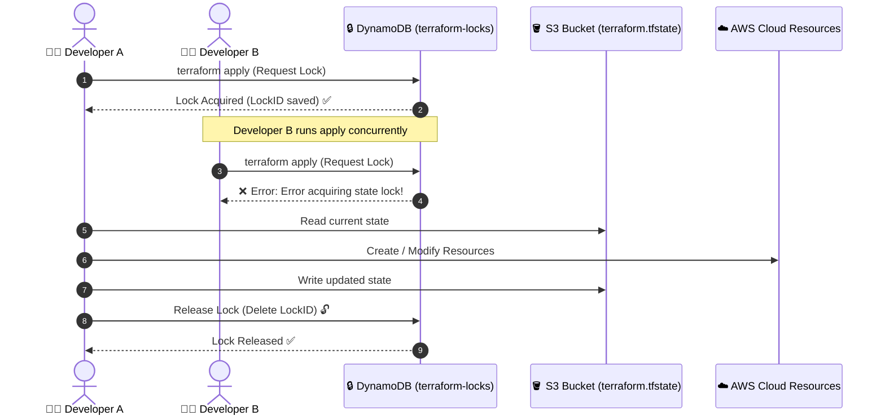
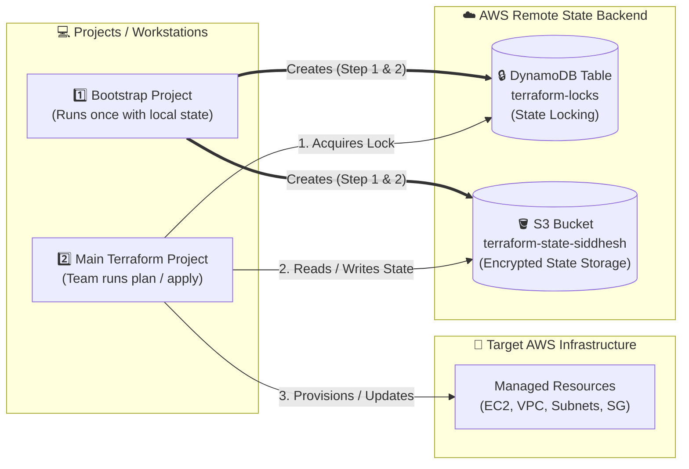

# Remote State Setup (S3 + DynamoDB)

## Why Remote State?

By default, Terraform stores the state file locally on your machine. This is fine for solo projects, but has a big problem in teams:

- If two people run `terraform apply` at the same time, they can **overwrite each other's state file** and cause chaos.
- The state file is also at risk if your machine crashes.

**Solution:** Store the state file remotely in **AWS S3**, and use **DynamoDB** to prevent concurrent changes (state locking).

---

## The Bootstrap Problem

**Problem:** To set up remote state, you need an S3 bucket and a DynamoDB table.  
But if you use a Terraform backend before those exist, Terraform will fail.

**Solution:**
1. First, run a **bootstrap Terraform project** that uses local state.
2. It creates the S3 bucket + DynamoDB table.
3. Then your main project uses that backend.

---

## Step 1: Create a Bootstrap Project

Create a folder called `bootstrap/` with a `main.tf` inside:

```hcl
provider "aws" {
  region = "ap-south-1"
}

# S3 Bucket to store the state file
resource "aws_s3_bucket" "tf_state" {
  bucket = "terraform-state-siddhesh"   # must be globally unique
}

# Enable versioning (keeps history of state file changes)
resource "aws_s3_bucket_versioning" "tf_state" {
  bucket = aws_s3_bucket.tf_state.id
  versioning_configuration {
    status = "Enabled"
  }
}

# Enable encryption at rest
resource "aws_s3_bucket_server_side_encryption_configuration" "tf_state" {
  bucket = aws_s3_bucket.tf_state.id
  rule {
    apply_server_side_encryption_by_default {
      sse_algorithm = "AES256"
    }
  }
}

# DynamoDB table for state locking
resource "aws_dynamodb_table" "tf_locks" {
  name         = "terraform-locks"
  billing_mode = "PAY_PER_REQUEST"

  hash_key = "LockID"
  attribute {
    name = "LockID"
    type = "S"
  }
}
```

---

## Step 2: Apply the Bootstrap Project

```bash
cd bootstrap
terraform init
terraform apply
```

This creates:
- ✅ S3 bucket `terraform-state-siddhesh` (with versioning + AES256 encryption)
- ✅ DynamoDB table `terraform-locks` (for state locking)

---

## Step 3: Configure Your Main Project to Use Remote State

In your main project (e.g., your EC2 infra project), create a `backend.tf`:

```hcl
terraform {
  backend "s3" {
    bucket         = "terraform-state-siddhesh"
    key            = "dev/terraform.tfstate"      # path inside the bucket
    region         = "ap-south-1"
    dynamodb_table = "terraform-locks"
    encrypt        = true
  }
}
```

Then run:

```bash
terraform init
```

Terraform will ask if you want to migrate your local state to the remote backend. Say **yes**. From now on, the state is stored in S3.

---

## Step 4: How State Locking Works

When you run `terraform apply`:
1. Terraform **creates a lock** in DynamoDB (`LockID` entry).
2. If another person tries to run `terraform apply` at the same time, they'll see:
   ```text
   Error: Error acquiring the state lock
   ```
3. Once the first run completes, the lock is **released** automatically.

This prevents two people from corrupting the state at the same time.



---

## How It All Fits Together



---

## Best Practices

- **Keep the bootstrap project separate** from your main infra project.
- **Never delete the bootstrap project** — it manages the infrastructure that stores your state.
- You can extend the bootstrap to create **separate state paths per environment**:
  - `dev/terraform.tfstate`
  - `stage/terraform.tfstate`
  - `prod/terraform.tfstate`
- Add encryption and versioning to your S3 bucket (already done in the example above).
