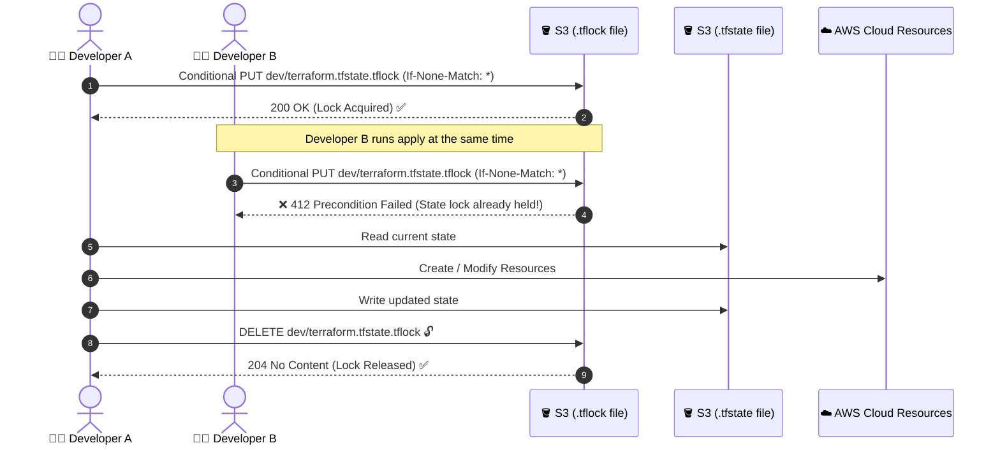
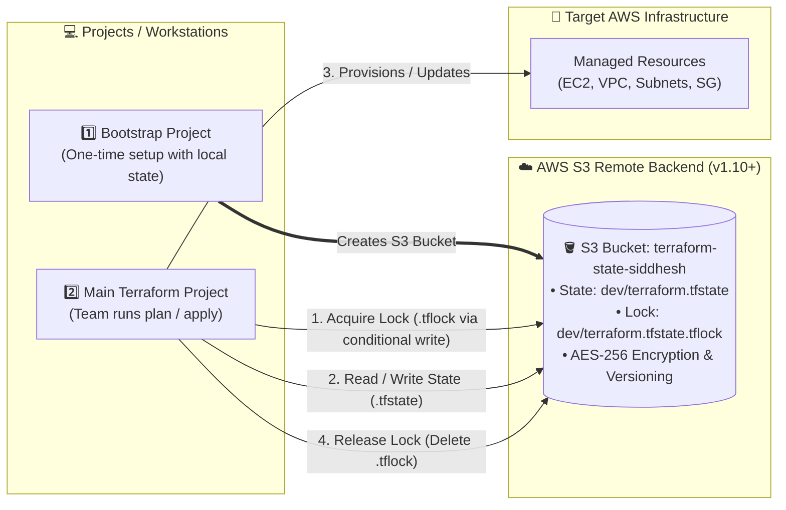

# Remote State Setup (S3 Native Locking & DynamoDB)

## Why Remote State & Locking?

By default, Terraform stores the state file locally on your machine (`terraform.tfstate`). This creates critical problems in a team environment:

1. **State Overwrites (Race Conditions):** If two developers run `terraform apply` simultaneously, they overwrite each other's state, corrupting infrastructure records.
2. **Data Loss:** If a local laptop crashes or is wiped, the state file is lost.
3. **Sensitive Data Exposure:** State files often contain database passwords, private keys, or API tokens in plain text.

**Solution:** Store the state file remotely in **AWS S3** (encrypted and versioned) and use **State Locking** to prevent concurrent execution.encryption

---

## ⚡ Big Update in Terraform v1.10+: Native S3 State Locking

> [!NOTE]
> Historically, Terraform required an **AWS DynamoDB** table alongside S3 solely for state locking.
> Starting with **Terraform v1.10** (released late 2024) and **OpenTofu v1.8+**, Terraform supports **Native S3 State Locking**. **You no longer need a DynamoDB table!**

### How Native S3 Locking Works Under the Hood

In August 2024, AWS introduced **Conditional Writes** for Amazon S3 (`PutObject` with the `If-None-Match` HTTP header). Terraform v1.10 leverages this capability directly:

1. **Lock Acquisition:**
   - When you run `terraform plan` or `terraform apply`, Terraform attempts to create a small lock file named `<key>.tflock` (e.g., `dev/terraform.tfstate.tflock`) in the same S3 path as your state file.
   - It sends a conditional write request: `PutObject` with header `If-None-Match: *` (meaning *"only write this file if it does NOT already exist"*).
2. **Conflict Prevention:**
   - If the `.tflock` object does not exist, S3 returns `200 OK` $\rightarrow$ Terraform successfully acquires the lock.
   - If another developer or CI/CD pipeline runs `terraform apply` at the same time, S3 detects the object already exists and returns `412 Precondition Failed` $\rightarrow$ Terraform stops immediately and displays:
     ```text
     Error: Error acquiring the state lock
     ```
3. **Lock Release:**
   - Once the operation finishes (success or clean exit), Terraform executes `DeleteObject` on the `.tflock` file, immediately freeing the lock for others.



---

## The Bootstrap Problem

**Problem:** To configure an S3 remote backend, the S3 bucket must already exist. But if you declare the backend before the bucket exists, `terraform init` fails.

**Solution:**
1. Run a lightweight **bootstrap project** using local state to create the S3 bucket.
2. Configure your **main infrastructure project** to use the newly created S3 backend.

---

## Option 1: Modern Setup (Terraform $\ge$ 1.10 — S3 Only, Recommended)

### Step 1: Create the Bootstrap Project (S3 Bucket Only)

Create a folder called `bootstrap/` with `main.tf`:

```hcl
provider "aws" {
  region = "ap-south-1"
}

# 1. S3 Bucket to store the state file & native lock file
resource "aws_s3_bucket" "tf_state" {
  bucket = "terraform-state-siddhesh"   # Must be globally unique
}

# 2. Enable versioning (rollback safety & history)
resource "aws_s3_bucket_versioning" "tf_state" {
  bucket = aws_s3_bucket.tf_state.id
  versioning_configuration {
    status = "Enabled"
  }
}

# 3. Enable encryption at rest
resource "aws_s3_bucket_server_side_encryption_configuration" "tf_state" {
  bucket = aws_s3_bucket.tf_state.id
  rule {
    apply_server_side_encryption_by_default {
      sse_algorithm = "AES256"
    }
  }
}

# 4. Best Practice: Lifecycle rule to clean up non-current lock files
# Since versioned buckets preserve deleted files, clean up old .tflock versions automatically
resource "aws_s3_bucket_lifecycle_configuration" "tf_state_lifecycle" {
  bucket = aws_s3_bucket.tf_state.id

  rule {
    id     = "cleanup-old-lock-versions"
    status = "Enabled"

    filter {
      prefix = ""
    }

    noncurrent_version_expiration {
      noncurrent_days = 7
    }

    expiration {
      expired_object_delete_marker = true
    }
  }
}
```

Run the bootstrap:
```bash
cd bootstrap
terraform init
terraform apply
```

### Step 2: Configure Main Project with `use_lockfile = true`

In your main project, create `backend.tf`:

```hcl
terraform {
  required_version = ">= 1.10.0"

  backend "s3" {
    bucket       = "terraform-state-siddhesh"
    key          = "dev/terraform.tfstate"
    region       = "ap-south-1"
    encrypt      = true
    use_lockfile = true  # Enables native S3 state locking (No DynamoDB required!)
  }
}
```

Then initialize:
```bash
terraform init
```

---

## Option 2: Classic Setup (Terraform < 1.10 — S3 + DynamoDB)

If you are maintaining an older codebase (Terraform 1.9 or earlier) or studying for legacy certification questions, DynamoDB is still required.

### Bootstrap `main.tf` Addition:
```hcl
# DynamoDB table used strictly for state locking in Terraform < 1.10
resource "aws_dynamodb_table" "tf_locks" {
  name         = "terraform-locks"
  billing_mode = "PAY_PER_REQUEST"

  hash_key = "LockID"
  attribute {
    name = "LockID"
    type = "S"
  }
}
```

### Classic `backend.tf`:
```hcl
terraform {
  backend "s3" {
    bucket         = "terraform-state-siddhesh"
    key            = "dev/terraform.tfstate"
    region         = "ap-south-1"
    dynamodb_table = "terraform-locks" # Required in < 1.10
    encrypt        = true
  }
}
```

---

## Comparison: Modern S3 Native vs Classic DynamoDB

| Feature | Modern S3 Native Locking | Classic S3 + DynamoDB |
| :--- | :--- | :--- |
| **Minimum Version** | Terraform $\ge$ 1.10 / OpenTofu $\ge$ 1.8 | Any Terraform version |
| **AWS Resources** | **1 Resource** (Only S3 Bucket) | **2 Resources** (S3 Bucket + DynamoDB Table) |
| **How Locking Works** | S3 Conditional Writes (`.tflock` file) | DynamoDB Table Items (`LockID` attribute) |
| **Backend Flag** | `use_lockfile = true` | `dynamodb_table = "terraform-locks"` |
| **IAM Permissions** | S3 permissions only (`s3:PutObject`, `s3:DeleteObject`, etc.) | S3 permissions + DynamoDB (`PutItem`, `DeleteItem`, `GetItem`) |
| **Maintenance & Cost** | Zero extra cost, simpler bootstrap | Managing two AWS services, extra resource tracking |

---

## How It All Fits Together



---

## Migration Guide: Moving from DynamoDB to S3 Native Locking

If you have an existing project using DynamoDB:

1. **Verify your Terraform version:** Ensure `terraform -version` shows $\ge$ `1.10.0`.
2. **Update `backend.tf`:**
   Add `use_lockfile = true` and remove `dynamodb_table`:
   ```hcl
   terraform {
     backend "s3" {
       bucket       = "terraform-state-siddhesh"
       key          = "dev/terraform.tfstate"
       region       = "ap-south-1"
       encrypt      = true
       use_lockfile = true
     }
   }
   ```
3. **Re-initialize backend:**
   ```bash
   terraform init -reconfigure
   ```
4. **Clean up DynamoDB:** Once verified, you can safely delete the DynamoDB table from your bootstrap project.

---

## Best Practices

- **Keep the bootstrap project separate** from your main infrastructure project.
- **Never delete the bootstrap state** — it manages the bucket storing your production state.
- **Separate state keys per environment:**
  - `dev/terraform.tfstate`
  - `stage/terraform.tfstate`
  - `prod/terraform.tfstate`
- **Enable S3 Lifecycle Rules:** In versioned buckets, delete markers and old versions of `.tflock` files accumulate over time. Expire non-current versions after 7 days.
- **Always Enable Encryption & Versioning:** Protect secrets with server-side encryption (AES256 or AWS KMS) and protect against accidental corruption with bucket versioning.
