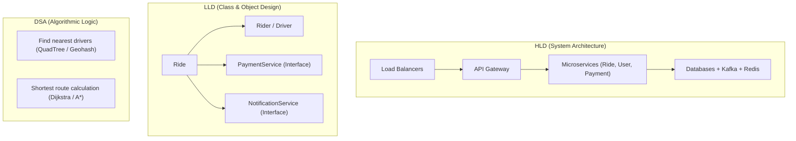
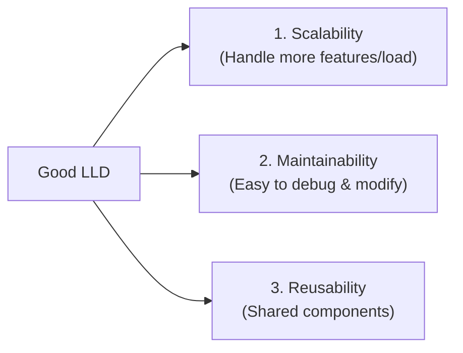
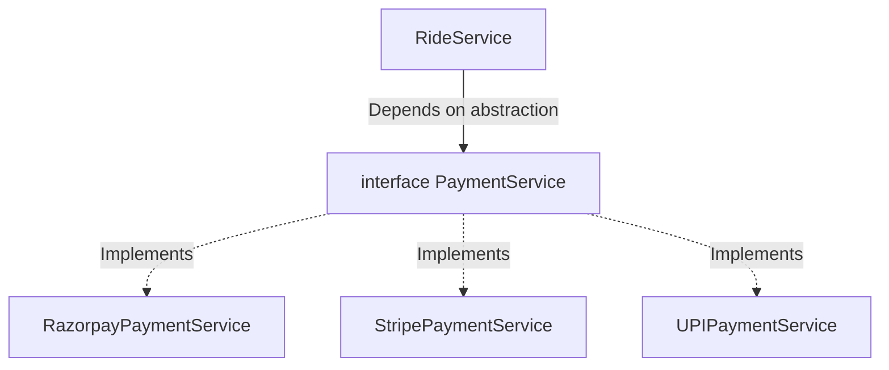
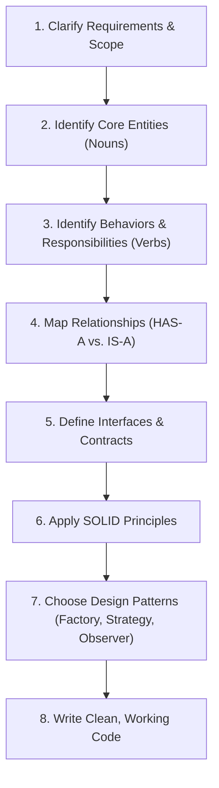
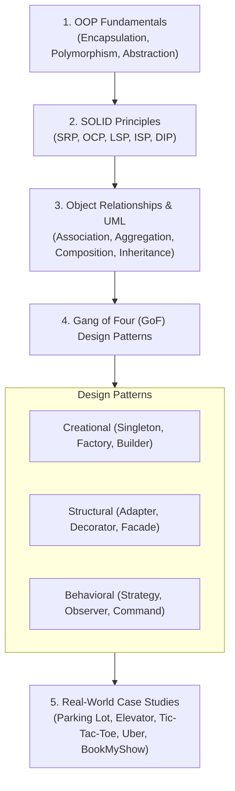

---
tags:
  - lld
  - system-design
  - oop
  - software-engineering
  - java
  - notes
---

# Low-Level Design (LLD) — Complete Introduction

> **Quick Definition:** LLD is the process of designing the **internal structure of software at the class and object level** before writing implementation code.  
> *"DSA is the brain, LLD is the skeleton, and HLD is the entire building."*

---

## 📌 Table of Contents
1. [[#1. What is LLD?|1. What is LLD?]]
2. [[#2. DSA vs. LLD vs. HLD|2. DSA vs. LLD vs. HLD]]
3. [[#3. Why Do We Need LLD? (The Monolith Class Problem)|3. Why Do We Need LLD? (The Monolith Class Problem)]]
4. [[#4. Three Core Goals of LLD|4. Three Core Goals of LLD]]
5. [[#5. Tight Coupling vs. Loose Coupling|5. Tight Coupling vs. Loose Coupling]]
6. [[#6. How LLD Appears in Java & Spring Boot|6. How LLD Appears in Java & Spring Boot]]
7. [[#7. The Step-by-Step LLD Framework (Interview & Design)|7. The Step-by-Step LLD Framework (Interview & Design)]]
8. [[#8. LLD Learning Roadmap|8. LLD Learning Roadmap]]
9. [[#9. Quick Revision Cheat Sheet|9. Quick Revision Cheat Sheet]]

---

## 1. What is LLD?

Low-Level Design (LLD) focuses on **how code is organized inside an application**. Before writing business logic, LLD answers:
- **Classes & Objects:** What classes and domain entities do we need?
- **Responsibilities:** Which class owns which behavior (Single Responsibility)?
- **Communication:** How do objects interact and pass data?
- **Abstractions:** What interfaces and abstract classes should be exposed?
- **Flexibility:** How can new features be added without breaking existing code?

### Real-World Domain: Ride-Sharing (Uber)
In a ride-sharing app, we identify entities like `User`, `Rider`, `Driver`, `Ride`, `Payment`, `Vehicle`, `Notification`, and `Location`.

**LLD decides the system mechanics:**
- Who creates a `Ride`?
- Who searches and matches a `Driver`?
- Who calculates the dynamic fare?
- Who triggers payments and notifications?
- How are these components connected without tight dependencies?

---

## 2. DSA vs. LLD vs. HLD

| Dimension | DSA (Data Structures & Algorithms) | LLD (Low-Level Design) | HLD (High-Level Design) |
| :--- | :--- | :--- | :--- |
| **Core Question** | *"How do I solve this computational problem efficiently?"* | *"How should I structure my classes, objects, and relationships?"* | *"How should the entire system architecture scale?"* |
| **Focus Area** | Time & Space Complexity ($O(N)$, $O(\log N)$) | Clean Code, Maintainability, SOLID, Design Patterns | Scalability, High Availability, Fault Tolerance |
| **Components** | Arrays, Graphs, Trees, Dynamic Programming | Classes, Interfaces, Inheritance, Composition | Microservices, Load Balancers, Kafka, DBs |
| **Building Analogy** | Engineering mechanics (elevator cable strength, traffic flow math) | Detailed blueprint (room layouts, plumbing lines, electrical wiring) | Master building architecture (total floors, zoning, power grid) |

### Concrete Example: "Build Uber"


---

## 3. Why Do We Need LLD? (The Monolith Class Problem)

Without proper design, applications decay into **God Classes** where a single service does everything:

```java
// ❌ BAD: One giant class holding all application logic
class RideService {
    void createRide() { /* ... */ }
    void findDriver() { /* ... */ }
    void calculateFare() { /* ... */ }
    void processPayment() { /* ... */ }
    void sendNotification() { /* ... */ }
    void generateInvoice() { /* ... */ }
    void cancelRide() { /* ... */ }
}
```

### Why This Fails in Production:
- **Fragile:** Changing payment logic can accidentally break ride booking.
- **Hard to Test:** Testing one small feature requires instantiating the entire universe.
- **Merge Conflicts:** Multiple developers editing the same class continuously clash.
- **No Extensibility:** Adding a new payment gateway (e.g., UPI) requires modifying and re-testing existing working code.

---

## 4. Three Core Goals of LLD



### 1. Scalability (Code Extensibility)
The structure allows the system to grow from 1,000 to 100,000,000 users and support dozens of new requirements without requiring a complete rewrite.
- *Solution:* Split monolithic services into modular interfaces (`PricingService`, `PaymentService`, `NotificationService`).

### 2. Maintainability
Code is readable, isolated, and simple to change.
- *Example:* When product asks to *"Add UPI payments"*, you simply create a new class:
  ```java
  public class UPIPayment implements PaymentMethod {
      @Override
      public void pay(double amount) { /* UPI logic */ }
  }
  ```
  Zero existing payment classes are touched or risked.

### 3. Reusability
Components are designed generically so they can be reused across different projects or features.
- *Example:* A generic `NotificationService` interface (`Email`, `SMS`, `Push`) can be reused in ride-sharing, e-commerce, or banking apps.

---

## 5. Tight Coupling vs. Loose Coupling

Coupling measures **how dependent classes are on each other**.

### ❌ Tight Coupling (Rigid & Fragile)
`RideService` depends directly on a concrete implementation:

```java
class RideService {
    // Directly tied to Razorpay — cannot switch without modifying RideService
    private RazorpayPaymentService paymentService = new RazorpayPaymentService();
}
```

### ✅ Loose Coupling (Flexible & Extensible)
`RideService` depends on an **abstraction (interface)**:

```java
interface PaymentService {
    void processPayment(Payment payment);
}

class RideService {
    private final PaymentService paymentService; // Injected via constructor

    public RideService(PaymentService paymentService) {
        this.paymentService = paymentService;
    }
}
```



> [!TIP] **The Core Rule**
> Always program to an **interface**, not an implementation. This is the foundation of the **Dependency Inversion Principle (DIP)** and the **Strategy Pattern**.

---

## 6. How LLD Appears in Java & Spring Boot

In production Java / Spring Boot applications, you apply LLD principles every day:

```
[ HTTP Request ]
       ↓
@RestController (Presentation Layer)
       ↓
@Service (Business Logic Layer) ──► Interface Abstractions (PaymentGateway, SMSClient)
       ↓
@Repository (Data Access Layer)
       ↓
[ Database ]
```

### Production Code Example
```java
@Service
public class RideServiceImpl implements RideService {

    private final PaymentGateway paymentGateway;       // Interface
    private final NotificationService notifier;        // Interface
    private final RideRepository rideRepository;

    // Dependency Injection (Inversion of Control)
    public RideServiceImpl(PaymentGateway paymentGateway, 
                           NotificationService notifier, 
                           RideRepository rideRepository) {
        this.paymentGateway = paymentGateway;
        this.notifier = notifier;
        this.rideRepository = rideRepository;
    }

    public void completeRide(Long rideId) {
        Ride ride = rideRepository.findById(rideId).orElseThrow();
        paymentGateway.charge(ride.getFare());
        notifier.send(ride.getRider().getPhone(), "Ride completed!");
    }
}
```

**LLD concepts at work here:** Abstraction, Polymorphism, Loose Coupling, Dependency Injection, and Separation of Concerns.

---

## 7. The Step-by-Step LLD Framework (Interview & Design)

When designing any LLD problem (e.g., Parking Lot, Tic-Tac-Toe, BookMyShow), follow this structured 8-step framework:



### Case Study Walkthrough: Parking Lot
1. **Requirements:** Multi-floor parking, support different vehicle types (Car, Bike, Truck), automated ticketing, fee calculation on exit.
2. **Core Entities:** `ParkingLot`, `ParkingFloor`, `ParkingSpot`, `Vehicle`, `Ticket`, `Payment`.
3. **Relationships:**
   - `ParkingLot` **HAS-A** list of `ParkingFloor`
   - `ParkingFloor` **HAS-A** list of `ParkingSpot`
   - `ParkingSpot` accommodates a `Vehicle`
4. **Behaviors:** `parkVehicle()`, `vacateSpot()`, `calculateFee()`, `processPayment()`.
5. **Design Patterns Applied:**
   - **Factory Pattern:** To create spots based on vehicle type.
   - **Strategy Pattern:** For dynamic fee calculation (Hourly vs. Vehicle-based).

---

## 8. LLD Learning Roadmap

To master LLD, follow this progression from foundations to case studies:



---

## 9. Quick Revision Cheat Sheet

- **What is LLD?** Designing classes, objects, relationships, and responsibilities before writing code.
- **DSA vs. LLD vs. HLD:**
  - **DSA:** Algorithmic efficiency ($O(N)$ execution).
  - **LLD:** Code structure, modularity, and maintainability.
  - **HLD:** Infrastructure, servers, databases, and microservices.
- **The 3 Pillars of Good LLD:**
  1. *Scalability* (adding features without rewriting existing code).
  2. *Maintainability* (easy to read, debug, and test).
  3. *Reusability* (modular components used across features).
- **Golden Architectural Principle:**
  $$\text{High Cohesion} + \text{Low Coupling}$$
  - **High Cohesion:** A class does only one focused job.
  - **Low Coupling:** Classes depend on abstractions (interfaces), not concrete implementations.
- **Mindset for Interviews:**
  > *"Don't just ask 'How do I make this work?' Ask 'How do I structure this so future changes won't break existing code?'"*
