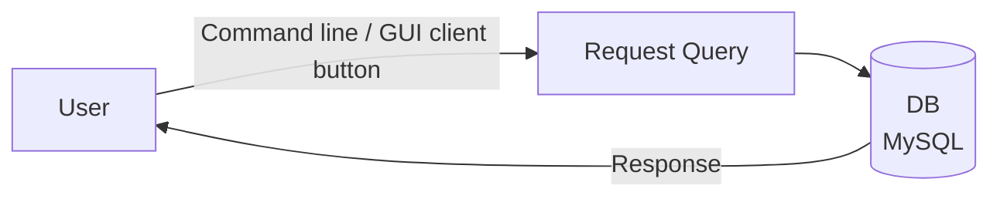
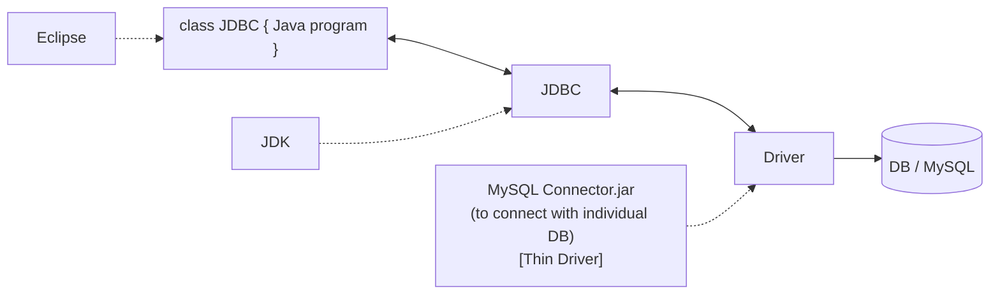

---

# JDBC Notes

**API** is a set of standard software functions (features) an application can use.

## Removed JDBC Driver Types (as of Java 8, practically)

In Java 8, the following JDBC driver types were removed / are no longer practically used:

1. JDBC–ODBC Bridge Driver
2. Native-API Driver

The driver types still used (**fully Java drivers**):

3. Network Protocol Driver
4. Thin Driver

## JDBC = Java Database Connectivity

- JDBC is a Java **API** (Application Programming Interface) to connect and perform operations (insert, delete, update, select, etc.) with a database.
- JDBC API uses a **JDBC driver** to connect with the DB.

## JDBC Working (Manual Flow)

_(This is done manually)_

## JDBC Architecture (Using a Java Program)

**Notes on the diagram:**

- `Eclipse` → used to run the Java program
- `JDK` → required for JDBC
- `MySQL Connector.jar` → the driver used to connect to the individual DB (this is the **Thin Driver**)