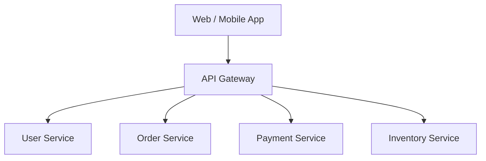
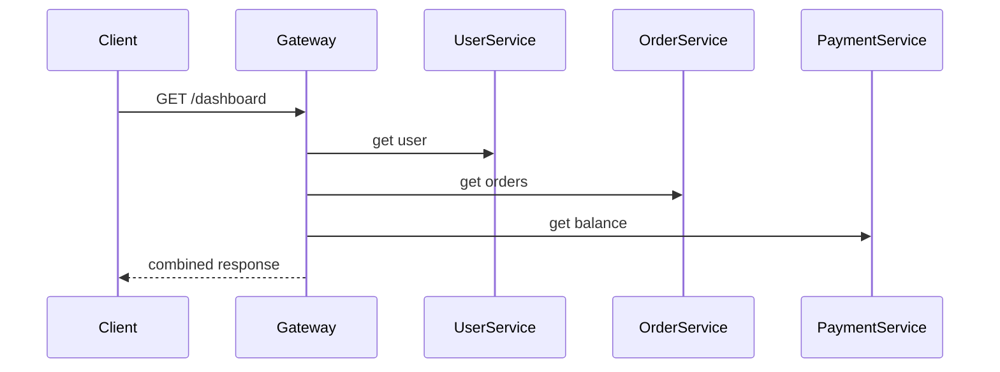
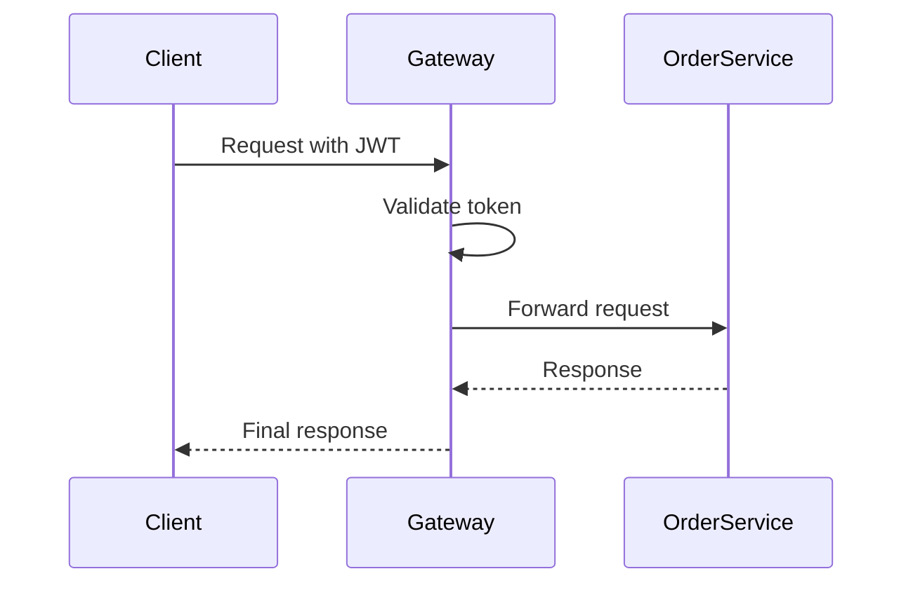
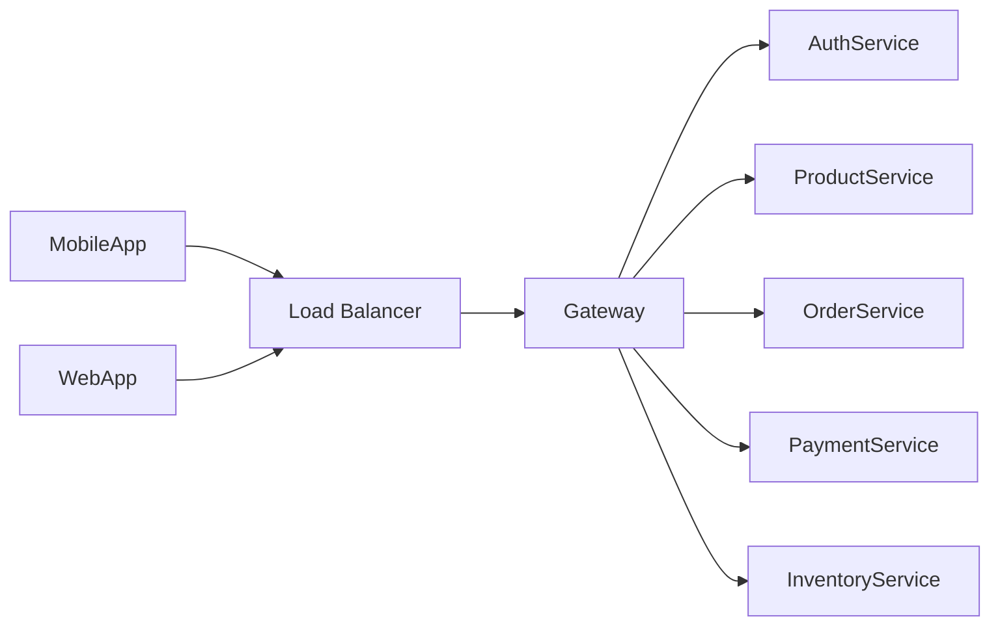

---

# 1. What is API Gateway?

**API Gateway = Single entry point for all clients**

Instead of:

```
Frontend → User Service  
Frontend → Order Service  
Frontend → Payment Service  
Frontend → Inventory Service  
```

We do:

```
Frontend → API Gateway → All Services
```

So **client talks only to API Gateway**, not directly to microservices.

---

# 2. Why do we need API Gateway?

Without API Gateway:

Problems:

1. Client must know **all service URLs**
    
2. Security must be implemented in **every service**
    
3. Too many network calls from frontend
    
4. If service changes → frontend breaks
    

---

With API Gateway:

Benefits:

|Feature|Meaning|
|---|---|
|Single Entry Point|Only one URL for client|
|Security|JWT, OAuth, API Key at one place|
|Routing|`/users/**` → user-service|
|Load balancing|Distribute traffic|
|Aggregation|Combine multiple service calls|
|Rate limiting|Prevent abuse|
|Logging|Central logs|
|Monitoring|Central metrics|

---

# 3. Basic Flow (Step by Step)

1. Client sends request
    
    ```
    GET /api/orders/123
    ```
    
2. API Gateway:
    
    - Validates JWT
        
    - Finds route
        
    - Forwards to order-service
        
3. order-service responds
    
4. Gateway sends response to client
    

Client never knows order-service exists.

---

# 4. Diagram (Core Architecture)



---

# 5. API Gateway Responsibilities (Very Important)

## 1. Routing

Map paths to services.

Example:

```
/api/users/**      → user-service
/api/orders/**     → order-service
/api/payments/**   → payment-service
```

---

## 2. Authentication & Authorization

Instead of doing this in every service:

```
User Service → JWT check  
Order Service → JWT check  
Payment Service → JWT check
```

Do it once:

```
API Gateway → JWT check
```

Then pass user info in header.

---

## 3. Aggregation

One client request → multiple service calls.

Example:

```
GET /api/dashboard
```

Gateway internally calls:

- user-service
    
- order-service
    
- payment-service
    

Then combines response.

### Diagram



---

## 4. Rate Limiting

Protect system from overload.

Example:

```
Max 100 requests per minute per user
```

If exceeded:

```
429 Too Many Requests
```

---

## 5. Circuit Breaker

If a service is down:

Gateway:

- Stops sending traffic
    
- Returns fallback response
    

This avoids **system collapse**.

---

# 6. API Gateway vs Service Discovery

| API Gateway                   | Service Discovery         |
| ----------------------------- | ------------------------- |
| For clients                   | For internal services     |
| Entry point                   | Finding service locations |
| Handles security              | Handles registration      |
| Example: Spring Cloud Gateway | Example: Eureka           |
|                               |                           |

They work **together**, not replace each other.

---

# 7. Popular API Gateway Tools

### Open Source

- Spring Cloud Gateway (Java)
    
- Netflix Zuul (old)
    
- Kong
    
- Traefik
    

### Cloud Managed

- AWS API Gateway
    
- Azure API Management
    
- GCP API Gateway
    

---

# 8. Spring Cloud Gateway (Java Example)

Since you are Java dev, this is important.

### application.yml

```yaml
spring:
  cloud:
    gateway:
      routes:
        - id: user-service
          uri: http://localhost:8081
          predicates:
            - Path=/api/users/**
        
        - id: order-service
          uri: http://localhost:8082
          predicates:
            - Path=/api/orders/**
```

Now:

```
http://localhost:8080/api/users/1
→ forwarded to
http://localhost:8081/api/users/1
```

---

# 9. Authentication Flow with Gateway (JWT)



Order service trusts gateway.

---

# 10. Common Interview Questions

### Q1: Can we avoid API Gateway?

Yes, but **not recommended** for large systems.

### Q2: Is API Gateway a bottleneck?

Yes, if:

- Not scaled
    
- No load balancer
    

Solution:

- Deploy multiple gateway instances
    
- Put behind Load Balancer
    

### Q3: Is API Gateway a microservice?

Technically yes, but it should:

- Be thin
    
- Have no business logic
    

---

# 11. Anti-Patterns (Very Important)

❌ Putting business logic in gateway  
❌ Heavy DB calls in gateway  
❌ Calling services directly from frontend  
❌ One gateway per service

Gateway should only:

- Route
    
- Secure
    
- Aggregate
    
- Monitor
    

---

# 12. When API Gateway is MUST

You definitely need it if:

- Mobile + Web clients
    
- Many microservices
    
- JWT / OAuth
    
- Rate limiting
    
- Versioning (`/v1`, `/v2`)
    

---

# 13. Real Industry Setup (E-commerce)



---

