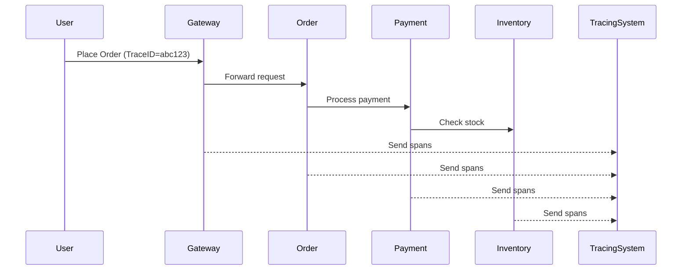
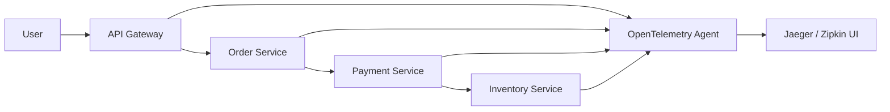

---

# 1️⃣ What is Distributed Tracing?

**Distributed Tracing** means:

> Tracking **one user request** as it travels through **multiple microservices**.

In microservices, **one API call** usually touches many services.

Example:

```
User → API Gateway → Order Service → Payment Service → Inventory Service
```

Distributed tracing answers:

- Where did request go?
    
- Which service is slow?
    
- Where did error happen?
    

---

# 2️⃣ Problem Without Distributed Tracing

### Real-world problem

User says:

> "My order is taking 10 seconds"

You check logs:

- Order service log → looks fine
    
- Payment service log → looks fine
    
- Inventory service log → looks fine
    

But:

- You **don't know full journey**
    
- You **don't know exact bottleneck**
    

Each service has **separate logs** → no connection.

---

# 3️⃣ Core Concepts (Very Important)

These 3 words are asked in interviews:

|Term|Meaning|
|---|---|
|**Trace**|Full journey of one request|
|**Span**|One step inside trace|
|**Trace ID**|Unique ID for whole request|
|**Span ID**|Unique ID for each step|

---

### Example Trace

User places order:

Trace ID: `abc123`

|Service|Span|
|---|---|
|API Gateway|Span 1|
|Order Service|Span 2|
|Payment Service|Span 3|
|Inventory Service|Span 4|

All spans share **same Trace ID**.

---

# 4️⃣ Mermaid Diagram (Flow)



---

# 5️⃣ How Distributed Tracing Works Internally

### Step by step:

1. First service creates **Trace ID**
    
2. Passes Trace ID in headers:
    
    ```
    X-Trace-Id: abc123
    ```
    
3. Every service:
    
    - Creates its own Span
        
    - Sends data to tracing server
        
4. Tracing server builds **full map**
    

---

# 6️⃣ What Data is Collected in a Span?

Each span usually contains:

- Service name
    
- API name
    
- Start time
    
- End time
    
- Duration
    
- Status (SUCCESS / ERROR)
    
- Error message (if any)
    

---

# 7️⃣ Popular Distributed Tracing Tools

|Tool|Company|
|---|---|
|**Zipkin**|Twitter|
|**Jaeger**|Uber|
|**OpenTelemetry**|CNCF (standard)|
|**AWS X-Ray**|Amazon|
|**Datadog APM**|Datadog|
|**New Relic**|New Relic|

Most modern systems use:

> **OpenTelemetry + Jaeger/Zipkin**

---

# 8️⃣ Real Industrial Architecture



---

# 9️⃣ What Problems It Solves

| Problem            | Solved by               |
| ------------------ | ----------------------- |
| Slow API           | See exact slow service  |
| Random failures    | See failing span        |
| Timeout            | See which hop timed out |
| Performance tuning | Compare latency         |

---

# 🔟 Logs vs Metrics vs Tracing (Interview Gold)

| Feature                 | Logs | Metrics | Tracing |
| ----------------------- | ---- | ------- | ------- |
| Single request tracking | ❌    | ❌       | ✅       |
| Aggregated numbers      | ❌    | ✅       | ❌       |
| Root cause analysis     | ❌    | ❌       | ✅       |

They work best together:

> **Observability = Logs + Metrics + Traces**

---

# 11️⃣ Simple Real-Life Example (Courier)

Think like courier delivery:

- Trace = entire delivery journey
    
- Span = each city checkpoint
    
- Trace ID = tracking number
    

If parcel is late:  
You check:

> "Stuck in Pune hub for 3 hours"

Same idea in microservices.

---

# 12️⃣ Common Interview Questions

### Q1: Why distributed tracing is needed?

Because one request touches **multiple services** and logs alone cannot show full picture.

---

### Q2: Difference between span and trace?

- Trace = whole journey
    
- Span = one step
    

---

### Q3: How trace id is passed?

Using **HTTP headers** or **message headers (Kafka/RabbitMQ)**.

---

### Q4: Does tracing impact performance?

Yes slightly (1–3%), but acceptable in production.


---

# Final One-Line Summary

> **Distributed tracing is the system that tracks a single request across multiple microservices using Trace IDs and Spans, giving full visibility into performance and failures.**

---

If you want, next I can explain:

- Distributed tracing with **Kafka / async flow**
    
- Or practical **Spring Boot + OpenTelemetry flow (conceptually)**  
    (no heavy code, just architecture like you prefer)