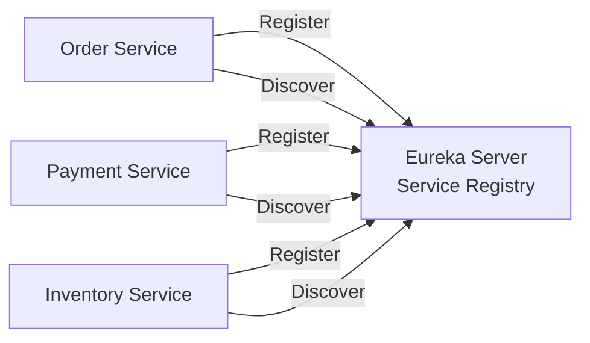
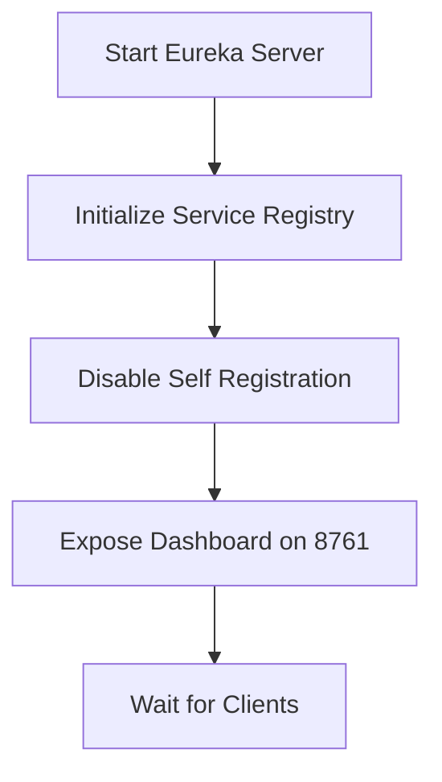
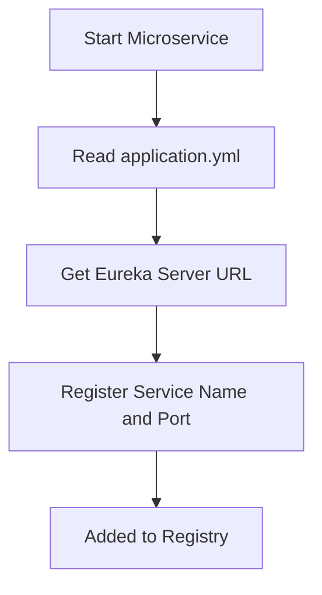
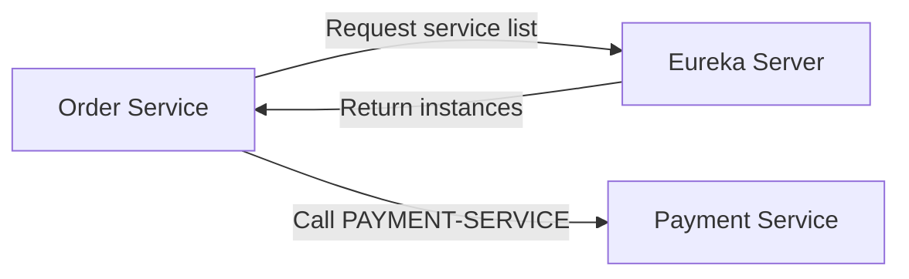
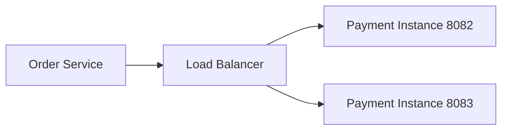
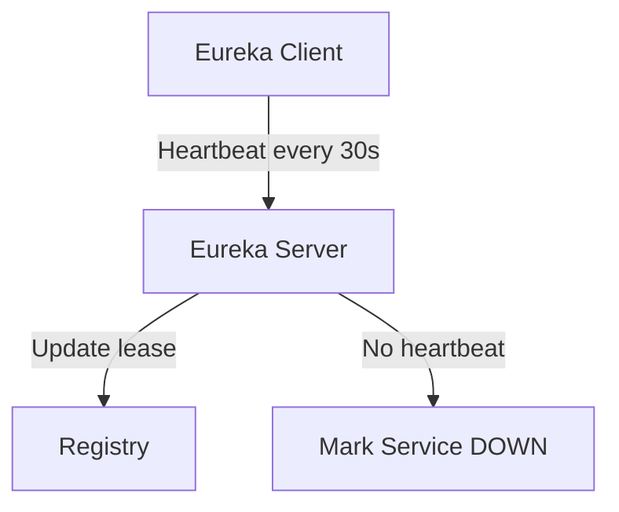
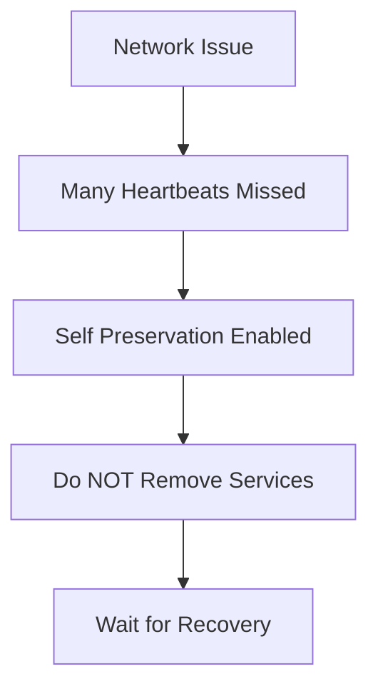

---

# 📌 What is Eureka?

**Eureka** is a **Service Discovery tool** used in **Microservices**.

👉 It helps microservices **find each other automatically**  
👉 No need to hardcode IP address or port

Originally created by **Netflix Eureka**  
Used in Spring Boot via **Spring Cloud Netflix**

---

## 🔍 Problem Eureka Solves (Real-World Example)

### ❌ Without Eureka

Imagine:

- Order Service runs on `localhost:8081`
    
- Payment Service runs on `localhost:8092`
    

Order Service calls:

```text
http://localhost:8092/pay
```

🚨 Problems:

- IP/Port changes → app breaks
    
- Multiple instances → no idea which one to call
    
- Scaling is very hard
    

---

### ✅ With Eureka

- All services **register themselves**
    
- Services call **service name**, not IP
    

```text
http://PAYMENT-SERVICE/pay
```

✔ Dynamic  
✔ Scalable  
✔ Cloud-friendly

---

## 🧩 Overall Eureka Architecture (Server + Clients)



---

### Components

1. **Eureka Server**
    
2. **Eureka Client**
    

---

## 🧠 Key Terms (Must Know)

|Term|Meaning|
|---|---|
|Service Registry|Database of all services|
|Service Discovery|Finding services dynamically|
|Heartbeat|Client tells server “I am alive”|
|Self-Registration|Client registers itself|
|Self-Preservation|Eureka avoids mass deletion|

---

# 🟦 Eureka Server (Discovery Server)

## 🔹 What is Eureka Server?

- Central place where **all services register**
    
- Maintains **service name → instance info**
    

---

## 🔹 Responsibilities

✔ Accept service registration  
✔ Store IP, port, status  
✔ Provide service list to clients  
✔ Health monitoring

---

## 🧩 How Eureka Server Works



1. Server starts
    
2. Clients register
    
3. Clients send heartbeat every **30 sec**
    
4. Server removes dead services (if needed)
    

---

## 🛠 Create Eureka Server (Spring Boot)

### 1️⃣ Dependency (`pom.xml`)

```xml
<dependency>
    <groupId>org.springframework.cloud</groupId>
    <artifactId>spring-cloud-starter-netflix-eureka-server</artifactId>
</dependency>
```

---

### 2️⃣ Main Class

```java
@SpringBootApplication
@EnableEurekaServer
public class EurekaServerApplication {

    public static void main(String[] args) {
        SpringApplication.run(EurekaServerApplication.class, args);
    }
}
```

---

### 3️⃣ `application.yml`

```yaml
server:
  port: 8761

spring:
  application:
    name: eureka-server

eureka:
  client:
    register-with-eureka: false
    fetch-registry: false
```

🔴 Why `false`?

- Server should not register itself
    

---

### 4️⃣ Access Dashboard

```
http://localhost:8761
```

You will see:  
✔ Registered services  
✔ Instances  
✔ Status

---

# 🟩 Eureka Client

## 🔹 What is Eureka Client?

Any **microservice** that:

- Registers itself
    
- Discovers other services
    

Examples:

- Order Service
    
- Payment Service
    
- Inventory Service
    

---

## 🧩 How Eureka Client Works



1. Client starts
    
2. Registers with Eureka Server
    
3. Sends heartbeat
    
4. Fetches registry
    
5. Calls other services by **service name**
    

---

## 🛠 Create Eureka Client (Spring Boot)

### 1️⃣ Dependency

```xml
<dependency>
    <groupId>org.springframework.cloud</groupId>
    <artifactId>spring-cloud-starter-netflix-eureka-client</artifactId>
</dependency>
```

---

### 2️⃣ Main Class

```java
@SpringBootApplication
@EnableEurekaClient
public class OrderServiceApplication {

    public static void main(String[] args) {
        SpringApplication.run(OrderServiceApplication.class, args);
    }
}
```

---

### 3️⃣ `application.yml`

```yaml
server:
  port: 8081

spring:
  application:
    name: ORDER-SERVICE

eureka:
  client:
    service-url:
      defaultZone: http://localhost:8761/eureka
```

📌 `name` = **Service ID**

---

## 🔁 Service-to-Service Call (Using Service Name)

### ❌ Old Way

```java
restTemplate.getForObject("http://localhost:8092/pay", String.class);
```

---

### ✅ Eureka Way

```java
restTemplate.getForObject("http://PAYMENT-SERVICE/pay", String.class);
```

✔ No IP  
✔ Load balanced  
✔ Scalable

---

## 🧩 Service Discovery Flow



---

## ⚖ Load Balancing with Eureka

If PAYMENT-SERVICE has:

- Instance 1 → 8082
    
- Instance 2 → 8083
    

Calls are **distributed automatically**  
(Usually via **Spring Cloud LoadBalancer**. Spring Eureka client and server internally use **Spring Cloud LoadBalancer**)



---

## 💓 Heartbeat & Health Check

|Feature|Value|
|---|---|
|Heartbeat Interval|30 sec|
|Lease Expiry|90 sec|
|Health URL|`/actuator/health`|

If heartbeat stops → service marked **DOWN**



---

## 🛡 Self-Preservation Mode

### What is it?

If many services go down suddenly, Eureka **does NOT delete them immediately**

👉 Protects system during:

- Network issue
    
- Temporary outage
    



---

## ❓ Is Eureka Mandatory Today?

⚠️ Important Interview Point

|Scenario|Use Eureka?|
|---|---|
|Small project|Optional|
|Kubernetes|❌ (K8s has built-in discovery)|
|Legacy Microservices|✅|
|Spring Cloud Project|✅|

---

## 🧠 Eureka vs Kubernetes Discovery (Quick)

|Eureka|Kubernetes|
|---|---|
|App-level|Infra-level|
|Spring based|Platform based|
|Manual setup|Built-in|

---
