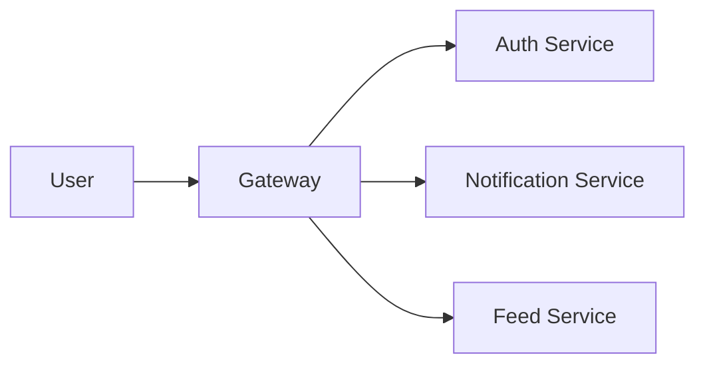
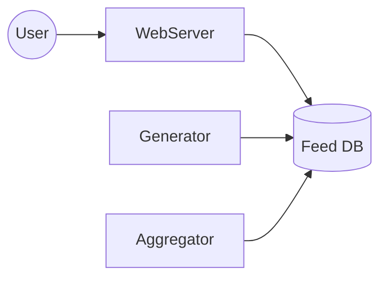
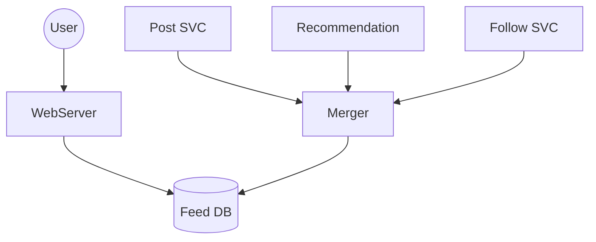

---

# System Design: Introduction & Strategy

## 1. What is System Design?

System Design is the process of planning and creating the structure of a software system. The goal is to build a system that:

- **Works Efficiently:** Performs well under load.
    
- **Scales:** Handles many users and data.
    
- **Maintainable:** Easy to fix and update with minimal cost.
    
- **Reliable:** Keeps running even when errors occur.
    

> **Mindset:** Take your time. Go slowly. Take notes and revise every day. System design is not about memorizing; it is about **solving problems**.

---

## 2. How to Approach a System Design Interview

Don't get overwhelmed by a big problem statement. Use this step-by-step approach:

1. **Take Baby Steps:** Progress slowly but steadily.
    
2. **Think Practically:** System design is real-world logic, not just theory.
    
3. **Go Structured:** Don't jump straight to drawing. Understand the problem statement first.
    
4. **Break It Down (Crucial):** Divide the big system into smaller **Components**.
    

---

## 3. The Strategy: "Divide and Conquer"

When the problem statement is too big (e.g., "Design Facebook"), break it into high-level features/components.

Example: Designing Facebook

Instead of designing "Facebook" all at once, design these individual parts:

- **Auth Service:** Handling login/signup.
    
- **Notification Service:** Sending alerts to users.
    
- **Feed Service:** Showing posts to users.
    

### High-Level Diagram

---

## 4. Dissecting Components (Deep Dive)

Once you have the high-level components, pick one (e.g., the **Feed Service**) and "crack it open" (dissect it).

### A. The Basic Flow

1. **User** sends a request.
    
2. **Web Server** receives the request.
    
3. **Database (DB)** stores or retrieves the data.
      
4.  If you don't know **Aggregator** don't draw it. 

### B. The Advanced Flow (Aggregator Pattern)

For complex features like a Feed, a simple DB read isn't enough. You need:

- **Generator:** Creates the content (e.g., new posts).
    
- **Aggregator:** Collects posts from friends/groups.
    

Code snippet

---

## 5. Technical Checklist for Each Component

For every single component you design, you must figure out these technical details:

1. **Database & Caching:**
    
    - Where do we store data? (SQL vs NoSQL).
        
    - How do we make it fast? (Redis/Memcached).
        
2. **Scaling:**
    
    - Can this component handle 1 million users?
        
    - _Solution:_ Horizontal scaling (adding more servers).
        
3. **Fault Tolerance:**
    
    - What happens if this component crashes?
        
    - _Solution:_ Backups and replicas.
        
4. **Async Processing (Delegation):**
    
    - Don't make the user wait for heavy tasks (like processing a video upload).
        
    - _Solution:_ Use a Message Queue (e.g., Kafka/RabbitMQ) to handle tasks in the background.
        
5. **Communication:**
    
    - How do components talk to each other? (REST API, gRPC, or Message Queues).
        

---

## 6. Principles of Good Design

How do you know if your design is good? Check these rules:

- **Single Responsibility:** Each component should do **one thing** only. (e.g., The "Payment Service" shouldn't handle "User Profile Pictures").
    
- **Isolation:**
    
    - Is the component scalable on its own?
        
    - Is it fault-tolerant on its own?
        
    - **Availability:** If one component fails (e.g., Notifications), the rest of the system (e.g., Login) should still work.
        

---
