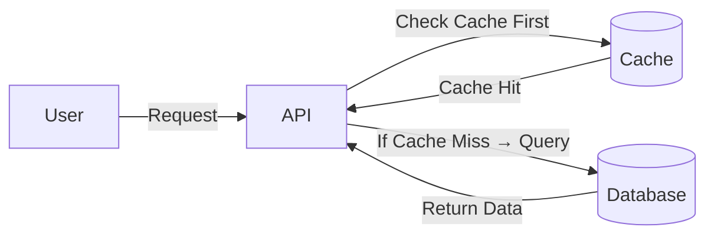

---

### 1\. What is Caching?

In simple terms, a **Cache** is anything that helps you avoid performing an "expensive" operation. When we talk about "expensive" in computing, we usually mean operations that take a lot of time or resources, such as:

  * **Network I/O:** Calling a remote server.
  * **Disk I/O:** Reading data from a hard drive.
  * **Heavy Computation:** Complex calculations.

**Common examples of operations we try to cache:**

1.  **API Calls:** Fetching user profile information (Caching this improves performance significantly).
2.  **File Reading:** Reading a specific line from a large file repeatedly.
3.  **Database Joins:** Doing complex multiple-table joins in a database.

### 2\. The Core Concept

The main idea is to store **frequently accessed data** in a **temporary storage location** (the cache).

  * Fetching data directly from the main Database is often slow because it involves expensive queries or disk usage.
  * Therefore, we keep a copy of that data in a "Cache" (a place that is faster to access).
  * When a request comes in, we check the Cache **first**. If the data is there, we don't need to bother the main database.

#### Caching Architecture Diagram

### 3\. Key Characteristics of Caching

  * **Speed vs. Cost:** Caches are much **faster** than traditional databases, but they are also more **expensive** (in terms of hardware costs, like RAM).
  * **Selective Storage:** Because storage is expensive, we **do not cache all the data**. We only store a subset of data—specifically, the data that is **most likely to be accessed**.
  * **Technology:** Common technologies used for caching are **Redis** and **Memcached**.

### 4\. What is a Cache, really?

  * **Not just RAM:** While we often think of caches as RAM (Random Access Memory), a cache is not restricted to RAM-based storage.
  * **Definition:** *Any* storage that is  "nearer" to the user and helps you avoid an expensive task is considered a cache for you.
  * **The Simplest Form:** At their core, most caches are just **"Glorified Hash Tables."** They store data as Key-Value pairs for quick lookups.

### 5\. Real-World Examples

Here is how caching is used in industry:

1.  **Google News:**
      * *Scenario:* People mostly read the latest news.
      * *Strategy:* The most recent news articles are more likely to be accessed, so they are served from the cache to handle the high traffic.
2.  **Authentication Tokens:**
      * *Scenario:* Every time you click something on a website, the server checks if you are logged in.
      * *Strategy:* Checking the database for every single click is too heavy. Auth tokens are stored in the cache to quickly verify users on every request.
3.  **Live Streaming (e.g., YouTube/Twitch):**
      * *Scenario:* Thousands of people are watching the same moment of a video.
      * *Strategy:* The last 10 minutes of a live stream are cached on a **CDN** (Content Delivery Network) because that is the segment accessed the most.

-----

