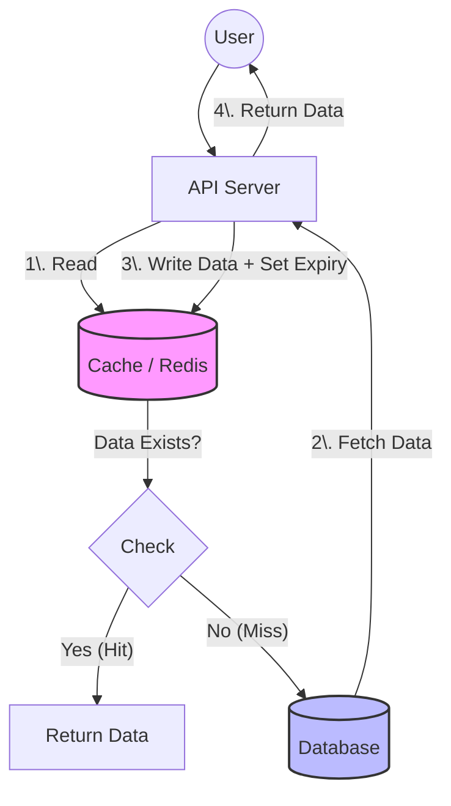
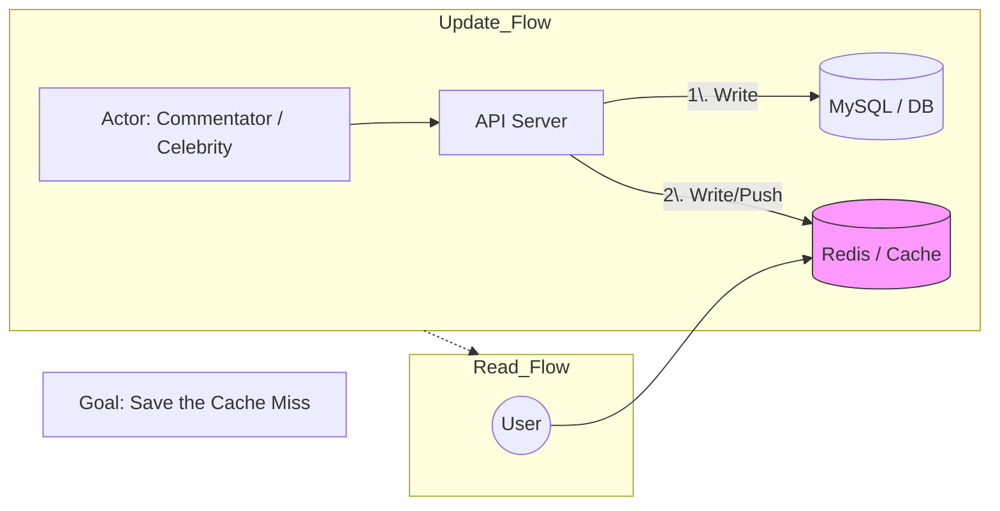
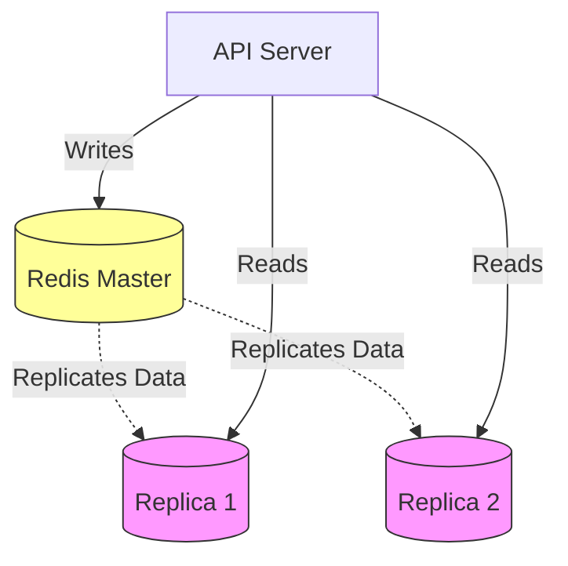
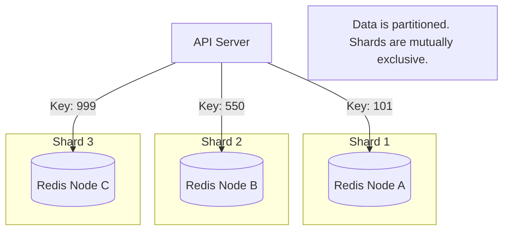

## 1. Populating the Cache

The cache sits between the **API Server** and the **Database**. Its primary goal is to reduce latency and database load by storing frequently accessed data in memory (e.g., Redis).

### Strategy A: Lazy Population (Lazy Loading / Cache-Aside)

This is the most popular strategy. Data is only loaded into the cache when it is requested.

**The Workflow:**

1. The API receives a read request.
    
2. It checks the **Cache** first.
    
    - **If data exists (Cache Hit):** Return data immediately.
        
    - **If data does NOT exist (Cache Miss):**
        
        1. Fetch data from the **Database** (or perform the heavy computation).
            
        2. **Persist** the result in the Cache.
            
        3. Return the data to the user.
            
3. _Note:_ Whenever we set something in the cache, we typically set an **expiry (TTL)** to ensure data eventually refreshes.
    

Example Use Case: Caching Blogs

Fetching a blog post often involves complex SQL queries with multiple joins, which is expensive.

- **Flow:** When a user requests a blog, we fetch it from the DB once, cache it in Redis, and serve all subsequent requests from Redis.
    

Code snippet

---

### Strategy B: Eager Population (Write-Through / Proactive)

In this strategy, the cache is updated at the same time the database is updated. This ensures the cache always has the latest data, avoiding the "cache miss" penalty for the first reader.

#### Scenario 1: Sync Updates (Live Data)

Writes go to **both** the database and the cache in the same request call.

- **Example: Live Cricket Score**
    
    - Thousands of users are watching the score (high read volume).
        
    - Since you know you will be serving this data immediately and frequently, it makes no sense to wait for a cache miss.
        
    - **Action:** When the commentator updates the score, the API updates the DB _and_ the Cache simultaneously.
        

#### Scenario 2: Proactive Pushing (Anticipating Need)

You push data to the cache because you anticipate a surge in traffic for that specific data.

- **Example: Celebrity Tweets**
    
    - When a celebrity with 100,000+ followers posts something, thousands of users will request it instantly.
        
    - **Action:** When the post is created, the system **proactively pushes** it to the cache immediately, saving the system from a massive spike of cache misses.
        

Code snippet

---
## Comparison: Sync Updates vs. Proactive Pushing

| Feature               | Scenario 1: Sync Updates (Live Data)            | Scenario 2: Proactive Pushing (Anticipating Need)      |
| :-------------------- | :---------------------------------------------- | :----------------------------------------------------- |
| **Concept**           | **The Mirror Effect** (Reactive)                | **The Butler Effect** (Predictive)                     |
| **Core Philosophy**   | React to a change that *just happened*.         | Predict a need that *will happen* soon.                |
| **Trigger**           | **Database Event** (Insert, Update, Delete).    | **Prediction/Context** (Location, time, user history). |
| **Question Answered** | "What is the current state?"                    | "What will the user do next?"                          |
| **Main Goal**         | **Consistency** & Data Integrity.               | **Zero Latency** & User Experience (UX).               |
| **Payload Size**      | **Small** (Tiny deltas/changes).                | **Large** (Files, assets, map chunks).                 |
| **Risk**              | **Low** (User definitely needs this data).      | **High** (Bandwidth wasted if prediction is wrong).    |
| **Common Use Cases**  | Chat apps, Stock tickers, Uber driver location. | Video buffering, Netflix "Next Episode", Map loading.  |

---

## 2. Scaling the Cache

Since a cache (like Redis) is essentially a database that stores data in memory, the scaling techniques are very similar to regular database scaling.

### A. Vertical Scaling

- **Concept:** Make your cache node "bigger."
    
- **Action:** Upgrade the server to have **more RAM** and CPU to handle more data and load.
    

### B. Horizontal Scaling: Replication (Scaling Reads)

- **Concept:** Distribute the read load across multiple nodes.
    
- **Architecture:** Master-Replica architecture.
    
    - **Master:** Handles writes (and replicates data to replicas).
        
    - **Replicas:** Handle read traffic.
        
- **Benefit:** Allows you to handle significantly more concurrent users reading data.
    

Code snippet

### C. Horizontal Scaling: Sharding (Scaling Writes/Storage)

- **Concept:** Partition data across multiple mutually exclusive nodes (Shards).
    
- **Architecture:**
    
    - Data is split (e.g., User IDs 1-1000 go to Shard A, 1001-2000 go to Shard B).
        
    - Each shard manages a subset of the total data.
        
    - _Note:_ Each shard can have its own replicas for reliability.
        
- **Benefit:** infinite scaling of storage size and write throughput.
    

Code snippet

