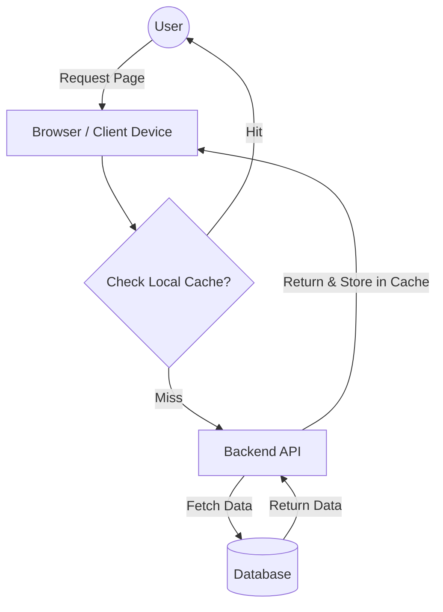
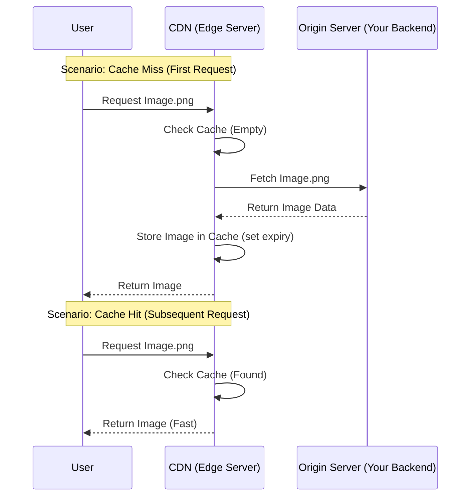
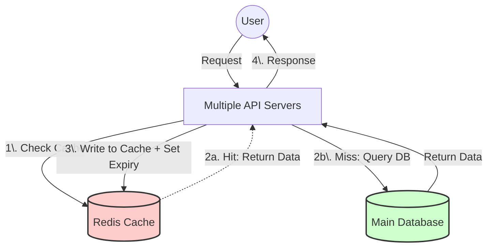
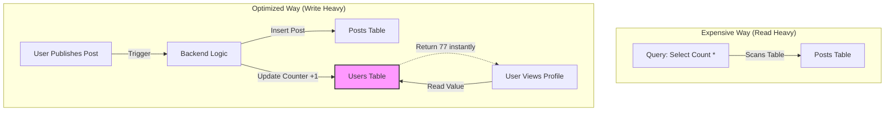

-----

Caching is not limited to a single tool like Redis; it is a fundamental concept applicable at every layer of your infrastructure. The primary goal is to reduce latency and load on backend systems. However, **"Too much caching is bad"**—it introduces complexity regarding data consistency (stale data) and cache invalidation.

### **1. Client-Side Caching**

This is the "first line of defense." It involves storing frequently accessed data directly on the user's device (Browser, Mobile App).

  * **What to cache:** "Near constant" data that doesn't change often, such as images, CSS/JS bundles, logos, and static user information.
  * **Mechanism:** The browser stores the file locally. When the application needs it, it loads it from the disk/memory rather than making a network request.
  * **Invalidation:** Controlled via "Time to Live" (TTL) or Expiry headers.
  * **Benefit:** Massive performance boost because no network request is sent to the backend.
  * **Trade-off:** The user might see stale data until the cache expires.

**Visual Flow: Client-Side Caching**

-----

### **2. Content Delivery Networks (CDN)**

CDNs are a network of servers distributed geographically across the globe. They are primarily used for static assets (images, videos, audio) and live streaming.

  * **Geography Matters:** If a user in the US requests an image hosted on a server in India, the latency is high. A CDN serves the image from a US-based server.
  * **Lazy Cache Population:** CDNs often use a "Pull" method. They don't have the file initially.
    1.  User requests file from CDN.
    2.  CDN checks its storage. If missing (Miss)...
    3.  CDN requests it from the **Origin Server** (your main backend).
    4.  CDN caches the response.
    5.  CDN serves the user.
    6.  Next user gets the cached version immediately (Hit).
  * **Expiry:** Just like local cache, CDN data must have an expiry (TTL) so it is eventually deleted and refreshed.

**Visual Flow: CDN Lazy Loading**

-----

### **3. Remote / Centralized Caching (Redis)**

This is the most common backend caching pattern. A "Remote Cache" (like Redis or Memcached) acts as a centralized short-term memory for your application.

  * **Characteristics:**
      * **In-Memory:** Stores data in RAM, making it incredibly fast but more expensive than disk storage.
      * **Shared:** Multiple API servers access the same Redis instance.
  * **Usage:** Used to store frequently accessed data (e.g., user sessions, active feeds).
  * **Critical Rules:**
      * **Always set an Expiration:** Since RAM is limited, keys must expire to prevent memory leaks (filling up the cache with unused data).
      * **Size:** The cache size is relatively small compared to your main database.

**Visual Flow: Remote Cache Architecture**

-----

### **4. Database Caching (Denormalization)**

Sometimes, "caching" is just structuring your database to avoid expensive computations. This is often called **Denormalization** or storing **Aggregates**.

  * **The Problem:** Running `SELECT count(*) FROM posts WHERE user_id = 123` is expensive. It scans the table every time a user views their profile.
  * **The Solution:** Store a `total_posts` column directly in the `Users` table.
  * **Mechanism:**
      * Instead of counting rows on *Read*, you update the counter on *Write*.
      * When a new post is created: `UPDATE users SET total_posts = total_posts + 1 WHERE id = 123`.
  * **Benefit:** The read query becomes `SELECT total_posts FROM users`, which is instant (O(1) access).

**Visual Flow: Database Counter Optimization**

-----

### **Summary of Caching Locations**

| Level | Technology Example | What is cached? | Primary Goal |
| :--- | :--- | :--- | :--- |
| **Client** | Browser, Mobile Storage | Static assets, User settings | Eliminate network calls entirely. |
| **Network** | CDN (Cloudflare, AWS CloudFront) | Images, Video, CSS, JS | Reduce latency by serving data geographically closer. |
| **Backend** | Redis, Memcached | Sessions, DB query results | Reduce load on the primary database; speed up compute. |
| **Database** | Denormalized Columns | Aggregates (Counts, Sums) | Avoid expensive CPU computations during reads. |

 **Cache Eviction Policies** 
 LRU or LFU