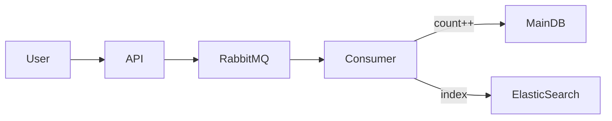
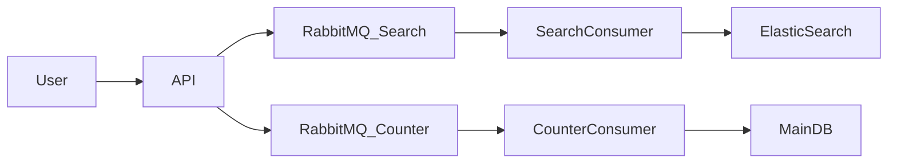
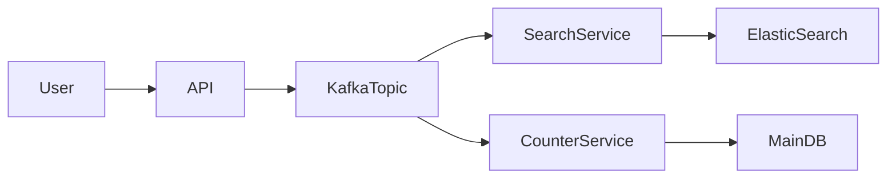
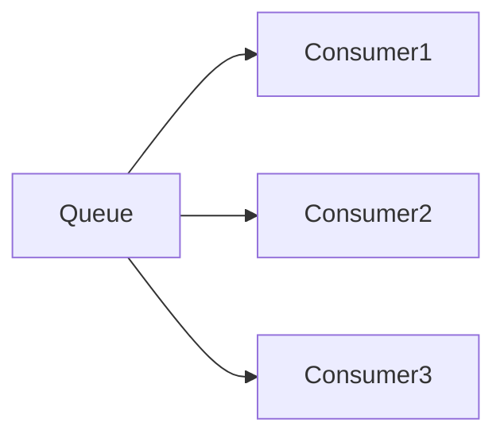
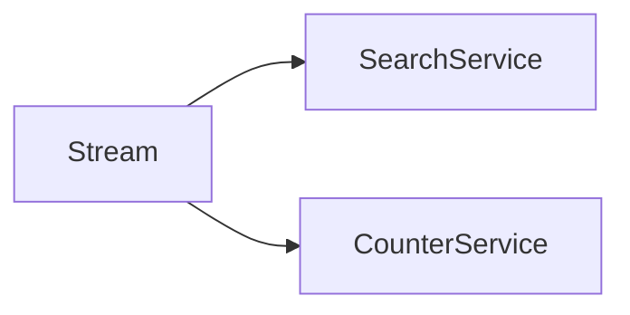
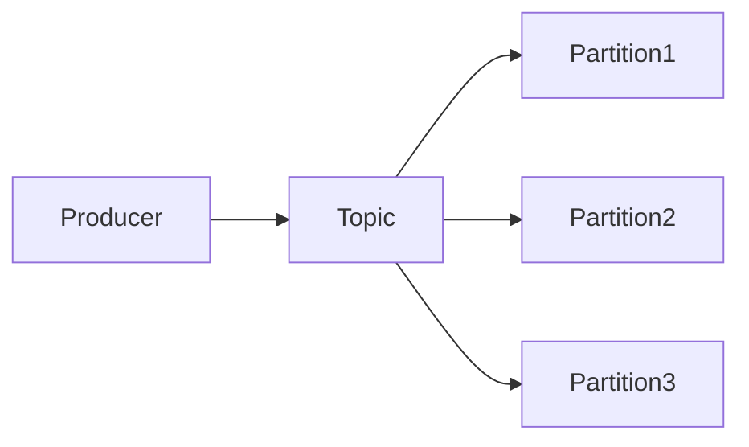
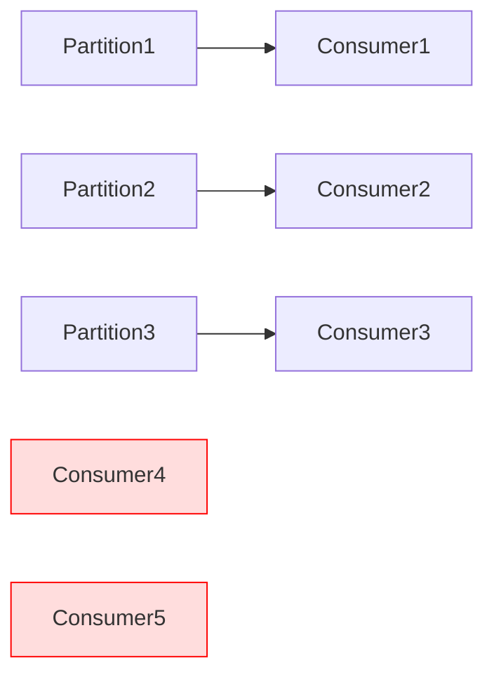

---

## 1️⃣ Problem Statement (Before Kafka)

Example: **Medium.com like system**

When a blog is published, we need to:

- ✅ Save blog in main database
    
- ✅ Index blog in **Elasticsearch** (for search)
    
- ✅ Increase **user’s blog count**
    

👉 These are **multiple independent actions** triggered by **one event (blog published)**.

---

## 2️⃣ Approach 1: One Queue, One Consumer Doing Everything

### Flow

- API publishes message to RabbitMQ
    
- Consumer:
    
    - Updates count in DB
        
    - Indexes data in Elasticsearch
        

### Diagram 

### ❌ Problem

What if:

- DB update succeeds
    
- Elasticsearch indexing fails
    

Result:

- Blog count is correct ❌
    
- Search does not show blog ❌
    

👉 **System becomes inconsistent**

---

## 3️⃣ Approach 2: Two Queues, Two Consumers

Idea:

- One queue for search
    
- One queue for counter
    

### Flow

- API writes **same event** to two RabbitMQ queues
    
- Each queue has its own consumer
    

### Diagram

### ❌ Problem Still Exists

What if:

- API writes successfully to Search queue
    
- API fails while writing to Counter queue
    

Result:

- Blog is searchable ✅
    
- Blog count is wrong ❌
    

👉 **Still inconsistent**

---

## 4️⃣ Root Cause of the Problem

The real problem is:

> ❌ **Writing the same event multiple times**

We want:

- **Write once**
    
- **Read by many services independently**
    

This is exactly where **Message Streams** come in.

---

## 5️⃣ Message Streams – Core Idea

### Key Concept

> **Write once, read by many**

- Producer writes **one event**
    
- Multiple consumers read **the same event**
    
- Consumers are **independent**
    
- Failure of one consumer does **not affect others**
    

---

## 6️⃣ Kafka Solution (Approach 3)

Kafka is a **message stream platform**.

### Flow

- API publishes one message to Kafka
    
- Search service consumes it
    
- Counter service consumes it
    

### Diagram

### ✅ Why This Works

- API writes **only once**
    
- Search and Counter read **independently**
    
- If Search fails:
    
    - Counter still works
        
- If Counter fails:
    
    - Search still works
        
- Failed consumer can **re-read messages**
    

👉 **Eventually consistent system (industry standard)**

---

## 7️⃣ Message Queue vs Message Stream

### Message Queue (RabbitMQ, SQS)

- One message → consumed by **one consumer**
    
- Message is **removed after consumption**
    
- Used for **task processing**
    

👉 Each message goes to **only one consumer**

---

### Message Stream (Kafka, Kinesis)

- One message → consumed by **many consumer groups**
    
- Message is **not deleted immediately**
    
- Used for **event-driven systems**
    

👉 **Same message is read multiple times**

---

## 8️⃣ Kafka Internals (Very Important)

### Kafka Basics

- Kafka stores data in **Topics**
    
- Each topic has **Partitions**
    
- Producer sends message to a **topic**
    
- Message goes to a **partition** (based on key)
    

### Diagram

---

### Ordering Guarantee

- ✅ Messages are **ordered inside one partition**
    
- ❌ No ordering guarantee **across partitions**
    

👉 If ordering matters, use **same key**

---

## 9️⃣ Kafka Consumer Limitation

### Rule

> **Number of consumers ≤ number of partitions**

Example:

- Partitions = 3
    
- Consumers = 5
    

Result:

- 2 consumers will be **idle**
    

### Diagram

👉 For scaling consumers, **increase partitions**

---

