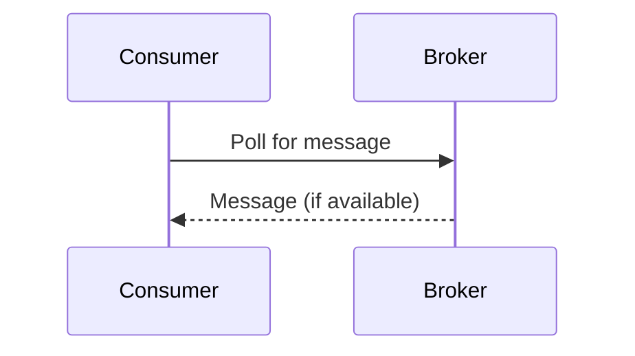
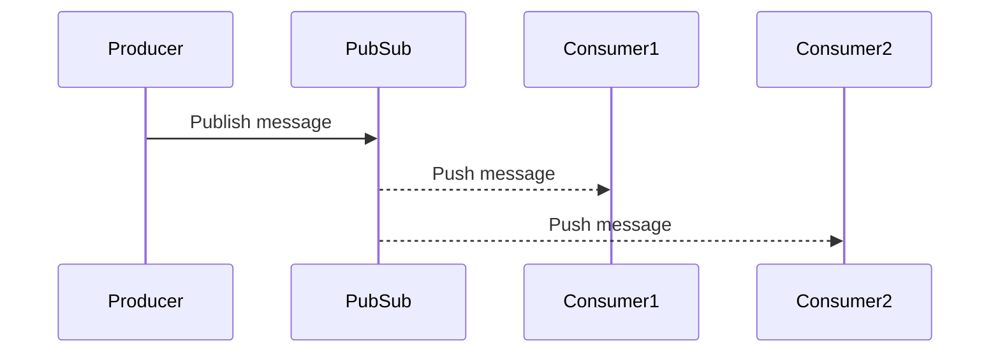
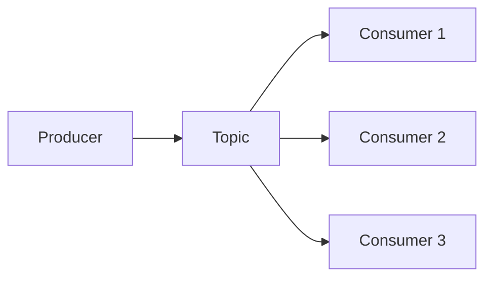
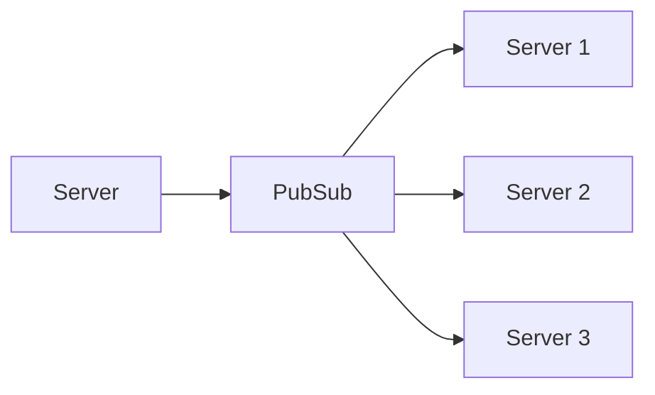
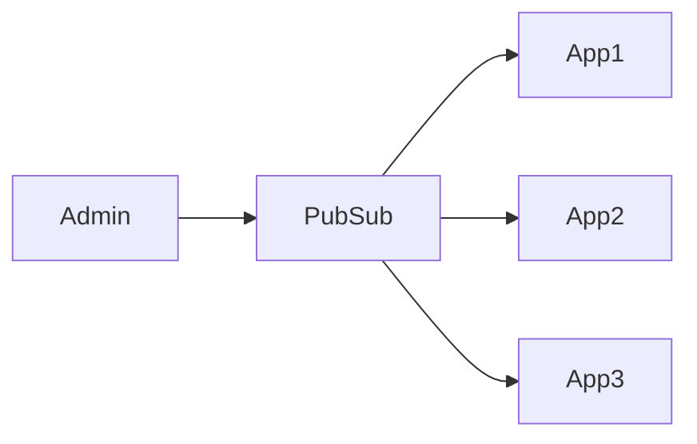

---

## 1️⃣ Why Pub/Sub? (Problem before Pub/Sub)

Before Pub/Sub, systems mainly used:

### ❌ Direct API Calls

- One service calls another service using REST API.
    
- Problems:
    
    - Tight coupling (service depends on another)
        
    - Slow when many consumers exist
        
    - Not scalable
        

### ❌ Polling (Pull Model)

Consumers repeatedly ask:

> “Any new message?”  
> “Any update?”  
> “Any update?”

Problems:

- Wastes CPU and network
    
- Increases latency
    
- Slow reaction time
    
- Not real-time
    

### ❌ Message Queues (RabbitMQ, SQS)

You already learned:

- Producer → Queue → Consumer
    
- Message is processed **once**
    
- Good for **task processing**
    

But problem:

- Not good for **broadcast**
    
- One message → one consumer (mostly)
    
- Not ideal for realtime updates
    

### ❌ Kafka (Message Streams)

You learned Kafka:

- High throughput
    
- Durable storage
    
- Consumers **pull** data
    
- Great for analytics & pipelines
    

But Kafka also has issues:

- Pull-based → **consumption lag**
    
- Not real-time push
    
- Overkill for simple realtime notifications
    

---

## 👉 So the question became:

> **How to push data instantly to many consumers without polling?**

### ✅ Answer: **Pub/Sub**

---

## 2️⃣ What is Pub/Sub?

**Pub/Sub = Publish / Subscribe**

- Producer **publishes** messages to a topic
    
- Consumers **subscribe** to the topic
    
- Message is **pushed** to all subscribers
    

📌 Key idea:

> **Producer does NOT know consumers**  
> **Consumers do NOT poll**

---

## 3️⃣ Pull vs Push (Important Concept)

### 🔁 Pull Model (Queue / Kafka)

**Pros**

- Consumer controls speed
    
- No overload
    

**Cons**

- Latency
    
- Lag under high load
    

---

### 🚀 Push Model (Realtime Pub/Sub)

**Pros**

- Very low latency
    
- Near real-time
    
- No polling
    

**Cons**

- Consumers can be overwhelmed
    

---

## 4️⃣ Realtime Pub/Sub Explained

From your notes:

> Instead of consumers pulling messages, messages are pushed to them.

Examples:

- Redis Pub/Sub
    
- WebSockets
    
- Firebase Realtime DB
    
- AWS SNS (similar concept)
    

---

## 5️⃣ Architecture: Realtime Pub/Sub

### What happens?

- Producer sends message once
    
- All consumers receive it
    
- No storage (usually)
    
- No retry guarantee (depends on tool)
    

---

## 6️⃣ Advantage of Realtime Pub/Sub

### ✅ Very Fast Delivery

- Milliseconds
    
- Perfect for real-time systems
    

### ✅ No Polling

- Saves CPU
    
- Saves network
    

### ✅ Broadcast

- One message → many consumers
    

---

## 7️⃣ Disadvantage (Very Important)

### ❌ Consumer Overload

From your note:

> What if consumers receive messages faster than they can process?

Problem:

- Messages are pushed continuously
    
- Slow consumer = crash / memory issue
    
- No backpressure control
    

📌 This is why:

- Pub/Sub is **not** used for heavy processing
    
- It’s used for **notifications**
    

---

## 8️⃣ Comparison with Queue & Kafka (Clear Table)

| Feature          | Queue  | Kafka   | Pub/Sub          |
| ---------------- | ------ | ------- | ---------------- |
| Model            | Pull   | Pull    | Push             |
| Latency          | Medium | Medium  | Very Low         |
| Storage          | Yes    | Yes     | Usually No       |
| Replay           | No     | Yes     | No               |
| Broadcast        | No     | Yes     | Yes              |
| Consumer Control | Yes    | Yes     | No               |
| Use Case         | Tasks  | Streams | Realtime updates |

---

## 9️⃣ Practical Use Cases (From Your Notes)

### 1️⃣ Message Broadcast

Example:

- Chat messages
    
- Live score updates
    
- Stock price updates
    

---

### 2️⃣ Configuration Push

Example:

- Feature flag updates
    
- Config change
    
- Enable/disable service
    

📌 All servers get update **without polling**

---

## 🔟 Where Redis Pub/Sub Fits

Redis Pub/Sub:

- Extremely fast
    
- In-memory
    
- No persistence
    
- Best for:
    
    - Notifications
        
    - Cache invalidation
        
    - Realtime signals
        

❌ Not good for:

- Guaranteed delivery
    
- Retry logic
    
- Long-term storage
    

---

## 🧠 Final Mental Model (Easy to Remember)

- **Queue** → “Do this job”
    
- **Kafka** → “Store and process data stream”
    
- **Pub/Sub** → “Tell everyone now”
    

---

## ✅ When to Choose Pub/Sub

Choose Pub/Sub when:

- Low latency is required
    
- Messages are lightweight
    
- Real-time delivery matters
    
- Missing a message is acceptable
    

---

If you want, next we can:

- Compare **Redis Pub/Sub vs Kafka**
    
- Design **Chat System using Pub/Sub**
    
- Learn **Backpressure problem & solutions**
    
- See **Hybrid design (Kafka + Pub/Sub)**
    

Just tell me 👍