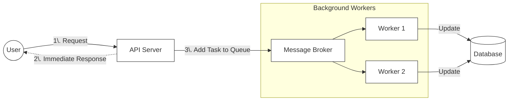
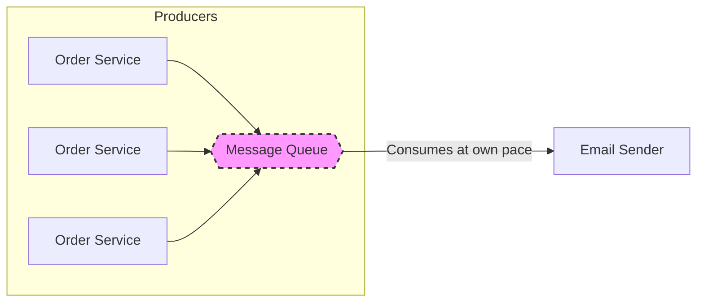
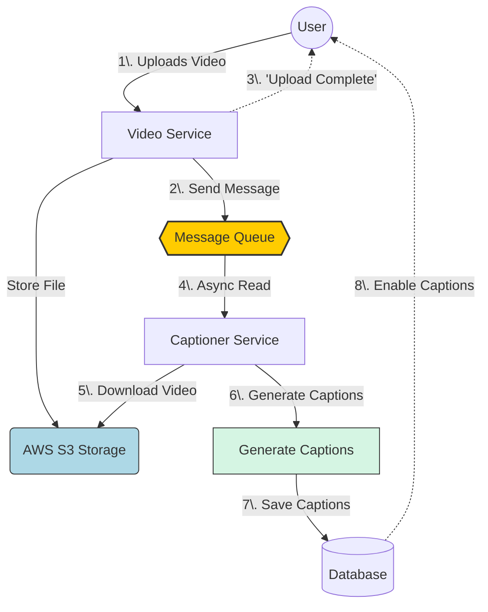

-----

### **1. What is a Message Queue?**

A **Message Queue** (or Broker) is a component in system design that acts as a "middleman" or a temporary storage buffer between two services. It helps different parts of a software system talk to each other without being directly connected.

  * **Producer:** The service that sends the message (task).
  * **Queue (Broker):** The place where messages sit and wait.
  * **Consumer (Worker):** The service that picks up the message and does the work.

-----

### **2. Synchronous vs. Asynchronous Processing**

To understand why we need queues, we first need to understand the two ways systems handle requests.

#### **A. Synchronous (The "Wait" Method)**

  * **Definition:** The user sends a request and **waits** for it to finish before they can do anything else.
  * **Real-world examples:**
      * Loading your Instagram feed (you stare at a spinner).
      * Logging into a website.
      * Making a payment transaction.
  * **Problem:** If the task takes too long, the user gets frustrated or the system times out.

#### **B. Asynchronous (The "Fire and Forget" Method)**

  * **Definition:** The user sends a request, the system says "Got it, I'll do it later," and the user is free to go do other things.
  * **Real-world example:** **Spinning up a Virtual Machine (VM)** or **Video Processing**.
  * **Why Async?** Creating a VM takes 5-10 minutes. You cannot make a user stare at a loading screen for 10 minutes.
  * **Solution:** We use a Message Queue to handle this in the background.

#### **Diagram: Asynchronous Flow**

-----

### **3. Why Use Message Queues? (Key Features)**

Brokers solve specific problems in large systems.

#### **Feature 1: Decoupling (Connecting Sub-systems)**

Brokers allow you to connect different systems (e.g., an "Order Service" and an "Email Service") without them knowing the details of each other. If one fails, the other keeps working.

#### **Feature 2: Buffering (The "Shock Absorber")**

Imagine a huge spike in traffic (e.g., a sale event).

  * **Without Queue:** If 10,000 people order at once, your Email Service might crash trying to send 10,000 emails instantly.
  * **With Queue:** The queue "absorbs" the 10,000 requests. The Email Service (consumer) can then process them at its own safe speed (e.g., 50 emails per second).

#### **Diagram: Buffering Load**

#### **Feature 3: Fault Tolerance (Re-queueing)**

  * **Scenario:** A worker picks up a message but crashes (power cut, error) before finishing the job.
  * **Safety Net:** The Broker sees that the job wasn't finished. It puts the message **back into the queue** (re-queue) so a healthy worker can pick it up.

-----

### **4. Industrial Example: Video Auto-Captioning**

This is the main example from your notes (Image 3 & 4).

**The Scenario:**
A user uploads a video to YouTube/Instagram. We need to generate subtitles (captions) for it. This is a heavy task that takes time.

**The Workflow:**

1.  **Upload:** User uploads the video file to storage (like AWS S3).
2.  **Notification:** The Video Service sends a message to the Queue: *"New video at ID \#123, please process."*
3.  **User Response:** The system **immediately** tells the user "Upload Complete\!" (User is happy).
4.  **Processing (Async):**
      * A "Captioner" service (Consumer) sees the message.
      * It downloads the video from S3.
      * It generates the text captions.
      * It updates the Database.
5.  **Result:** When the user refreshes the page later, the "CC" button is enabled.

#### **Diagram: Video Processing Architecture**

-----

### **5. Popular Tools**

In the industry, you won't build a queue from scratch. You will use these standard tools:

  * **RabbitMQ** (Very popular, general purpose)
  * **AWS SQS** (Simple Queue Service - Cloud based)
  * **Apache Kafka** (For massive amounts of streaming data)

---

