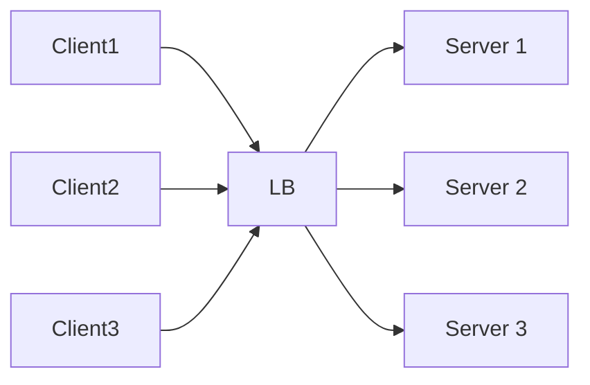
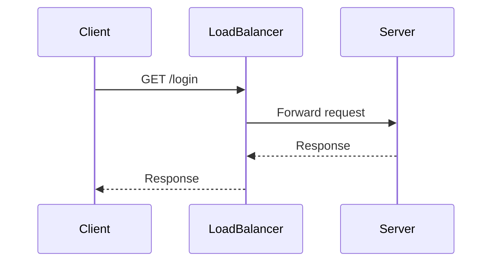
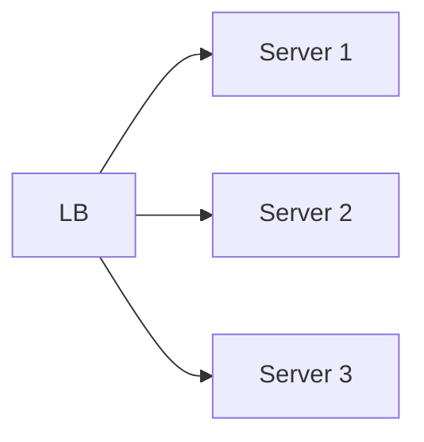
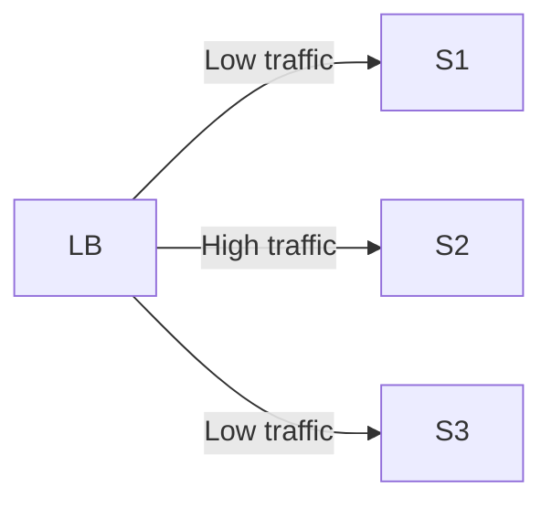
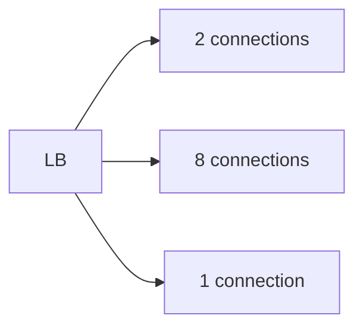
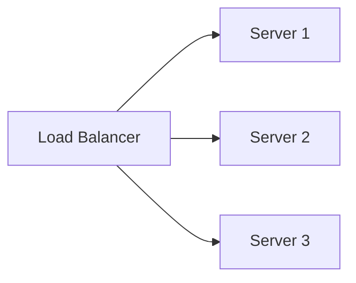
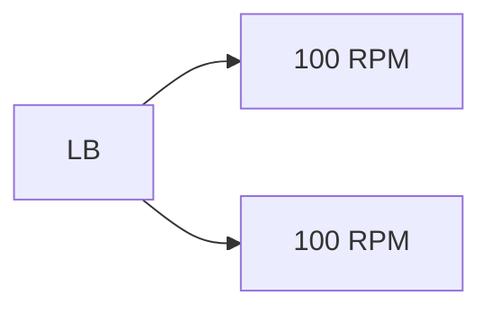
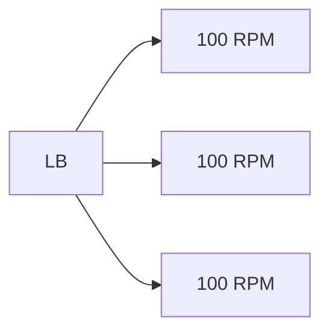
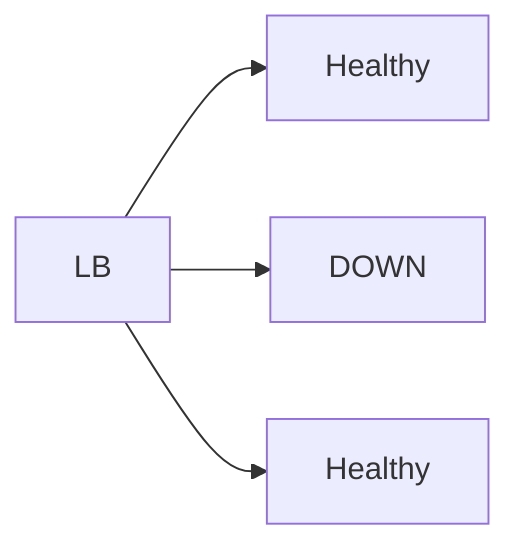

---

## 1. What is a Load Balancer?

A **Load Balancer (LB)** is one of the **most important components** in a **distributed system**.

👉 Its main job is to **distribute incoming client requests** across **multiple servers**.

This helps us:

- Handle more traffic
    
- Avoid overloading one server
    
- Scale the system **horizontally**
    

### Key Point

> **Load Balancer is the ONLY point of contact for clients**

Clients **never talk directly** to backend servers.

---

## 2. How Clients Reach a Load Balancer

Every load balancer has **one fixed identity**:

- ✅ **Static IP** OR
    
- ✅ **Static DNS name** (domain)
    

This allows:

- Browsers
    
- Mobile apps
    
- Other backend services
    

to always reach the load balancer.

Example:

```
auth.example.com
```

---

## 3. Load Balancer Hides Backend Servers

The load balancer **hides how many servers are behind it**.

Clients:

- Do NOT know
    
- Do NOT care
    

how many servers exist.

👉 This allows **horizontal scalability**.

### Meaning of Horizontal Scalability

- Add more servers
    
- Without changing client code
    
- Without changing client configuration
    

---

## 4. Basic Architecture (Mermaid Diagram)



---

## 5. Request – Response Flow

Step-by-step flow (very important for interviews):

1. Client already has **IP / Domain of Load Balancer**
    
    ```
    auth.example.com
    ```
    
2. Client makes an API call
    
    ```
    GET auth.example.com/login
    ```
    
3. Request reaches **Load Balancer**
    
4. Load balancer **selects one server**
    
5. Load balancer forwards the **same request** to that server
    
6. Server processes the request and sends response back to LB
    
7. Load balancer sends response to client
    

### Flow Diagram



---

## 6. Job of Load Balancer

The job of a load balancer is to **"balance" the load**.

How it balances depends on:

- **Load balancing algorithm**
    
- Which algorithm is configured
    

👉 This behavior is **configurable**.

---

## 7. Load Balancing Algorithms

### 7.1 Round Robin (Uniform Infrastructure)

- Requests are distributed **one by one**
    
- All servers assumed to have **same capacity**
    

Example:

- Request 1 → S1
    
- Request 2 → S2
    
- Request 3 → S3
    
- Request 4 → S1 (cycle repeats)
    

#### Diagram



✅ Best when all servers are equal.

---

### 7.2 Weighted Round Robin (Non-uniform Infrastructure)

Used when:

- Servers have **different power**
    
- Example: CPU, RAM, machine size differs
    

Each server is given a **weight**.

Example:

- S1 → weight 1
    
- S2 → weight 3
    
- S3 → weight 1
    

S2 will receive **more requests**.

#### Diagram



---

### 7.3 Least Connections

- Load balancer checks:  
    👉 Which server has **least active connections**
    
- That server gets the next request
    

Best when:

- Request processing time varies a lot
    
- Example: heavy DB queries, reports
    

Used heavily with:

- **Analytics**
    
- **Streaming**
    
- **Long-running APIs**
    

#### Diagram



👉 Next request goes to **S3**

---

### 7.4 Hash-Based Routing

- Load balancer calculates **hash of an attribute**
    
- Same attribute → same server
    

Attributes can be:

- IP address
    
- User ID
    
- Session ID
    
- URL
    

Example:

```
hash(userId) → Server
```

Used for:

- Session stickiness
    
- Cache consistency
    

#### Diagram



---

## 8. Key Advantages of Load Balancer

---

### 8.1 Scalability

More servers = more capacity.

Example:

- Each server can handle **100 RPM**
    

#### 2 Servers



👉 Total = **200 RPM**

#### 3 Servers



👉 Total = **300 RPM**

---

### 8.2 Availability (High Availability)

If one server crashes:

- System does NOT go down
    
- Load balancer sends traffic only to **healthy servers**
    

#### Diagram



👉 New requests go to **S1 and S3 only**

---

## 9. Real Industrial Example

### Example: E-commerce Website (Amazon / Flipkart type)

- Millions of users open the app
    
- All API calls go to:
    
    ```
    api.shop.com
    ```
    
- This domain points to a **Load Balancer**
    

Behind the load balancer:

- Multiple backend services
    
- Auto-scaling enabled
    
- Servers added/removed dynamically
    

If one backend crashes:

- Users **do not notice**
    
- Load balancer redirects traffic
    

### Tools Used in Industry

- **AWS ALB / NLB**
    
- **NGINX**
    
- **HAProxy**
    
- **Google Cloud Load Balancer**
    

---
