---


## 1. What problem does Circuit Breaker solve?

**Main problem:**  
👉 **Cascading failures**

### Cascading failure means:

- One service becomes slow or down
    
- Other services that depend on it also slow down
    
- Slowly the **entire system becomes unusable**
    

---

## 2. Example: Social Media Feed System

User opens the **Feed** page.

### Services involved:

- Feed Service
    
- Recommendation Service
    
- Trending Service
    
- Profile Service
    
- Post Service
    

### Dependency chain:

- Feed → Recommendation → Profile → Profile DB
    
- Feed → Trending → Post → Post DB
    
- Recommendation & Trending both depend on **Profile** and **Post**
    

---

## 3. Mermaid Diagram – Normal Flow (Healthy System)


✔ All services are healthy  
✔ Requests flow normally  
✔ User gets feed data fast

---

## 4. What goes wrong without Circuit Breaker?

### Scenario:

- **Profile DB becomes slow / overloaded**
    

### What happens:

1. Profile service becomes slow
    
2. Recommendation & Trending wait for Profile
    
3. Feed waits for Recommendation & Trending
    
4. Threads get blocked
    
5. Requests pile up
    
6. **Complete outage or very slow response**
    

---

## 5. Mermaid Diagram – Cascading Failure (No Circuit Breaker)

```mermaid
flowchart LR
    User --> Feed

    Feed --> Recommend
    Feed --> Trending

    Recommend --> Profile
    Trending --> Profile

    Profile --> ProfileDB[(Profile DB ⚠️ Slow)]
```



❌ Profile DB is slow  
❌ Everything depending on it becomes slow  
❌ Bad user experience

---

## 6. Circuit Breaker – Core Idea

> **“Call a service only if it is healthy.”**

If a service is **failing repeatedly**, stop calling it for some time.

This is exactly like an **electrical circuit breaker**:

- Too much load → breaker trips
    
- Power stops → system is saved
    

---

## 7. How Circuit Breaker works (Conceptually)

### Step-by-step:

1. Service A calls Service B
    
2. Failures are monitored (timeouts, errors)
    
3. If failures cross a threshold → **circuit opens**
    
4. Further calls to Service B are **blocked**
    
5. After some time → **retry in controlled manner**
    

---

## 8. Circuit Breaker States (Very Important for Interview)

### 1️⃣ Closed State (Normal)

- All requests go through
    
- Failures are counted
    

```text
Request → Allowed
```

---

### 2️⃣ Open State (Failure Mode)

- Too many failures
    
- Calls are blocked immediately
    

```text
Request → Fail Fast (No network call)
```

---

### 3️⃣ Half-Open State (Recovery Check)

- Few test requests are allowed
    
- If success → Close circuit
    
- If failure → Open again
    

---

## 9. Mermaid Diagram – Circuit Breaker States


---

## 10. Circuit Breaker with Feed System

### With Circuit Breaker enabled:

- Recommendation checks **Profile circuit**
    
- If circuit is OPEN → skip Profile call
    
- Return **partial or fallback response**
    

---

## 11. Mermaid Diagram – With Circuit Breaker


✔ No thread blocking  
✔ Fast failure  
✔ System stays alive

---

## 12. What is Fallback?

Fallback = **safe default response**

Examples:

- Empty recommendation list
    
- Cached profile data
    
- “Trending unavailable right now”
    

👉 User sees **something**, not a blank page or timeout

---

## 13. How is Circuit Breaker implemented in real systems?

### Industry approach:

- Circuit breaker config stored in:
    
    - Config server
        
    - Redis
        
    - DB (rare)
        
- Config is **cached in memory**
    
- Services check breaker **before calling dependency**
    

---

## 14. Centralized Circuit Breaker Concept


- When outage happens:
    
    - Circuit is tripped
        
    - Other services stop sending requests
        

---

## 15. Can Redis / Pub-Sub be used?

✅ **Yes (Advanced but common)**

How:

- Circuit state stored in Redis
    
- When tripped → publish event
    
- All services instantly know
    

✔ Faster than DB polling  
✔ Near real-time update

---

## 16. Benefits of Circuit Breaker

✔ Prevents cascading failures  
✔ Protects downstream services  
✔ Faster response (fail fast)  
✔ Better user experience  
✔ System stays partially available

---

## 17. Interview One-Line Answer (Very Important)

> **Circuit Breaker prevents cascading failures by stopping calls to unhealthy services and failing fast instead of waiting for timeouts.**

---

## 18. Real Industry Tools (Just names)

- Resilience4j (Java, Spring Boot)
    
- Hystrix (deprecated but still asked)
    
- Istio (service mesh level)
    
- Envoy proxy
    

---

## 19. Simple Mental Model (Remember this)

> **Timeouts slow systems  
> Circuit breakers save systems**

---


## 3. What signals does Circuit Breaker observe?

### Core signals (very important):

### 1️⃣ Response Time (Latency)

- If a call takes too long → considered slow

### 2️⃣ Timeout

- Call did not finish within allowed time
    

### 3️⃣ Exception / Error

- SQL exception
    
- Connection timeout
    
- 5xx error
    

### 4️⃣ Failure Rate

- % of failed calls in recent window