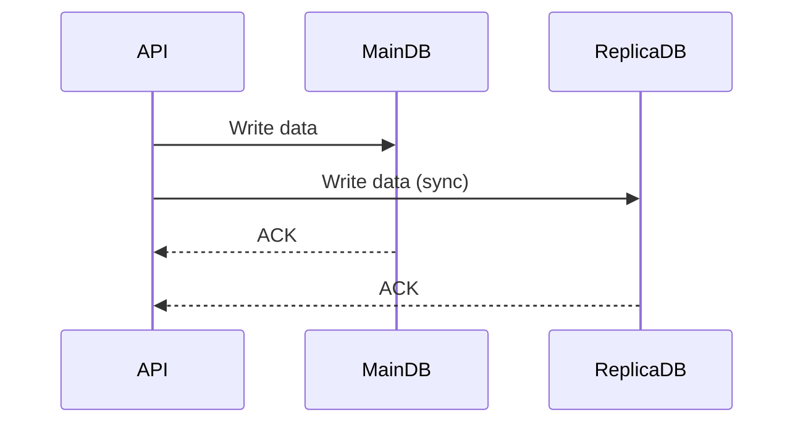
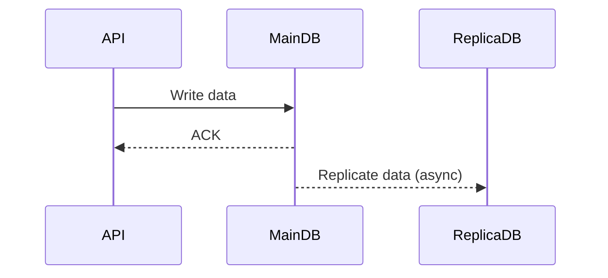
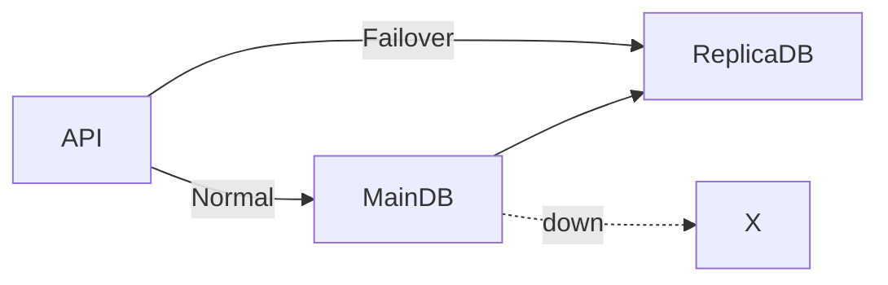
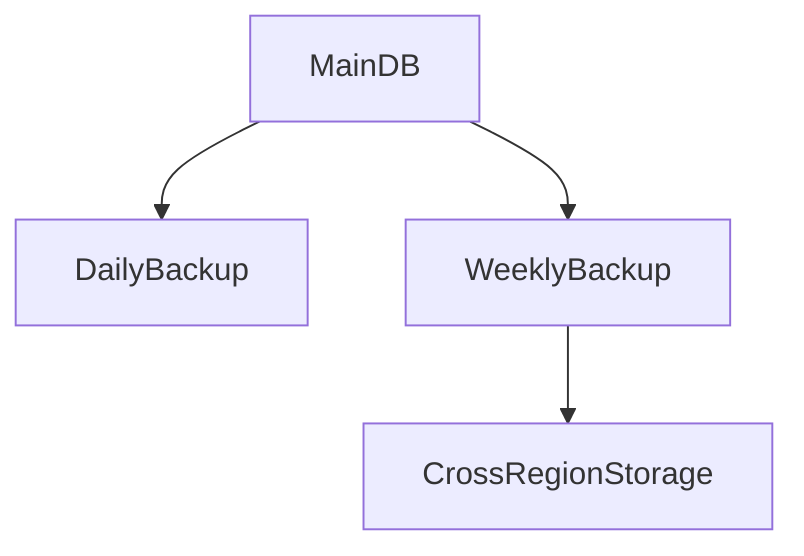
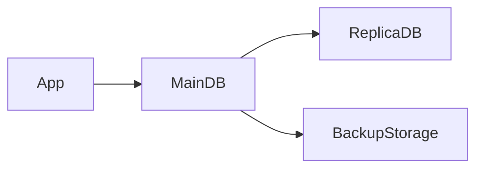
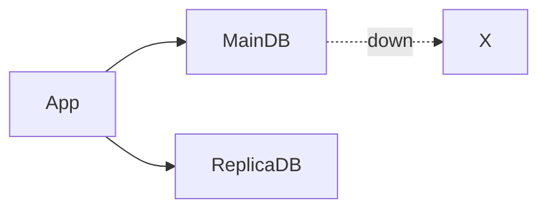

---

## 1. Why this topic is important

In real systems:

- **API servers are stateless**
    
- **Databases are stateful**
    

👉 This single line is the **heart of the problem**.

### What does it mean?

#### API servers (stateless)

- They do not store permanent data.
    
- If one API server goes down:
    
    - Load balancer sends traffic to another one.
        
    - New server can be started quickly.
        
- **No data loss**
    

#### Databases (stateful)

- They store **critical data** (users, payments, orders).
    
- If database goes down:
    
    - Application may still run
        
    - But **data is unavailable or lost**
        
- This is **catastrophic failure**
    

💥 Worst case: **Disk crash → permanent data loss**

---

## 2. Real industry example

### Example: E-commerce application (Amazon / Flipkart style)

- API server crash → fine (new pod/VM spins up)
    
- Database crash →  
    ❌ Orders lost  
    ❌ Payments stuck  
    ❌ Users angry
    

So **protecting database is more important than protecting API servers**.

---

## 3. What is Data Redundancy?

**Data Redundancy = keeping multiple copies of data**

👉 If one copy is lost, another copy can save you.

### Where redundancy can be applied

- Row / document level
    
- Table level
    
- Database level
    
- Region level (multi-region)
    

---

## 4. Continuous Redundancy (Database Replication)

This is what you explained very well 👌

### Idea

- Create **replica (copy)** of the main database
    
- Keep replica updated with main DB
    

---

## 5. Replication Types

### 5.1 Synchronous Replication (Sync)

- API writes to **both databases**
    
- Write is successful **only when both DBs confirm**
    

#### Pros

- No data loss
    

#### Cons

- Slower writes
    
- Higher latency
    

#### Mermaid Diagram

📌 Used in **banking / financial systems**

---

### 5.2 Asynchronous Replication (Async)

- API writes only to **main DB**
    
- Main DB copies data to replica **later**
    

#### Pros

- Fast writes
    
- Better performance
    

#### Cons

- Small chance of data loss
    

#### Mermaid Diagram

📌 Used in **most large-scale systems**

---

## 6. Failover (Main DB goes down)

If **main database crashes**:

- Replica can **take over**
    
- Almost instant recovery
    

### Important note (your point was correct)

- Replica may be:
    
    - **Active** (serving reads)
        
    - OR **Standby** (only for emergency)
        

#### Mermaid Diagram

---

## 7. Data Redundancy ≠ Backup

This is very important for interviews ⚠️

|Feature|Redundancy|Backup|
|---|---|---|
|Purpose|High availability|Disaster recovery|
|Speed|Instant|Slow|
|Used for|DB crash|Human error, corruption|
|Example|Replica DB|Daily backup|

---

## 8. Backup and Restore Strategy

### Common industry practice

- **Daily incremental backup**
    
- **Weekly full backup**
    
- **One copy in different region**
    

📌 This protects against:

- Disk failure
    
- Accidental delete
    
- Data corruption
    
- Ransomware
    

#### Mermaid Diagram

---

## 9. Disaster Recovery (DR)

### What is Disaster Recovery?

If:

- Data center burns 🔥
    
- Region goes down
    
- Cloud outage
    

👉 Restore system using **backup from another region**

---

## 10. Redundancy vs Backup (Simple English)

- **Redundancy** → system should not stop
    
- **Backup** → data should not be lost
    

A **good system always has both** ✅

---

## 11. Interview-ready one-line summary

> API servers are easy to replace because they are stateless, but databases are stateful and critical. To prevent data loss and downtime, we use data redundancy through replication and backup strategies with disaster recovery.

---

If you want next:

- How **AWS RDS** implements this internally
    
- How **Spring Boot + DB replication** works
    
- Or **real interview questions & answers** from this topic
    

----

# 1️⃣ Data Redundancy vs Backup (Very Simple)

## First, one sentence definition

- **Data Redundancy** → _System should keep running even if DB fails_
    
- **Backup** → _Data should not be lost even if everything fails_
    

They solve **different problems**.

---

## 2️⃣ Real-life example (Notebook example 📒)

### Imagine:

You are writing notes in a notebook.

---

### 🟢 Data Redundancy (Live copy)

- You write notes in **Notebook A**
    
- At the same time, you write the same notes in **Notebook B**
    
- If Notebook A is lost → you **immediately continue** using Notebook B
    

👉 **No waiting**, no rewrite

📌 This is **Data Redundancy**

---

### 🔵 Backup (Stored copy)

- Every night, you **photocopy** your notebook
    
- You keep photocopies in a cupboard
    
- If notebook is lost:
    
    - You **take time**
        
    - Restore notes from photocopy
        
    - Some latest notes may be missing
        

📌 This is **Backup**

---

## 3️⃣ Now convert this to database language

|Concept|Data Redundancy|Backup|
|---|---|---|
|Copy type|Live copy|Stored copy|
|Speed|Instant|Slow|
|Used when|DB crashes|Data deleted / corrupted|
|System down?|❌ No|✅ Yes|
|Example|Primary + Replica DB|Daily backup file|

---

## 4️⃣ Industry example (E-commerce app)

### Scenario 1: Database server crashes 💥

#### With Data Redundancy

- Main DB crashes
    
- Replica DB takes over
    
- Users don’t even notice
    

👉 **Application keeps running**

---

#### With only Backup

- DB crashes
    
- App stops
    
- Team restores backup
    
- App comes back after minutes or hours
    

👉 **Downtime happens**

---

## 5️⃣ Mermaid Diagram: Redundancy vs Backup

- `MainDB → ReplicaDB` = **Redundancy**
    
- `MainDB → BackupStorage` = **Backup**
    

---

# 2️⃣ What is Failover?

Now let’s answer your second question clearly.

---

## 6️⃣ Failover (Simple meaning)

> **Failover = automatic switch to backup system when main system fails**

Very important interview keyword ⭐

---

## 7️⃣ Real-life example (Electricity 🔌)

- Main power line fails
    
- Generator starts automatically
    
- Lights stay ON
    

👉 This automatic switching is **Failover**

---

## 8️⃣ Database Failover

### Normal situation

- App uses **Main Database**
    

### Failure situation

- Main DB goes down
    
- System **switches to Replica DB**
    

👉 This switch is called **Failover**

---

## 9️⃣ Mermaid Diagram: Failover

---

## 🔁 Failover types (simple)

### 1. Automatic Failover

- Happens automatically
    
- Very fast (seconds)
    
- Used in production systems
    

### 2. Manual Failover

- Human intervention needed
    
- Slower
    
- Used in small systems
    

---

## 🔥 Important Interview Point

> Failover usually works with **Data Redundancy**, not with Backup.

Because:

- Replica DB is already running
    
- Backup needs restore time
    

---

## 10️⃣ Final one-line summary (remember this)

- **Data Redundancy** → multiple live databases
    
- **Backup** → stored copy for recovery
    
- **Failover** → switching from main DB to replica DB
    

---

## 11️⃣ Simple memory trick 🧠

- **Redundancy** = _Running system_
    
- **Backup** = _Saving data_
    
- **Failover** = _Switch_
    

---

If you want next:

- How AWS **RDS Multi-AZ** uses these
    
- Or **interview questions + answers**
    
- Or connect this to **load balancer concept**
    

----

Also undersand: liquibase  and flyway