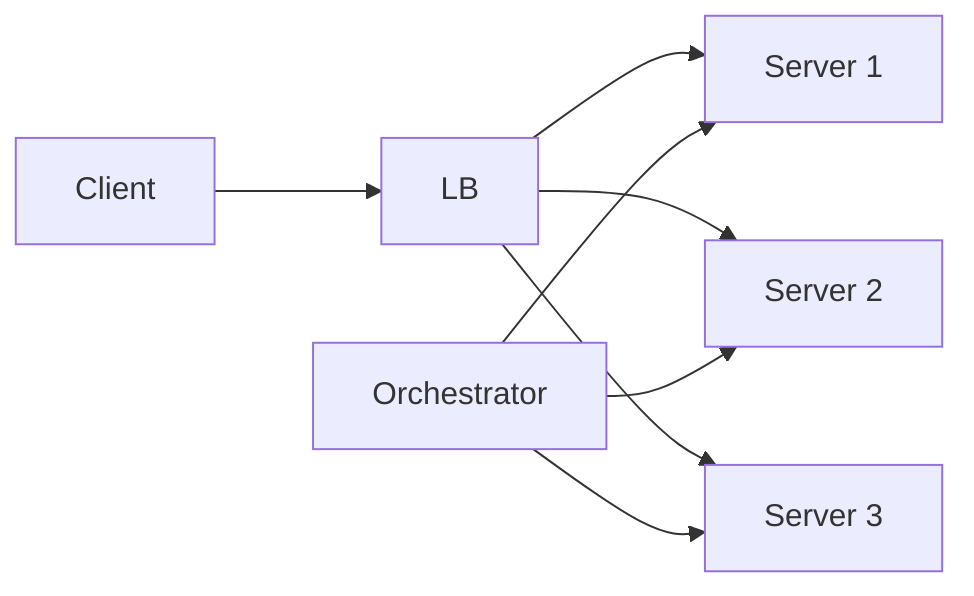
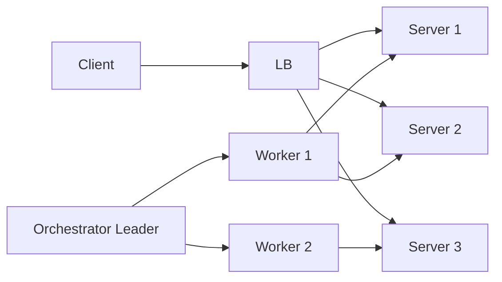
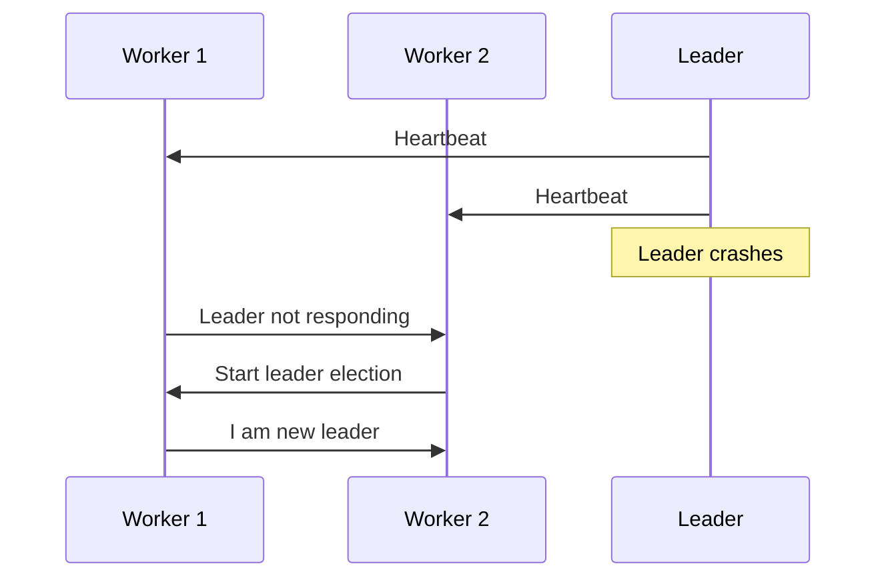

---

## 1️⃣ Problem Statement (Why this concept is needed)

### Scenario

- We have **multiple backend servers** that handle HTTP requests.
    
- A **Load Balancer (LB)** sends traffic to these servers.
    
- If **one server goes down**, a new server should start **automatically**.
    
- This work is done by a special component called an **Orchestrator**.
    

### Goal

✅ No human intervention  
✅ Minimal downtime  
✅ System should recover automatically

---

## 2️⃣ Basic Architecture (Without Leader Election)

### Components

- **Client** → sends requests
    
- **Load Balancer** → distributes traffic
    
- **Servers** → handle requests
    
- **Orchestrator** → monitors servers and restarts failed ones
    

### Flow

- Orchestrator checks server health
    
- If a server is unhealthy → spin up a new server
    

### Mermaid Diagram

---

## 3️⃣ Big Problem ❌ (Single Point of Failure)

👉 **What if the orchestrator itself goes down?**

- Who will monitor the orchestrator?
    
- Do we need another orchestrator?
    
- Then who monitors that one?
    

This creates an **infinite chain problem** ❌

---

## 4️⃣ Solution 💡: Leader–Follower (Leader Election)

Instead of **one orchestrator**, we run **multiple orchestrators**.

### Key Idea

- Only **ONE orchestrator is active (Leader)**
    
- Others are **Followers (Workers)**
    
- If the leader dies → followers **elect a new leader**
    

---

## 5️⃣ Leader–Follower Setup Explained

### Roles

### 🟦 Leader

- Monitors orchestrator workers
    
- Decides who should restart services
    
- Controls the system
    

### 🟥 Workers (Followers)

- Monitor backend servers
    
- Send health status to leader
    
- Can become leader if needed
    

---

## 6️⃣ Working Flow (Step by Step)

### Case 1: Backend server fails

- Worker detects server is unhealthy
    
- Worker restarts the server
    

### Case 2: Worker fails

- Leader detects worker is unhealthy
    
- Leader spins up a new worker
    

### Case 3: Leader fails 🔥

- Workers detect leader is dead
    
- **Leader Election starts**
    
- One worker becomes the new leader
    
- System continues → **auto-recovery**
    

---

## 7️⃣ Mermaid Diagram: Leader–Follower Architecture

---

## 8️⃣ Leader Failure & Election Flow

---

## 9️⃣ Leader Election (Concept Only)

How workers choose a leader depends on the **algorithm**, such as:

- Bully Algorithm
    
- Raft
    
- Paxos
    
- Zookeeper-based election
    

⚠️ Concept is important, **algorithm is implementation detail**.

---

## 🔁 Real-World Example

### Kubernetes

- **Master Node = Leader**
    
- **Worker Nodes = Followers**
    
- If master dies → another master is elected
    

### Database (MySQL / PostgreSQL)

- Primary = Leader
    
- Replica = Followers
    
- Failover uses leader election
    

---

## 10️⃣ Key Benefits 🎯

✅ No single point of failure  
✅ Automatic recovery  
✅ Highly available system  
✅ Used in real production systems

---

## 12️⃣ Practice Exercise (Very Important for Understanding)

👉 **Simulate this using Java threads**

- Threads = workers
    
- One thread = leader
    
- Kill leader thread
    
- Other threads elect a new leader
    

If you want, next I can:

- 🔹 Explain **leader election algorithms**
    
- 🔹 Write a **Java multithreading simulation**
    
- 🔹 Connect this concept with **Spring Boot / Kubernetes**
    

Just tell me 👍