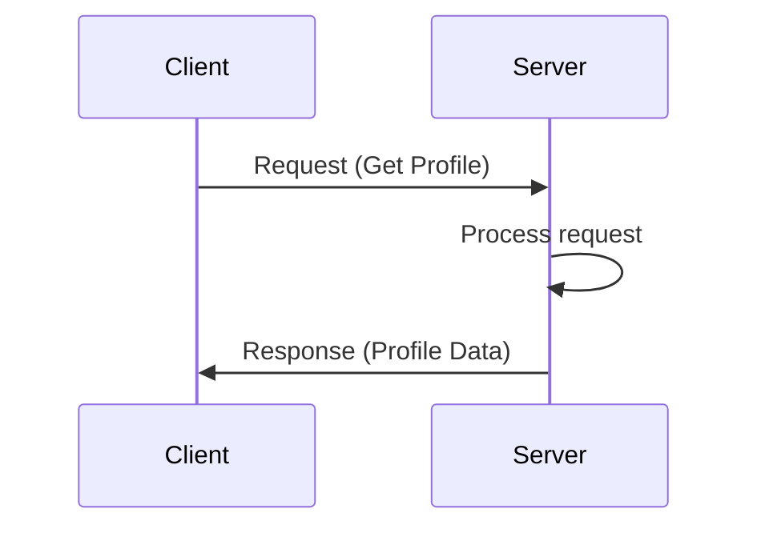
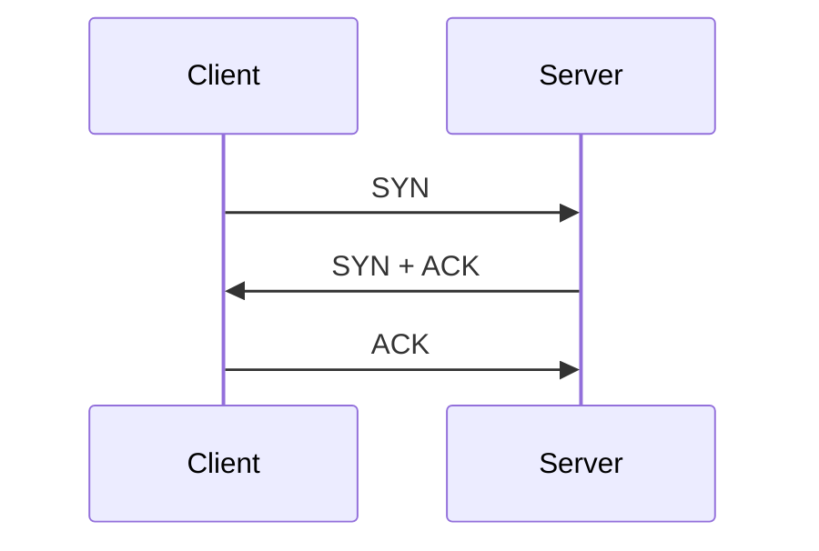
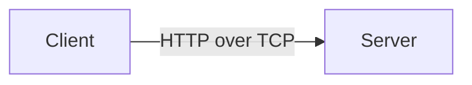
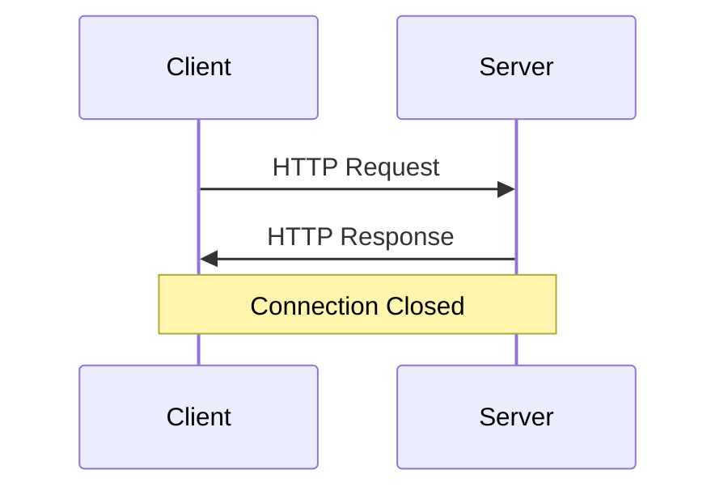
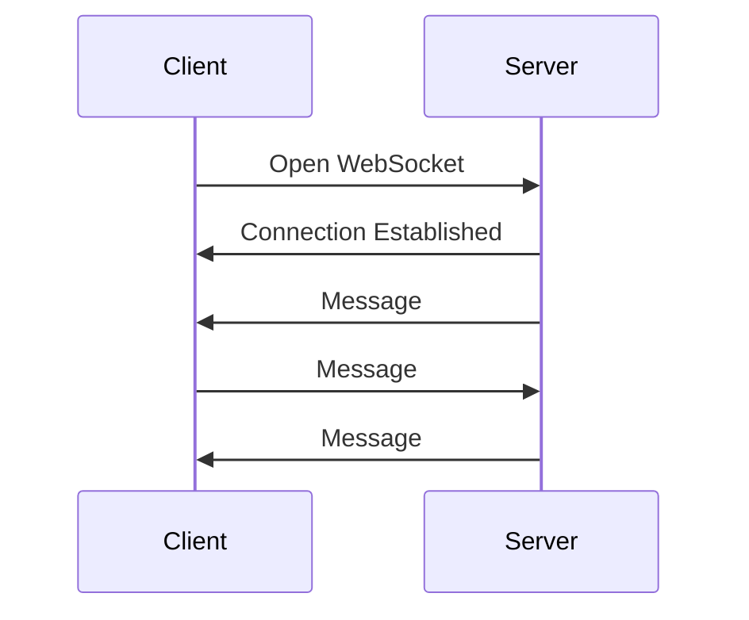

---


# 1. Client–Server Model (Foundation of the Internet)

## What is Client–Server Model?

The **client–server model** is the **most common way** two machines talk to each other.

- **Client** → asks for something (request)
    
- **Server** → does the work and sends back result (response)
    

### Simple real-world example 🏪

Think of a **restaurant**:

- You (Client):  
    “Give me a burger”
    
- Kitchen (Server):  
    Prepares burger and gives it back
    

You don’t cook yourself.  
The kitchen does the job.

---

### Technical example 🌐

|Client Action|Server Action|
|---|---|
|Login request|Verify credentials|
|Get profile|Fetch data from DB|
|Delete post|Delete record|
|Create order|Save order|

---

### Mermaid Diagram: Client–Server



---

# 2. Network Communication Basics

Client and Server are connected using a **network** (Internet).

To exchange data, they use **transport protocols**.

## Two Important Protocols

### TCP (Transmission Control Protocol) ✅

- Reliable
    
- Ordered
    
- No data loss
    
- Used **almost everywhere (99.9%)**
    

### UDP (User Datagram Protocol) ⚡

- Faster
    
- No guarantee of delivery
    
- Used in:
    
    - Video calls
        
    - Online games
        
    - Live streaming
        

👉 **Web apps mostly use TCP**

---

# 3. Important Properties of TCP

## 1️⃣ TCP Setup – 3-Way Handshake

Before data transfer, TCP **creates a connection**.

Steps:

1. Client → SYN
    
2. Server → SYN + ACK
    
3. Client → ACK
    

### Real-world example 📞

Like saying:

- “Hello?”
    
- “Yes?”
    
- “Okay, let’s talk”
    

### Mermaid Diagram



---

## 2️⃣ TCP Teardown – 4-Way Handshake (often simplified as 2-way)

Connection is **not closed immediately** after data exchange.

Why?

- To ensure all data is received
    
- To avoid data loss
    

---

## 3️⃣ TCP Connection Stays Open

TCP **does not break automatically**.

It closes only when:

- Client closes it
    
- Server closes it
    
- Network failure happens
    

👉 That’s why:

> “Connection remains open almost forever”

---

# 4. Protocol Over TCP (Very Important Concept)

TCP **only sends bytes**.  
It **does NOT care** what data means.

So client & server must **agree on a format**.

This agreed format is called a **Protocol**.

---

## HTTP = One Such Protocol

- HTTP defines:
    
    - How request looks
        
    - How response looks
        
- Example:
    
    - GET
        
    - POST
        
    - Headers
        
    - Body
        

### Real-world analogy 📄

Like:

- Two people agree to talk in **English**
    
- English = protocol
    
- Mouth = TCP
    

---

### Mermaid Diagram



---

# 5. HTTP Basics

## What is HTTP?

> HTTP is **just a format** that client and server understand.

You can even create your **own protocol**.

### Example:

Client sends:

```
GET_KN
```

Server:

- Reads it
    
- Processes it
    
- Sends response
    

---

# 6. HTTP Versions Overview

|Version|Key Idea|
|---|---|
|HTTP/1.1|Most common|
|HTTP/2|Faster, multiplexing|
|HTTP/3|Uses QUIC (UDP based)|

---

# 7. HTTP/1.1 – Important Properties

## 1️⃣ Uses TCP

Before HTTP request:

- TCP connection must be established
    

---

## 2️⃣ Connection Usually Closed After Response

Flow:

- Client → Request
    
- Server → Response
    
- Connection → Closed ❌
    

---

## 3️⃣ New Connection for Every Request

This causes:

- Extra TCP handshake
    
- More latency
    
- More CPU usage
    

👉 This is **expensive**

---

## 4️⃣ Keep-Alive Header

To reduce cost:

```http
Connection: keep-alive
```

This tells:

- “Don’t close the connection”
    

⚠️ Server **may or may not honor it**

---

### Mermaid Diagram: HTTP/1.1



---

# 8. WebSocket (Real-Time Communication)

## Why WebSocket?

HTTP:

- Client asks
    
- Server responds
    
- Server **cannot push data**
    

WebSocket:

- **Bi-directional**
    
- Server can send data anytime
    

---

## Key Feature ⭐

> Server can proactively send data  
> without client asking

---

### Real-world examples 📡

|Use case|
|---|
|Chat apps|
|Live stock prices|
|Online games|
|Live notifications|
|Live likes/comments|

---

## Why WebSocket is Fast?

- TCP connection is created **once**
    
- No repeated handshakes
    
- Very **low latency**
    

---

### Mermaid Diagram: WebSocket



---

# 9. WebSocket vs HTTP/1.1

|Feature|HTTP/1.1|WebSocket|
|---|---|---|
|Direction|One-way|Two-way|
|Latency|High|Very low|
|Server push|❌ No|✅ Yes|
|Connection|Short-lived|Long-lived|

---

# 10. When Should You Use WebSocket?

Use WebSocket **only if**:

- Real-time updates needed
    
- Low latency is important
    

❌ Don’t use it for:

- Normal CRUD APIs
    
- Login / Signup
    

---

# 11. Missing But Important Points (Added)

## 🔹 Stateless vs Stateful

### HTTP

- Stateless
    
- Each request is independent
    

### WebSocket

- Stateful
    
- Connection remembers client
    

---

## 🔹 Scalability Challenge

WebSockets:

- Harder to scale
    
- Needs:
    
    - Sticky sessions
        
    - Message brokers (Redis, Kafka)
        

---

# 12. Practice Exercise (Very Good Choice)

> Build a **chat application using Socket.IO**

Why this is excellent:

- Uses WebSocket concepts
    
- Shows real-time communication
    
- Impresses interviewers
    

---

## Final Summary 🧠

- Client–Server is the base of everything
    
- TCP provides reliable communication
    
- HTTP is a protocol over TCP
    
- HTTP/1.1 is request-response based
    
- WebSocket enables real-time, bi-directional communication
    
- Use WebSocket only when needed
    

---
