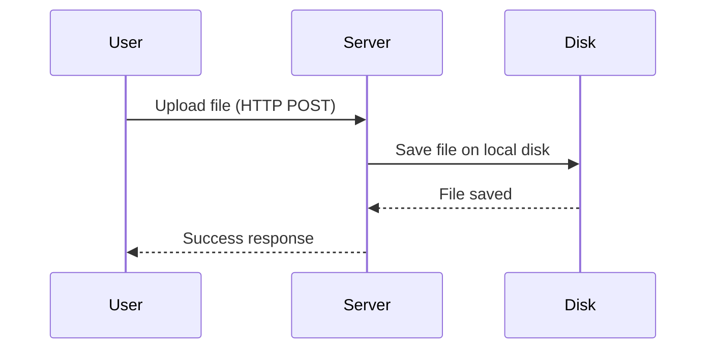
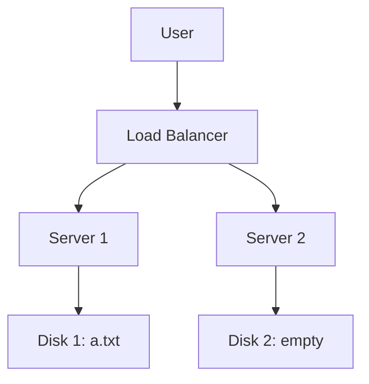
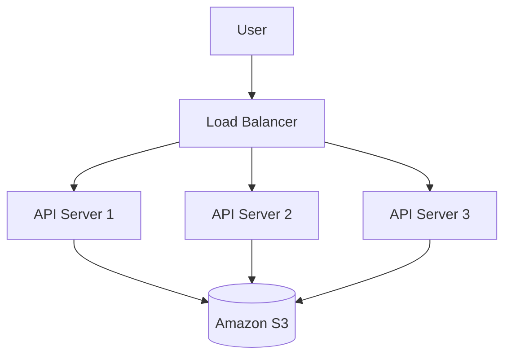
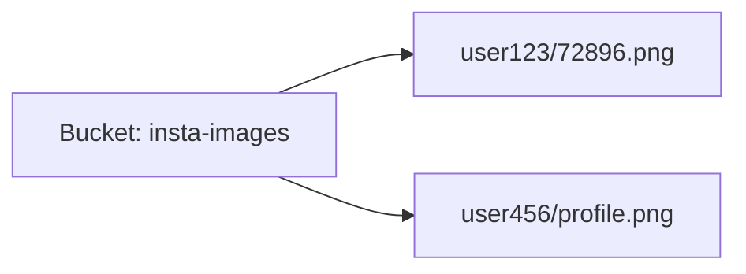
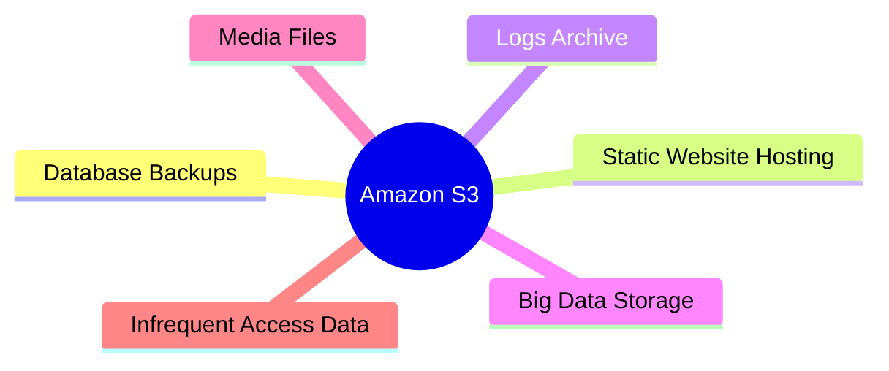
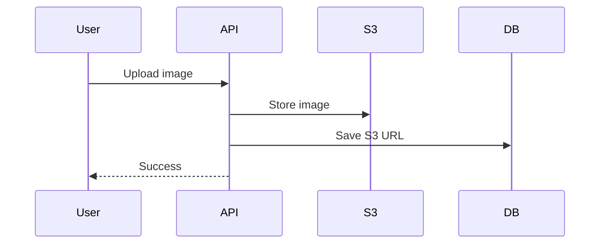

---

## 1. How file storage worked earlier (Single Server Model)

### Idea

Earlier, when a user uploaded a file:

- The file was sent to **one server**
    
- The server saved the file on its **own hard disk**
    
- Files were usually stored inside a **static folder**
    

This is how `/static` folders worked.

---

### Flow (Old Way)



---

### Example (Old Way)

- User uploads: `a.txt`
    
- Server saves file at:
    

```
/home/app/www/static/a.txt
```

When user requests:

```
GET /static/a.txt
```

Server:

1. Converts URL → file path
    
2. Reads file from disk
    
3. Sends file back
    

---

### Why this worked earlier

- Only **one server**
    
- Simple logic
    
- No scaling required
    

---

## 2. Problem with Multiple Servers (Scaling Issue)

When traffic increases:

- We add **multiple servers**
    
- Each server has **its own disk**
    

### Problem

- File uploaded to **Server-1**
    
- Request goes to **Server-2**
    
- Server-2 **does NOT have that file**
    

❌ File not found  
❌ Data inconsistency

---

### Problem Diagram



---

## 3. Need for Centralized Storage

So we need:

- One **central place**
    
- Accessible by **all servers**
    
- Infinitely scalable
    
- Highly durable
    

👉 This is **Blob Storage**

---

## 4. What is Blob Storage?

### Simple definition

**Blob Storage = storage for large unstructured files**

Examples:

- Images
    
- Videos
    
- Audio
    
- PDFs
    
- Logs
    
- DB backups
    

Blob = Binary Large Object

---

## 5. Amazon S3 (Simple Storage Service)

Amazon S3 is:

- **Blob storage**
    
- **Network attached**
    
- **Highly scalable**
    
- **Highly durable**
    

---

### New Architecture (Modern Way)



---

### Key Result

- All servers use **same storage**
    
- Servers become **stateless**
    
- Easy scaling
    

---

## 6. Important S3 Concepts

### 1️⃣ Bucket

- Bucket = **namespace**
    
- Bucket name must be **globally unique**
    

Examples:

- `insta-images`
    
- `user-uploads`
    
- `app-backups`
    

---

### 2️⃣ Object (File)

Each file in S3 is an **object**

Object =

```
Bucket + Key + Data + Metadata
```

---

### 3️⃣ Key

- Key = path of file inside bucket
    
- Looks like folder, but **not real folder**
    

Example:

```
s3://insta-images/user123/72896.png
```

- Bucket → `insta-images`
    
- Key → `user123/72896.png`
    

---

### Mermaid View



---

## 7. Is S3 a File System?

❌ NO

S3 is **NOT**:

- Linux file system
    
- POSIX file system
    

S3 does **NOT** support:

- File locking
    
- Append
    
- Rename like OS
    

---

### What S3 Supports

✔ Create object  
✔ Read object  
✔ Replace object  
✔ Delete object

---

## 8. Advantages of S3

### ✅ Cheap & Durable

- 99.999999999% durability
    
- Data replicated across zones
    

---

### ✅ Store Any File

- Images
    
- Videos
    
- Audio
    
- Text
    
- DB backups
    
- CSV exports
    

---

### ✅ Highly Scalable

- No limit on size
    
- No server management
    

---

### ✅ AWS Integration

- Athena
    
- Glue
    
- EMR
    
- Lambda
    
- CloudFront
    

---

## 9. Disadvantages of S3

### ❌ Slow Reads

- Network call
    
- Higher latency than local disk
    

So:

- ❌ Not good for frequent small reads
    
- ✔ Good for large files
    

---

### ❌ Not a Full File System

- No directory hierarchy
    
- No file locking
    

---

## 10. When You SHOULD Use S3

Use S3 when:

- Data must be **centrally accessible**
    
- Data is **large**
    
- Reads are **not ultra-fast**
    

---

### Common Use Cases



---

## 11. When NOT to Use S3

❌ High-frequency reads  
❌ Low latency file access  
❌ Transactional file system

Better options:

- EC2 SSD
    
- EBS
    
- Local disk
    
- In-memory cache
    

---

## 12. Real-World Example (Simple)

### Instagram-like App

1. User uploads photo
    
2. Backend uploads image to S3
    
3. DB stores only **S3 URL**
    
4. Any server can show image
    




---

## 14. Next Practice (Good for You)

Since you are backend-focused 👇

1. Read **S3 API basics**
    
2. Learn:
    
    - PUT Object
        
    - GET Object
        
    - DELETE Object
        
3. Understand **ACL vs Bucket Policy**
    
4. Upload file using backend (later with Java)
    

---
