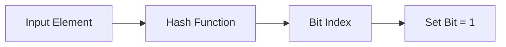
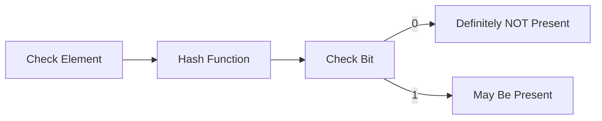
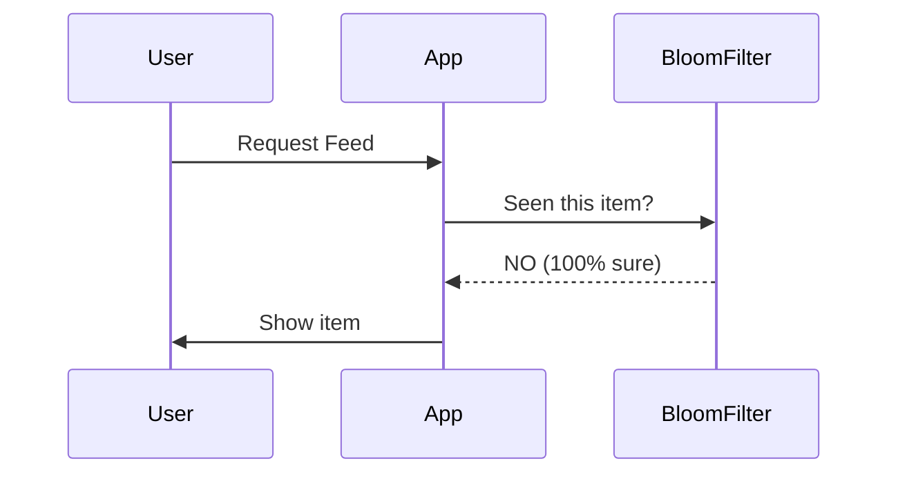

---

# Bloom Filter 

## 1. What is a Bloom Filter?

A **Bloom Filter** is a **probabilistic data structure** used to **check whether an element is present in a set or not**.

It gives **two types of answers**:

- ❌ **Definitely NOT present** → 100% sure
    
- ✅ **MAY be present** → not 100% sure (false positive possible)
    

👉 **Important rule**  
A Bloom Filter **never gives false negative**, but **can give false positive**.

---

## 2. Why do we need Bloom Filter? (Problem)

### Real-world example: Instagram / Reels / YouTube

- User watches **hundreds of reels every day**
    
- Platform should **NOT recommend reels already watched**
    
- Naive approach:
    
    - Store all watched reels in a `Set`
        
    - Check before recommending
        

### Problem with naive approach

- Over time, the set becomes **very large**
    
- To check:
    
    - Load entire set into memory
        
    - Search inside it
        
- ❌ **Memory expensive**
    
- ❌ **Slow**
    

---

## 3. Key Insight (Very Important)

> **Once something is watched, it is never “unwatched”**

So:

- We **only add**
    
- We **never remove**
    

👉 This is the **perfect use case for Bloom Filter**

---

## 4. How Bloom Filter Works (Concept)

### Core idea

- Bloom Filter is basically a **bit array**
    
- Example: 8-bit array
    

```
Index:  0 1 2 3 4 5 6 7
Bits :  0 0 0 0 0 0 0 0
```

---

## 5. Inserting Elements

We use **hash functions**.

Example (1 hash function for simplicity):

|Word|hash(word) % 8|Bit set|
|---|---|---|
|apple|2|bit[2] = 1|
|ball|6|bit[6] = 1|
|cat|2|bit[2] already 1|

Now bit array becomes:

```
Index:  0 1 2 3 4 5 6 7
Bits :  0 0 1 0 0 0 1 0
```

---

## 6. Checking Existence

### Case 1: Definitely NOT present

- dog → hash(dog) % 8 = 5
    
- bit[5] = 0
    

✅ **dog is NOT present (100% sure)**

---

### Case 2: MAY be present (false positive)

- elephant → hash(elephant) % 8 = 6
    
- bit[6] = 1
    

❓ **elephant MAY be present**  
(it could be set by another word)

---

## 7. Why False Positive Happens?

Because:

- Bloom Filter **does not store actual values**
    
- Different inputs can map to same bit
    

👉 That’s why:

- `YES` → maybe
    
- `NO` → guaranteed
    

---

## 8. Mermaid Diagram – Bloom Filter Flow

### Insert Flow



---

### Check Flow



---

## 9. Space Efficiency (Why Bloom Filter is Fast)

- Uses **bit array**
    
- Does **not store keys**
    
- Checking = **array lookup (O(1))**
    
- Very **memory efficient**
    

Example:

- Storing 10 million IDs in `Set` → huge memory
    
- Bloom Filter → few MBs
    

---

## 10. False Positive Rate

As number of inserted keys increases:

- More bits become `1`
    
- Chance of false positive increases
    

👉 To handle this:

### Options:

1. Create a **bigger Bloom Filter**
    
2. Estimate number of keys in advance
    
3. Use **multiple hash functions** (in real systems)
    

---

## 11. Limitations of Bloom Filter

❌ Cannot remove elements  
❌ False positives possible  
❌ Cannot list stored elements
❌ If you want to insert  smaller bloom filter element to  bigger element then again you need to re-write the logic to handle this, hence it is better to take predicate bloom filter size already.


---

## 12. When Should You Use Bloom Filter?

Use it when:

✅ You only **insert**, never delete  
✅ You need **100% sure NO**  
✅ False positives are acceptable  
✅ Speed and memory matter

---

## 13. Practical Applications

- Feed recommendation (Instagram, YouTube)
    
- Web crawler (already visited URL?)
    
- Cache filtering (avoid DB call)
    
- Tinder feed (already swiped?)
    
- Medium article recommendation
    

---

## 14. Bloom Filter in Real Systems

You **don’t implement it from scratch** usually.

Popular options:

- **Redis Bloom Filter**
    
- Guava (Java)
    
- Python libraries
    

👉 Redis provides Bloom Filter as a **core feature**

---

## 15. Mermaid Diagram – System Design Usage



---

If you want, next we can:

- Implement Bloom Filter **using Redis**
    
- Compare **Bloom Filter vs Set**
    
- Learn **Counting Bloom Filter**
    
- Use Bloom Filter in **Spring Boot system design**
    

Just tell me 👍