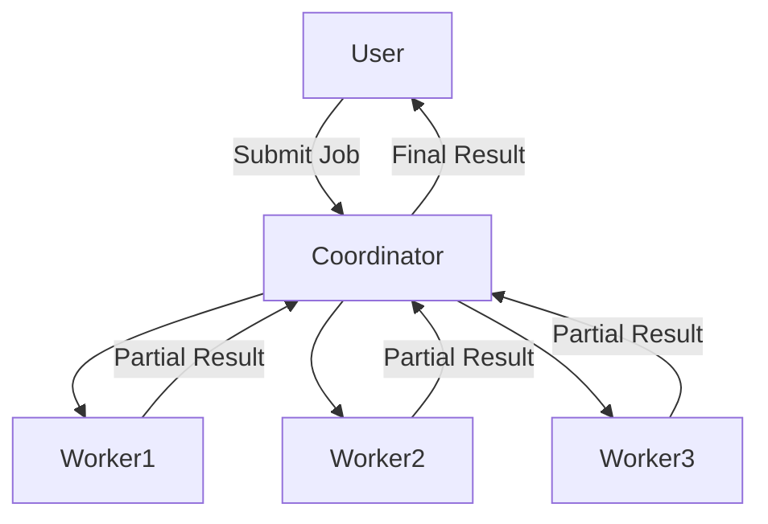
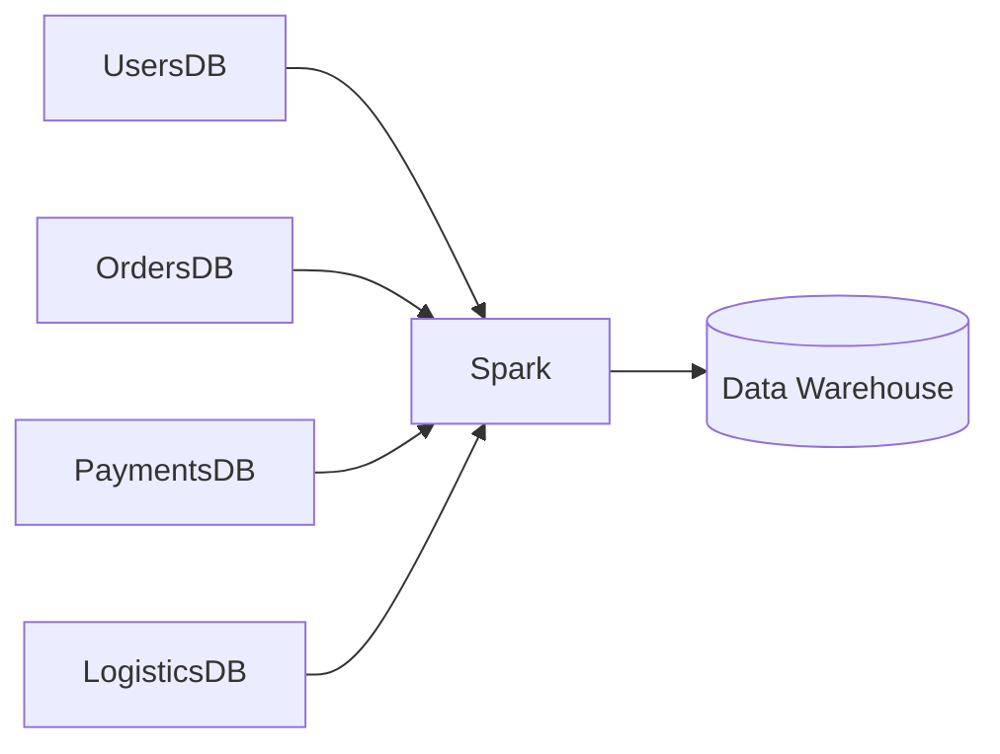
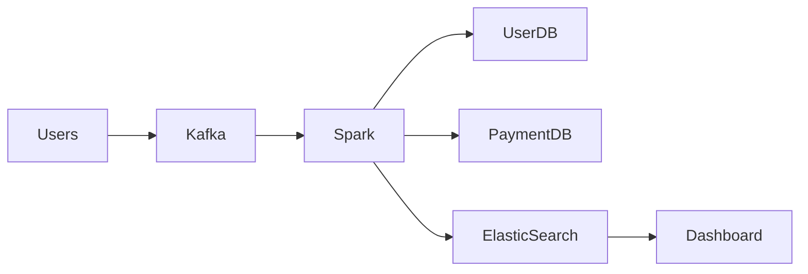

---


# 📘 Big Data Processing – Detailed Notes (System Design View)

---

## 1️⃣ What is Big Data Processing?

### Simple meaning

When **one machine is not enough** to process data (because data is too big or needs fast processing), we:

👉 **Split the data**  
👉 **Process it in parallel**  
👉 **Merge the result**

This idea is called **Big Data Processing**.

> 💡 Core principle: **Divide and Conquer**

---

### Why companies need it (real world)

Companies like **Amazon, Netflix, Uber, Google** deal with:

- Millions of users
    
- Billions of events (clicks, orders, payments)
    
- TBs or PBs of data
    

They use Big Data Processing to:

- Analyze user behavior
    
- Train ML models
    
- Generate reports
    
- Do real-time analytics
    
- Move data between systems
    

---

## 2️⃣ Example Problem: Word Frequency Count (Classic Big Data Example)

### Problem

> Given **1 TB text data**, count frequency of each word.

---

## Approach 1️⃣: Single Machine (Simple Approach)

### Steps

1. Load file from disk
    
2. Read character by character
    
3. When space found → word complete
    
4. Update in-memory HashMap  
    `wordFreq[word]++`
    

### Time Complexity

- **O(n)** → good
    
- But only **one machine** working ❌
    

### Problem

- Very slow
    
- Memory limit
    
- CPU limit
    

> Works for **small data**, fails for **big data**

---

## Approach 2️⃣: Multithreading (One Machine, Many Threads)

### Idea

- Split file into chunks
    
- Each thread processes one chunk
    
- All threads update word count
    

### Limitation

- Threads depend on **CPU cores**
    
- Still **one machine**
    
- Cannot scale beyond hardware limits
    

💡 Example:

> Laptop with 8 cores → max ~8 threads efficiently

---

## Approach 3️⃣: Distributed Computing (Big Data Solution)

### Core Idea

Instead of **one big machine**, use:

- Many **small machines**
    
- Each machine processes **part of data**
    

---

### High-Level Steps

1. Split data into **partitions**
    
2. Distribute partitions to machines
    
3. Each machine computes independently
    
4. Send result to a coordinator
    
5. Merge final output
    

---

## 🧠 Coordinator–Worker Model (Very Important)

### Mermaid Diagram



---

### Roles

#### 🧑‍💼 Coordinator (Master)

- Receives job
    
- Splits data
    
- Assigns work
    
- Tracks progress
    
- Merges result
    

#### 🧑‍🔧 Workers

- Process assigned data
    
- Work independently
    
- Send partial result
    

---

## ⚠️ Challenges in Distributed Systems

When many machines are involved, problems appear:

1. **What if a machine fails?**
    
2. **What if job is partially complete?**
    
3. **How to retry safely?**
    
4. **How to scale up/down?**
    
5. **Who cleans resources after job?**
    

👉 Handling this manually is **very complex**

---

## 🛠️ Big Data Tools (Why We Use Them)

Tools like:

- **Apache Spark**
    
- **Apache Flink**
    
- **Hadoop**
    

They handle:

- Job distribution
    
- Fault tolerance
    
- Retry logic
    
- Resource management
    
- Scaling
    
- Recovery
    

> ✅ Developer focuses only on **business logic**

---

## 3️⃣ Apache Spark & Flink (Industrial View)

### What they do

- Large-scale data processing
    
- Runs on **commodity hardware**
    
- Integrates with many systems
    

---

### Example 1: Batch Processing (Data Warehouse)

#### Business Case

Company wants to:

- Combine `users`, `orders`, `payments`, `logistics`
    
- Generate analytics
    
- Store result in **AWS Redshift**
    

### Mermaid Diagram



---

### Use Case

- Daily sales report
    
- Revenue analytics
    
- Fraud analysis
    

---

## 4️⃣ Real-Time Big Data (Kafka + Spark)

### Business Scenario

- User performs actions (click, payment, blog publish)
    
- Events are generated continuously
    
- Company wants **real-time dashboards**
    

---

### Flow Explanation

1. Events produced to **Kafka**
    
2. Spark consumes events
    
3. Spark enriches data using DBs
    
4. Store result in analytics DB
    

---

### Mermaid Diagram



---

### Why not single machine?

- Too slow
    
- Cannot handle event volume
    
- No fault tolerance
    

---

## 5️⃣ Event Enrichment Example (Very Important for Interviews)

### Kafka Event

```json
{
  "event": "BLOG_PUBLISHED",
  "userId": "U123",
  "blogId": "B456"
}
```

### User DB

```json
{
  "userId": "U123",
  "name": "Siddhesh",
  "email": "abc@gmail.com",
  "bio": "Java Developer"
}
```

### Spark Output

```json
{
  "userId": "U123",
  "blogId": "B456",
  "user": {
    "name": "Siddhesh",
    "email": "abc@gmail.com",
    "bio": "Java Developer"
  }
}
```

### Stored as

- JSON file on disk
    
- OR ElasticSearch
    
- OR Data Warehouse
    

---

## 6️⃣ Key Takeaways (Very Interview Friendly)

- Big Data = **Data + Scale + Speed**
    
- Single machine ❌
    
- Threads help but limited ❌
    
- Distributed systems ✅
    
- Coordinator–Worker pattern
    
- Spark/Flink abstract complexity
    
- Kafka enables real-time pipelines
    

---

## 7️⃣ What You Should Practice Next (Hands-on)

### Step-by-step learning path

1. Install **Spark locally**
    
2. Run simple word count
    
3. Process sales CSV
    
4. Kafka + Spark integration
    
5. Event enrichment job
    

> 💡 This aligns perfectly with **backend + system design interviews**

---

Good question 👍
This term is used **a lot** in Big Data and System Design interviews.

I’ll explain it in **very simple English**, with **real-world + industrial examples**.

---

## What is Commodity Hardware?

### Simple definition

**Commodity hardware** means:

> **Normal, cheap, easily available computers**
> (not special or very powerful machines)

Think of:

* Regular servers
* Normal CPUs
* Normal disks
* Normal network

❌ Not supercomputers
❌ Not very expensive machines

---

## Easy Real-World Example 🧠

### Bike vs Truck example

* **One big truck** → very powerful, very expensive
* **Many bikes** → cheap, easy to replace, scalable

Big Data systems prefer:

👉 **Many bikes instead of one truck**

If one bike fails → others still work
If truck fails → everything stops ❌

---

## Commodity Hardware in IT Terms

Commodity hardware usually means:

* x86 servers (Intel / AMD)
* 8–32 CPU cores
* 16–128 GB RAM
* Normal HDD / SSD
* Standard network

These are:

* Easily available
* Cheap compared to high-end machines
* Replaceable

---

## Why Big Data Uses Commodity Hardware?

### 1️⃣ Cost (Very Important)

💰 One high-end server = very costly
💰 Many normal servers = cheaper

Example:

* 1 super machine = ₹1 crore
* 100 normal machines = cheaper + scalable

---

### 2️⃣ Scalability

Need more power?

❌ Don’t upgrade machine
✅ Just **add more machines**

This is called **horizontal scaling**

---

### 3️⃣ Fault Tolerance

Machines **will fail**.

Big Data tools assume:

* Hardware failure is normal
* Software will handle it

Example:

* One server crashes
* Spark re-runs task on another server

---

## Commodity Hardware + Big Data Tools = Perfect Match

Big Data tools like:

* Spark
* Hadoop
* Flink

Are designed to:

* Run on unreliable machines
* Retry on failure
* Re-distribute tasks automatically

> 💡 Software handles failure, not hardware

---

## Industrial Example 🏭

### Amazon / Flipkart

* Millions of users
* Huge data
* They don’t use supercomputers

They use:

* Thousands of normal servers
* Managed by software (Spark, Kafka, Kubernetes)

---

## Example Comparison Table

| Feature          | Super Computer    | Commodity Hardware  |
| ---------------- | ----------------- | ------------------- |
| Cost             | Very high ❌       | Low ✅               |
| Availability     | Rare ❌            | Easily available ✅  |
| Scaling          | Vertical (hard) ❌ | Horizontal (easy) ✅ |
| Failure Handling | Hardware based ❌  | Software based ✅    |
| Used in Big Data | ❌                 | ✅                   |

---

## One-Line Interview Answer 🎯

> **Commodity hardware means using many low-cost, easily available machines instead of one powerful machine, and handling failures at software level.**

---

## Link with Your Previous Topic

* Big Data
* Distributed computing
* Spark / Flink
* Kafka pipelines

👉 All assume **commodity hardware will fail**
👉 And they are built to **survive failures**

---
